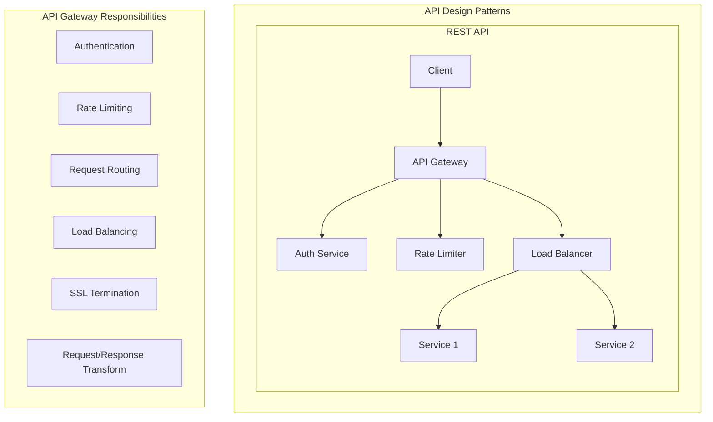

# API Design

## Overview

API design is fundamental to system design interviews. You must understand how to design clean, scalable, and maintainable APIs that clients will use to interact with your system.

## What You Must Master

### 1. REST API Design Principles

| Principle | What to Know | Why It Matters |
|-----------|--------------|----------------|
| **Resource naming** | Use nouns, not verbs (`/users` not `/getUsers`) | Standard convention, easier to understand |
| **HTTP methods** | GET, POST, PUT, PATCH, DELETE semantics | Correct method = correct behavior |
| **Status codes** | 200, 201, 400, 401, 403, 404, 429, 500 | Proper error communication |
| **Pagination** | Cursor vs offset pagination | Large dataset handling |
| **Versioning** | URL vs header versioning | Backward compatibility |

### 2. HTTP Methods Deep Dive

```
┌─────────────────────────────────────────────────────────────────────┐
│                        HTTP Methods                                  │
├──────────┬─────────────────────┬──────────────┬─────────────────────┤
│  Method  │      Purpose        │ Idempotent?  │    Safe?            │
├──────────┼─────────────────────┼──────────────┼─────────────────────┤
│   GET    │ Read resource       │     Yes      │     Yes             │
│   POST   │ Create resource     │     No       │     No              │
│   PUT    │ Replace resource    │     Yes      │     No              │
│   PATCH  │ Partial update      │     No*      │     No              │
│   DELETE │ Remove resource     │     Yes      │     No              │
└──────────┴─────────────────────┴──────────────┴─────────────────────┘

* PATCH can be idempotent if implemented correctly
```

### 3. Status Codes You Must Know

```
2xx Success
├── 200 OK              → Request succeeded
├── 201 Created         → Resource created (POST)
└── 204 No Content      → Success, no body (DELETE)

4xx Client Errors
├── 400 Bad Request     → Invalid request body/params
├── 401 Unauthorized    → Not authenticated
├── 403 Forbidden       → Authenticated but not allowed
├── 404 Not Found       → Resource doesn't exist
├── 409 Conflict        → Resource state conflict
└── 429 Too Many Reqs   → Rate limit exceeded

5xx Server Errors
├── 500 Internal Error  → Server bug
├── 502 Bad Gateway     → Upstream server error
├── 503 Unavailable     → Server overloaded/maintenance
└── 504 Gateway Timeout → Upstream timeout
```

## Architecture Diagram



## Pagination Strategies

### Offset-Based (Simple but problematic)

```
GET /api/users?offset=20&limit=10

Problems:
- Skip is expensive: DB scans offset+limit rows
- Data shift: New inserts cause duplicates/skips
```

### Cursor-Based (Preferred for large datasets)

```
GET /api/users?cursor=eyJpZCI6MTAwfQ&limit=10

Response:
{
  "data": [...],
  "next_cursor": "eyJpZCI6MTEwfQ",
  "has_more": true
}

Benefits:
- Consistent results even with inserts
- Efficient: uses index directly
- Better for infinite scroll
```

### Comparison

| Aspect | Offset | Cursor |
|--------|--------|--------|
| Jump to page N | ✅ Easy | ❌ Must traverse |
| Large offsets | ❌ Slow | ✅ Fast |
| Real-time data | ❌ Inconsistent | ✅ Consistent |
| Implementation | ✅ Simple | ⚠️ More complex |

## API Versioning Strategies

### URL Versioning (Most common)
```
GET /api/v1/users
GET /api/v2/users
```
**Pros**: Clear, easy routing
**Cons**: URL pollution

### Header Versioning
```
GET /api/users
Accept: application/vnd.company.v2+json
```
**Pros**: Clean URLs
**Cons**: Hidden, harder to test

### Query Parameter
```
GET /api/users?version=2
```
**Pros**: Simple
**Cons**: Can be forgotten

## Interview Checklist

When designing APIs in interviews, always cover:

- [ ] **Request format**: What data does client send?
- [ ] **Response format**: What data comes back?
- [ ] **Authentication**: How do we know who's calling?
- [ ] **Authorization**: Can this user perform this action?
- [ ] **Rate limiting**: How do we prevent abuse?
- [ ] **Pagination**: How do we handle large datasets?
- [ ] **Error handling**: What errors can occur?
- [ ] **Idempotency**: Is it safe to retry?
- [ ] **Versioning**: How do we evolve the API?

## Real Example: Twitter API Design

```
POST /api/v1/tweets
Authorization: Bearer {token}
{
    "text": "Hello World",
    "reply_to": "tweet_123",      // optional
    "media_ids": ["media_abc"]    // optional
}

Response: 201 Created
{
    "id": "tweet_456",
    "text": "Hello World",
    "author": {
        "id": "user_789",
        "username": "john"
    },
    "created_at": "2024-01-15T12:00:00Z",
    "metrics": {
        "likes": 0,
        "retweets": 0,
        "replies": 0
    }
}
```

## Common Mistakes to Avoid

1. **Using verbs in URLs**: `/getTweets` → `/tweets`
2. **Inconsistent naming**: `/users` vs `/tweet` (mix singular/plural)
3. **Ignoring pagination**: Returning millions of rows
4. **No rate limiting**: API gets abused
5. **Leaking internal IDs**: Using auto-increment IDs (use UUIDs)
6. **No API versioning**: Breaking changes break clients

## Key Concepts to Articulate

| Concept | One-Sentence Explanation |
|---------|--------------------------|
| **Idempotency** | Same request multiple times = same result |
| **HATEOAS** | Response includes links to related resources |
| **Content negotiation** | Client specifies desired response format |
| **Rate limiting** | Restricting request frequency per client |
| **API Gateway** | Single entry point handling cross-cutting concerns |

Run examples:
```bash
# This module focuses on API design concepts
# See the networking module for HTTP implementation
cargo run --bin networking
```
