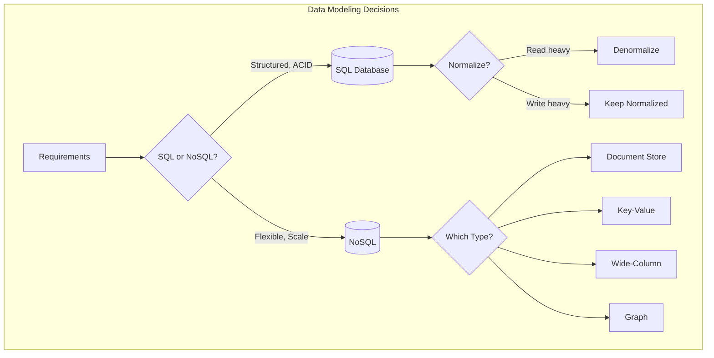

# Data Modeling

## Overview

Data modeling is about designing how data is stored, organized, and accessed. Your choice of data model directly impacts system performance, scalability, and maintainability.

## What You Must Master

### 1. SQL vs NoSQL Decision

This is the **most common decision** you'll make in system design interviews.

```
┌─────────────────────────────────────────────────────────────────────────┐
│                    When to Use SQL vs NoSQL                             │
├─────────────────────────────────────────────────────────────────────────┤
│                                                                         │
│   Choose SQL (PostgreSQL, MySQL) when:                                  │
│   ├── Complex relationships between entities                           │
│   ├── Need ACID transactions                                           │
│   ├── Data structure is well-defined and stable                        │
│   ├── Complex queries with JOINs                                       │
│   └── Examples: Banking, E-commerce orders, User management            │
│                                                                         │
│   Choose NoSQL when:                                                    │
│   ├── Document store (MongoDB): Flexible schema, nested data           │
│   ├── Key-Value (Redis, DynamoDB): Simple lookups, caching             │
│   ├── Wide-Column (Cassandra): Time-series, high write throughput      │
│   ├── Graph (Neo4j): Relationship-heavy queries                        │
│   └── Examples: Social feeds, IoT data, Session storage                │
│                                                                         │
└─────────────────────────────────────────────────────────────────────────┘
```

### 2. Database Selection Matrix

| Use Case | Best Database | Why |
|----------|--------------|-----|
| User profiles | PostgreSQL | Structured, relationships |
| Session storage | Redis | Fast, expiring data |
| Chat messages | Cassandra | High write, time-series |
| Social connections | Neo4j | Graph queries |
| Product catalog | MongoDB | Flexible schema |
| Search | Elasticsearch | Full-text, faceting |
| Analytics | ClickHouse | Columnar, aggregations |
| Time-series | TimescaleDB | Time-based queries |

### 3. Schema Design Patterns

## Normalization vs Denormalization

```
┌─────────────────────────────────────────────────────────────────────────┐
│                     Normalized (3NF)                                     │
│                                                                          │
│   users                    orders                  products              │
│   ┌────────────┐          ┌──────────────┐       ┌─────────────┐        │
│   │ id         │──┐       │ id           │   ┌───│ id          │        │
│   │ name       │  └──────►│ user_id (FK) │   │   │ name        │        │
│   │ email      │          │ product_id ──┼───┘   │ price       │        │
│   └────────────┘          │ quantity     │       └─────────────┘        │
│                           └──────────────┘                               │
│                                                                          │
│   Pros: No data duplication, easy updates                               │
│   Cons: JOINs are expensive at scale                                    │
├─────────────────────────────────────────────────────────────────────────┤
│                     Denormalized                                         │
│                                                                          │
│   orders                                                                 │
│   ┌──────────────────────────────────────────────────┐                  │
│   │ id                                               │                  │
│   │ user_id                                          │                  │
│   │ user_name (duplicated)                           │                  │
│   │ user_email (duplicated)                          │                  │
│   │ product_name (duplicated)                        │                  │
│   │ product_price (duplicated)                       │                  │
│   │ quantity                                         │                  │
│   └──────────────────────────────────────────────────┘                  │
│                                                                          │
│   Pros: Fast reads, no JOINs                                            │
│   Cons: Data duplication, update anomalies                              │
└─────────────────────────────────────────────────────────────────────────┘
```

## Architecture Diagram



## Key Access Patterns

Before designing your schema, answer:

1. **What queries will we run most often?**
2. **What's the read/write ratio?**
3. **What data do we need to return together?**
4. **What's the data size and growth rate?**

### Example: Social Media Posts

```sql
-- Access patterns:
-- 1. Get user's feed (most recent posts from following)
-- 2. Get single post with author info
-- 3. Get all posts by a user
-- 4. Get post with likes/comments count

-- Normalized approach (good for writes)
CREATE TABLE posts (
    id UUID PRIMARY KEY,
    user_id UUID REFERENCES users(id),
    content TEXT,
    created_at TIMESTAMP
);

CREATE TABLE likes (
    user_id UUID,
    post_id UUID REFERENCES posts(id),
    PRIMARY KEY (user_id, post_id)
);

-- Denormalized approach (good for reads)
CREATE TABLE posts_denorm (
    id UUID PRIMARY KEY,
    user_id UUID,
    user_name VARCHAR,           -- duplicated
    user_avatar_url VARCHAR,     -- duplicated
    content TEXT,
    likes_count INT DEFAULT 0,   -- pre-computed
    comments_count INT DEFAULT 0, -- pre-computed
    created_at TIMESTAMP
);
```

## Interview Checklist

- [ ] **Identify entities**: What objects exist in the system?
- [ ] **Relationships**: How do entities relate? (1:1, 1:N, N:M)
- [ ] **Access patterns**: Which queries are most common?
- [ ] **Read vs write**: What's the ratio?
- [ ] **Scale**: How much data? How fast growing?
- [ ] **Consistency**: Do we need strong consistency?
- [ ] **Indexes**: Which columns do we query on?

## Common Modeling Patterns

### 1. Polymorphic Associations

```sql
-- Problem: Comments can be on posts, photos, or videos

-- Option 1: Separate tables (cleaner but more JOINs)
CREATE TABLE post_comments (...);
CREATE TABLE photo_comments (...);

-- Option 2: Single table with type (simpler but less type-safe)
CREATE TABLE comments (
    id UUID PRIMARY KEY,
    commentable_type VARCHAR,  -- 'post', 'photo', 'video'
    commentable_id UUID,
    content TEXT
);
CREATE INDEX idx_commentable ON comments(commentable_type, commentable_id);
```

### 2. Hierarchical Data (Tree Structures)

```sql
-- Option 1: Adjacency List (simple, recursive queries)
CREATE TABLE categories (
    id INT PRIMARY KEY,
    name VARCHAR,
    parent_id INT REFERENCES categories(id)
);

-- Option 2: Materialized Path (fast reads)
CREATE TABLE categories (
    id INT PRIMARY KEY,
    name VARCHAR,
    path VARCHAR  -- '/1/5/23/' - all ancestors
);
-- Find all descendants: WHERE path LIKE '/1/5/%'

-- Option 3: Nested Sets (fast subtree queries, complex updates)
CREATE TABLE categories (
    id INT PRIMARY KEY,
    name VARCHAR,
    lft INT,  -- left boundary
    rgt INT   -- right boundary
);
```

### 3. Event Sourcing Pattern

```
┌─────────────────────────────────────────────────────────────────────────┐
│   Instead of storing current state, store all events                    │
│                                                                         │
│   Events Table:                                                         │
│   ┌────────┬──────────────────┬─────────────────────────────────────┐  │
│   │  ID    │    Event Type    │           Payload                    │  │
│   ├────────┼──────────────────┼─────────────────────────────────────┤  │
│   │   1    │ AccountCreated   │ {user_id: 123, balance: 0}          │  │
│   │   2    │ MoneyDeposited   │ {user_id: 123, amount: 100}         │  │
│   │   3    │ MoneyWithdrawn   │ {user_id: 123, amount: 30}          │  │
│   └────────┴──────────────────┴─────────────────────────────────────┘  │
│                                                                         │
│   Current state = replay all events: Balance = 0 + 100 - 30 = 70       │
│                                                                         │
│   Use cases: Banking, audit logs, undo/redo                            │
└─────────────────────────────────────────────────────────────────────────┘
```

## Key Concepts to Articulate

| Concept | What to Explain |
|---------|-----------------|
| **Primary Key** | Unique identifier, clustered index in most DBs |
| **Foreign Key** | Enforces referential integrity |
| **Index** | Trade write speed for read speed |
| **Composite Key** | Multiple columns as primary key |
| **Partition Key** | Determines data distribution in distributed DBs |
| **Denormalization** | Duplicate data for read performance |
| **Sharding Key** | Column used to distribute data across shards |

## Red Flags in Interviews

❌ Choosing NoSQL just because "it scales better"
❌ Not considering access patterns before schema design
❌ Ignoring data growth and query patterns
❌ Not mentioning indexes
❌ Forgetting about consistency requirements

✅ "Let me first understand the access patterns..."
✅ "Given the read-heavy workload, I'd denormalize..."
✅ "We'll need an index on this column for the common query..."
