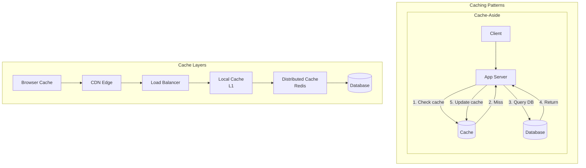

# Caching

## Overview

Caching reduces latency and database load by storing frequently accessed data in fast storage (RAM). Understanding caching is fundamental to almost every system design.

## What You Must Master

### 1. Cache Hit/Miss Flow

```
Without Cache:  Client → App Server → Database (100ms)
With Cache:     Client → App Server → Cache (1ms) ✓
                                    → Database (cache miss)
```

## Architecture Diagram



## Cache Strategies

### 1. Cache-Aside (Lazy Loading)
```
┌─────────────────────────────────────────────────┐
│  1. App checks cache                            │
│  2. If miss, read from DB                       │
│  3. Store in cache                              │
│  4. Return to client                            │
│                                                 │
│  Pros: Only caches what's needed                │
│  Cons: Cache miss penalty, stale data possible  │
└─────────────────────────────────────────────────┘
```

The app manages the cache explicitly. Most common pattern.

**Read path:** check cache → miss → query DB → populate cache → return.

**Write path:** update DB → delete cache key (NOT update it).

```
Read:  Client → cache.get(key)
         HIT  → return cached value                    (1ms)
         MISS → app queries DB (50ms) → cache.set(key) → return

Write: Client → update DB (50ms) → delete cache key (1ms) → return
       (next read will miss, fetch fresh from DB, repopulate cache)
```

**Pros:** only caches what's actually requested (no wasted memory).
**Cons:** first read after write is always a miss. Stale data possible if DB is updated by another service.

```
t=0  Cache: "Alice"   DB: "Alice"     ← in sync
t=1  DB updated to "Alicia"           ← cache doesn't know!
t=2  Read → cache HIT → "Alice"       ← STALE (DB says "Alicia")
t=3  TTL expires → next read misses → fetches "Alicia" from DB → back in sync
```

The stale window = time between DB update and cache expiry. Fix with short TTL (60s), event-driven invalidation, or switch to write-through.

### 2. Write-Through
```
┌─────────────────────────────────────────────────┐
│  1. Write to cache                              │
│  2. Cache writes to DB (synchronously)          │
│  3. Return success                              │
│                                                 │
│  Pros: Cache always consistent                  │
│  Cons: Higher write latency                     │
└─────────────────────────────────────────────────┘
```

Every write goes through the cache first. Cache is always consistent.

**Read path:** always from cache (cache is always fresh — every write already updated it).

**Write path:** update cache → update DB (synchronous) → return success.

```
Read:  Client → cache.get(key) → HIT → return          (1ms, always hits)

Write: Client → cache.set(key) (1ms) → DB.update(key) (50ms) → return success
       (both cache and DB updated atomically)
```

**Pros:** cache is NEVER stale. Zero miss penalty after writes.
**Cons:** every write waits for DB (higher write latency: cache + DB must both succeed).

**When to use:** data that's read immediately after writing (user profiles, settings). The extra write latency pays off because reads are guaranteed fresh.

### 3. Write-Behind (Write-Back)
```
┌─────────────────────────────────────────────────┐
│  1. Write to cache                              │
│  2. Return success immediately                  │
│  3. Async write to DB (batched)                 │
│                                                 │
│  Pros: Low write latency                        │
│  Cons: Risk of data loss                        │
└─────────────────────────────────────────────────┘
```

Writes go to cache only. DB updated asynchronously in background.

**Read path:** always from cache (same as write-through).

**Write path:** update cache → return success immediately → DB updated later (async, batched).

```
Read:  Client → cache.get(key) → HIT → return          (1ms)

Write: Client → cache.set(key) (1ms) → return success   (instant!)
       Background job: flush dirty keys to DB every N seconds
```

**Pros:** fastest writes possible (client doesn't wait for DB at all).
**Cons:** if server crashes before flush, data is LOST.

```
t=0  Write "score=100" → cache updated → return "success" to client
t=1  (server hasn't flushed to DB yet)
t=2  SERVER CRASHES
t=3  Restart → cache is empty, DB still has old value
     "score=100" is lost forever.
```

**When to use:** non-critical data where speed matters more than durability — view counts, analytics events, like counters. NEVER for payments or orders.

### 4. Read-Through
```
┌─────────────────────────────────────────────────┐
│  Cache sits between app and DB                  │
│  Cache handles all DB interaction               │
│                                                 │
│  Pros: Simple app logic                         │
│  Cons: Cache is a dependency                    │
└─────────────────────────────────────────────────┘
```

Like cache-aside, but the cache itself fetches from DB on miss (not your code).

**Read path:** app calls cache.get(key) → cache handles miss internally (fetches from DB, stores, returns).

**Write path:** depends on pairing — usually combined with write-through or write-behind.

```
Read:  Client → cache.get(key)
         HIT  → return cached value                    (1ms)
         MISS → cache automatically queries DB → cache stores it → return
         (app code NEVER touches the DB — cache does it)

Compare with cache-aside:
  Cache-aside:   app → cache.get() → miss → APP queries DB → APP calls cache.set()
  Read-through:  app → cache.get() → miss → CACHE queries DB → CACHE stores it → returns
```

**Pros:** simpler app code (app doesn't know about the DB at all).
**Cons:** cache is in the critical path — if cache goes down, reads fail. Cache must know how to query the DB (more complex cache layer).

**When to use:** when you want simpler application code and are willing to make the cache a critical dependency.

### Strategy Decision Matrix

```
                    Read path          Write path             Stale?   Data loss?
────────────────────────────────────────────────────────────────────────────────
Cache-aside         cache → miss → DB  update DB → del cache  yes      no
Write-through       cache (always hit) cache → DB (sync)      no       no
Write-behind        cache (always hit) cache only (async DB)   no       YES (crash)
Read-through        cache (auto-fill)  depends on pairing     depends  depends
```

## Eviction Policies

| Policy | Description | Use Case |
|--------|-------------|----------|
| **LRU** | Remove least recently used | General purpose |
| **LFU** | Remove least frequently used | Skewed access patterns |
| **FIFO** | Remove oldest entry | Simple, low overhead |
| **TTL** | Remove after time expires | Session data |
| **Random** | Remove random entry | When LRU overhead too high |

## Cache Invalidation

> "There are only two hard things in CS: cache invalidation and naming things."

The core problem: when should you throw away cached data? Too early = unnecessary cache misses. Too late = stale data.

### Strategies:
1. **TTL (Time-to-Live)**: Data expires after fixed time
   - Simplest. Set TTL=60s → max staleness = 60 seconds.
   - Works for most cases. Twitter uses 60s TTL for timelines.

2. **Event-driven**: Invalidate on data change
   - DB write → publish event → cache subscriber deletes key
   - Staleness: milliseconds (event propagation time)
   - Requires a message bus (Kafka, Redis Pub/Sub)

3. **Version-based**: Include version in key, increment on change

   Instead of invalidating the old key, create a NEW key with a new version.
   The old key naturally expires via TTL. No explicit deletion needed.

   ```
   Step 1: App stores current version number somewhere (DB or config):
     user:42 → version = 3

   Step 2: Cache key includes the version:
     cache key = "user:42:v3" → {"name": "Alice"}

   Step 3: User updates their profile:
     DB: update user 42, bump version to 4
     New cache key = "user:42:v4" → {"name": "Alicia"}

   Step 4: Old key "user:42:v3" is never read again → eventually evicted by LRU/TTL

   Nobody needs to DELETE the old key. It just becomes unreachable.
   ```

   Real-world example — CDN cache-busting for static files:
   ```
   Old: <link href="/style.css">           ← cached by every browser + CDN
        You update CSS, but users still get the old cached version!

   Fix: <link href="/style.abc123.css">    ← hash of file content in the name
        Update CSS → new hash → "/style.def456.css"
        Browsers fetch the new URL (cache miss on new name)
        Old "/style.abc123.css" naturally expires from CDN cache

   No need to purge CDN caches worldwide. Just change the URL.
   Used by: every modern web framework (Webpack, Vite, Next.js)
   ```

4. **Pub/Sub**: Subscribe to change events (CDC — Change Data Capture)

   The most robust approach for microservices. The DB itself tells you what changed.

   ```
   How it works:

   1. App writes to DB (UPDATE users SET name='Bob' WHERE id=42)

   2. DB emits a change event (CDC):
      PostgreSQL: logical replication / WAL decoding
      MySQL: binlog
      DynamoDB: DynamoDB Streams

   3. Event goes to a message bus:
      DB change → Debezium (CDC connector) → Kafka topic "db.users"

   4. Cache invalidator service subscribes to Kafka:
      Receives: {"table": "users", "id": 42, "op": "UPDATE"}
      Executes: cache.delete("user:42")

   Flow:
     DB write → WAL → Debezium → Kafka → Cache Invalidator → Redis DEL
     Latency: ~50-200ms end-to-end (milliseconds, not seconds)
   ```

   Why this is better than other approaches:
   ```
   TTL:         staleness = up to TTL seconds (coarse)
   Event-driven (app-level): app must remember to invalidate (easy to forget)
   CDC (Pub/Sub): captures ALL DB changes, even from:
     - Other microservices writing to the same DB
     - Admin scripts / migrations
     - Database triggers
     - Manual SQL fixes by on-call engineers
     Nothing can update the DB without CDC catching it.
   ```

   Used by: LinkedIn, Uber, Netflix (Debezium + Kafka is the standard stack)

### Which to pick?
```
Simple app, low stakes:    TTL (just set it and forget)
Microservices:             Event-driven (CDC + Kafka)
CDN / static assets:       Version-based (content hash in URL)
Strong consistency needed:  Write-through (skip invalidation entirely)
```

## Common Problems

### Cache Stampede (Thundering Herd)
When a popular cache key expires, many requests arrive simultaneously,
ALL see a cache miss, and ALL hit the DB at the same time.

```
t=0   Cache key "trending:posts" expires (TTL)
t=0   Request 1 → miss → query DB
t=0   Request 2 → miss → query DB     (simultaneously!)
t=0   Request 3 → miss → query DB     (simultaneously!)
...   1000 requests all hammering DB for the SAME key
t=1   DB is overwhelmed, latency spikes to 5 seconds
      or DB crashes entirely → cascading failure
```

**Solutions:**
- **Stagger TTLs (add random jitter)**: TTL = 60s + random(0..6s). Keys expire at different times so they don't all miss at once.
- **Lock while recomputing**: first thread to miss acquires a lock. Other threads wait (or serve stale data). Only 1 DB query instead of 1000.
- **Background refresh**: refresh cache BEFORE it expires. A background job refreshes at 50s (before the 60s TTL). Users never see a miss.

### Cache Penetration
Queries for data that DOESN'T EXIST always miss cache and always hit DB.
An attacker can exploit this: send millions of requests for `user:999999999` — never cached, always goes to DB.

```
GET user:999999999 → cache miss → DB query → not found → NOT cached
GET user:999999999 → cache miss → DB query → not found → NOT cached
... millions of times → DB crushed by queries that all return nothing
```

**Solutions:**
- **Cache negative results**: `cache.set("user:999999999", NULL, TTL=30s)`. Next request hits cache, gets NULL, doesn't touch DB.
- **Bloom filter**: a space-efficient data structure that can tell you "definitely NOT in the DB" in O(1). Check bloom filter before querying DB. If it says no → return 404 immediately.

### Hot Key
One cache key gets a disproportionate amount of traffic. E.g., a viral tweet — millions of reads per second on one key.

```
Redis single server: ~100K ops/sec
Viral tweet: 1M reads/sec on key "tweet:viral123"
→ single Redis server can't handle it → falls over
```

**Solutions:**
- **Local cache in app servers**: each app server caches the value in-process (HashMap). 10 servers × 100K req/s each = 1M req/s, 0 Redis hits.
- **Replicate hot key**: copy the value to multiple Redis shards: `tweet:viral123:shard0`, `tweet:viral123:shard1`, etc. Spread the load.
- **Client-side TTL**: cache on the client for 1-5 seconds. 1M users × 1 req/5s = 200K req/s instead of 1M.

## Advanced Caching — Real Industry Patterns

### Cache Warming (Pre-Heating)

After a deploy, Redis restart, or cache flush, the cache is empty (cold).
Every request is a miss → all traffic hits the DB → DB can't handle it → outage.

```
Deploy at 3am:
  03:00  Cache is empty (cold start)
  03:01  Traffic starts hitting → 100% cache miss rate
  03:02  DB load: 10x normal → latency spikes from 5ms to 500ms
  03:05  DB connection pool exhausted → 503 errors → alerts fire
  03:15  Cache gradually fills up → hit rate climbs → DB recovers

  The first 15 minutes after a cold start can be catastrophic.
```

**Solutions:**

1. **Pre-warm from DB before taking traffic:**
```
# Before deployment, run a warming script:
for key in TOP_10000_KEYS:
    value = db.query(key)
    cache.set(key, value, ttl=3600)

# THEN switch traffic to the new instance
```

2. **Warm from the old cache (cache-to-cache copy):**
```
Old Redis (being replaced) → dump keys → load into new Redis
Or: use Redis replication — new instance syncs from old before cutover
```

3. **Shadow warming (traffic replay):**
```
Record production read traffic for 1 hour.
Replay against the new cache instance: fills it with real hot keys.
Then switch traffic.
```

4. **Gradual rollout:**
```
Canary deploy: send 1% of traffic first → cache warms on 1%
               increase to 10% → 50% → 100% over 30 minutes.
The cache warms up proportionally. DB never sees a spike.
```

### Multi-Layer Caching (L1/L2)

Real systems don't use just one cache. They stack them:

```
Request → L1 (in-process HashMap, per-server) → L2 (Redis, shared) → DB

L1 (local):
  - Location: in-process memory of each app server
  - Latency: ~100ns (no network)
  - Size: small (100MB-1GB, limited by server RAM)
  - Shared: NO (each server has its own copy)
  - Consistency: eventually consistent (each server may have different values)
  - TTL: very short (5-30 seconds) to limit staleness

L2 (distributed):
  - Location: Redis/Memcached cluster (separate servers)
  - Latency: ~1ms (network round trip)
  - Size: large (10GB-1TB, dedicated machines)
  - Shared: YES (all app servers see the same data)
  - Consistency: single source of truth for cached data
  - TTL: longer (60s-3600s)

Flow:
  GET user:42
    L1 hit? → return (100ns)              99% of hot keys
    L1 miss → L2 hit? → set L1, return (1ms)    ~0.9%
    L2 miss → DB query → set L2 + L1, return (50ms)  ~0.1%

Why bother with L1?
  10 servers × 100K RPS each = 1M RPS.
  Redis handles ~100K-300K ops/s.
  Without L1: Redis is the bottleneck at 1M RPS.
  With L1 (99% hit rate): Redis sees only 10K RPS. Easily handled.
```

### Consistent Hashing for Cache Sharding

```
Single Redis server: limited to 100K-300K ops/s and ~50GB RAM.
Shard across N Redis servers → N× throughput and capacity.

Problem: how to decide which key goes to which shard?
  Naive: shard = hash(key) % N
  If you add/remove a server (N changes), EVERY key gets remapped → mass cache miss

Consistent hashing:
  Arrange servers on a ring (0 to 2^32).
  hash(key) → find the next server clockwise on the ring.
  Adding a server only remaps ~1/N of keys (the ones between the new server and its predecessor).

  With 10 shards: adding 1 shard remaps ~10% of keys (not 100%).

See: core-concepts/06-consistent-hashing for the full implementation.
```

### Cache Stampede Prevention In-Depth

The three real-world approaches used at scale:

```
1. Mutex/Lock (simplest):
   Thread 1: cache miss → acquire lock → fetch from DB → set cache → release lock
   Thread 2: cache miss → try lock → LOCKED → wait → lock released → cache hit

   Redis implementation:
     SETNX lock:user:42 "1" EX 5    ← acquire lock with 5s timeout
     IF acquired: fetch from DB, set cache, DEL lock:user:42
     IF not: sleep 50ms, retry GET from cache

   Downside: if the lock holder dies, everyone waits until the 5s timeout.

2. Probabilistic early refresh (best for high traffic):
   Instead of TTL=60s (hard deadline), refresh BEFORE expiry.
   Each request has a small probability of triggering a refresh:

   remaining_ttl = cache.ttl("user:42")
   if random() < exp(-remaining_ttl * β):
       # refresh cache in background

   When TTL is far away: probability ≈ 0 (don't refresh)
   When TTL is close: probability increases → one request refreshes it

   No lock needed. No thundering herd. Used by YouTube's Votebot.

3. Stale-while-revalidate:
   Serve STALE data while refreshing in the background.

   Cache entry has two TTLs:
     soft TTL (60s): after this, serve stale + trigger background refresh
     hard TTL (300s): after this, actually expire

   Request at t=65s: return stale value immediately, kick off async refresh
   Request at t=66s: still stale, but refresh is in progress — wait for it
   Request at t=67s: fresh value is back, serve it

   Latency: ZERO increase (always serve from cache, even if stale)
   Used by: Cloudflare, Fastly, most CDNs (Cache-Control: stale-while-revalidate)
```

### Cache Aside + DB Race Condition

A subtle but real bug that happens at scale:

```
The classic race condition:

  Thread A: cache miss → query DB (slow, takes 100ms)
  Thread B: writes new value to DB → deletes cache key
  Thread A: ...still waiting for DB response from BEFORE the update...
  Thread A: gets OLD value from DB → writes OLD value to cache

  Result: cache has STALE data. DB has new data.
           Cache won't refresh until TTL expires.

  Timeline:
    t=0   Thread A: GET user:42 → cache miss
    t=1   Thread A: SELECT * FROM users WHERE id=42  (starts DB query)
    t=50  Thread B: UPDATE users SET name='Bob' WHERE id=42  (DB updated)
    t=51  Thread B: DEL cache:user:42  (cache invalidated)
    t=100 Thread A: DB returns old result (name='Alice', from before t=50)
    t=101 Thread A: SET cache:user:42 = 'Alice'  ← STALE!

    Cache now says 'Alice'. DB says 'Bob'. TTL may be 1 hour.

Solutions:
  1. Short TTL (60s): limits the damage window
  2. Versioned cache keys: user:42:v5 → update bumps to user:42:v6
  3. Write-through: never cache on read miss, only on write
  4. Lease mechanism (Facebook's Memcache paper):
     On miss: server gives a "lease" token. When caching, must present the lease.
     If the key was invalidated between miss and set, the lease is revoked → stale set rejected.
```

### Cache Compression

```
For large cached values (API responses, serialized objects):

  Uncompressed: 10KB per entry × 10M entries = 100GB of Redis memory
  LZ4 compressed: 3KB per entry × 10M entries = 30GB (70% savings!)

  LZ4 compression: ~3GB/s throughput, ~100ns for a 10KB object
  Redis network RTT: ~1ms
  → Compression overhead is negligible compared to network time.

  Trade CPU for memory: Redis RAM is expensive ($$/GB/month).
  Compression is nearly free (0.1% of latency budget).

  Used by: Instagram (compressed JSON in Memcached)
```

### Distributed Cache Topology

```
Option 1: Client-side sharding
  App knows all Redis nodes. App hashes key → picks server.
  Simple, fast, but adding/removing nodes is manual.

Option 2: Redis Cluster
  Redis handles sharding internally (16384 hash slots).
  Auto-rebalancing when nodes join/leave.
  Slightly more complex, but operational simplicity.

Option 3: Proxy (Twemproxy / Redis Sentinel)
  Proxy sits between app and Redis nodes.
  App talks to proxy, proxy routes to the right shard.
  Single point of failure (mitigated by deploying multiple proxies).

At scale (1M+ ops/s):
  Local L1 cache → Redis Cluster (3-10 shards) → DB read replicas
  Each layer absorbs 90-99% of the traffic from the layer above.
```

### Monitoring — Cache Health Metrics

```
Metric              Healthy       Warning       Action
───────────────────────────────────────────────────────────
Hit rate            >95%          <90%          Check TTL, key design
Miss rate           <5%           >10%          Pre-warm, increase TTL
Eviction rate       ~0/s          >100/s        Increase cache size
Memory usage        <80%          >90%          Scale up or evict smarter
P99 latency         <2ms          >5ms          Check network, slow commands
Connection count    <80% of max   >90%          Increase pool, connection leak?
```

## Implementation

Our implementation includes:
1. **LRU Cache** - Classic doubly-linked list + hashmap
2. **TTL LRU Cache** - LRU with expiration
3. **Concurrent Cache** - Thread-safe with DashMap

Run the demo:
```bash
cargo run --bin caching
```
