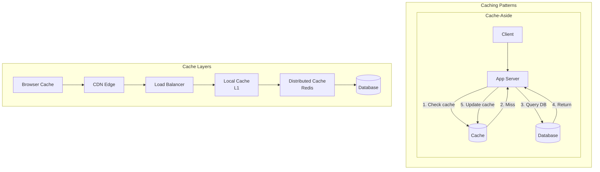

# Caching

## Overview

Caching reduces latency and database load by storing frequently accessed data in fast storage (RAM). Understanding caching is fundamental to almost every system design.

## What You Must Master

### 1. Cache Hit/Miss Flow

```
Without Cache:  Client → App Server → Database (100ms)
With Cache:     Client → App Server → Cache (1ms) ✓
                                    → Database (cache miss)
```

## Architecture Diagram



## Cache Strategies

### 1. Cache-Aside (Lazy Loading)
```
┌─────────────────────────────────────────────────┐
│  1. App checks cache                            │
│  2. If miss, read from DB                       │
│  3. Store in cache                              │
│  4. Return to client                            │
│                                                 │
│  Pros: Only caches what's needed                │
│  Cons: Cache miss penalty, stale data possible  │
└─────────────────────────────────────────────────┘
```

### 2. Write-Through
```
┌─────────────────────────────────────────────────┐
│  1. Write to cache                              │
│  2. Cache writes to DB (synchronously)          │
│  3. Return success                              │
│                                                 │
│  Pros: Cache always consistent                  │
│  Cons: Higher write latency                     │
└─────────────────────────────────────────────────┘
```

### 3. Write-Behind (Write-Back)
```
┌─────────────────────────────────────────────────┐
│  1. Write to cache                              │
│  2. Return success immediately                  │
│  3. Async write to DB (batched)                 │
│                                                 │
│  Pros: Low write latency                        │
│  Cons: Risk of data loss                        │
└─────────────────────────────────────────────────┘
```

### 4. Read-Through
```
┌─────────────────────────────────────────────────┐
│  Cache sits between app and DB                  │
│  Cache handles all DB interaction               │
│                                                 │
│  Pros: Simple app logic                         │
│  Cons: Cache is a dependency                    │
└─────────────────────────────────────────────────┘
```

## Eviction Policies

| Policy | Description | Use Case |
|--------|-------------|----------|
| **LRU** | Remove least recently used | General purpose |
| **LFU** | Remove least frequently used | Skewed access patterns |
| **FIFO** | Remove oldest entry | Simple, low overhead |
| **TTL** | Remove after time expires | Session data |
| **Random** | Remove random entry | When LRU overhead too high |

## Cache Invalidation

> "There are only two hard things in CS: cache invalidation and naming things."

### Strategies:
1. **TTL (Time-to-Live)**: Data expires after fixed time
2. **Event-driven**: Invalidate on data change
3. **Version-based**: Include version in key, increment on change
4. **Pub/Sub**: Subscribe to change events

## Common Problems

### Cache Stampede (Thundering Herd)
When cache expires, many requests hit DB simultaneously.

**Solutions:**
- Stagger TTLs (add random jitter)
- Lock while recomputing (only one request hits DB)
- Background refresh (refresh before expiry)

### Cache Penetration
Queries for non-existent data always miss cache and hit DB.

**Solutions:**
- Cache negative results (with short TTL)
- Bloom filter to check existence first

### Hot Key
Single key gets too many requests.

**Solutions:**
- Local cache in app servers
- Replicate hot key across cache nodes
- Shard hot key (key:0, key:1, ...)

## Implementation

Our implementation includes:
1. **LRU Cache** - Classic doubly-linked list + hashmap
2. **TTL LRU Cache** - LRU with expiration
3. **Concurrent Cache** - Thread-safe with DashMap

Run the demo:
```bash
cargo run --bin caching
```
