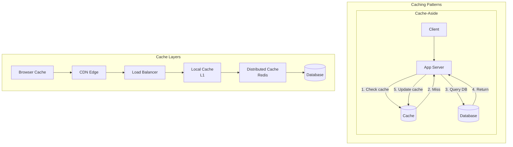

# Caching

## Overview

Caching reduces latency and database load by storing frequently accessed data in fast storage (RAM). Understanding caching is fundamental to almost every system design.

## What You Must Master

### 1. Cache Hit/Miss Flow

```
Without Cache:  Client → App Server → Database (100ms)
With Cache:     Client → App Server → Cache (1ms) ✓
                                    → Database (cache miss)
```

## Architecture Diagram



## Cache Strategies

### 1. Cache-Aside (Lazy Loading)
```
┌─────────────────────────────────────────────────┐
│  1. App checks cache                            │
│  2. If miss, read from DB                       │
│  3. Store in cache                              │
│  4. Return to client                            │
│                                                 │
│  Pros: Only caches what's needed                │
│  Cons: Cache miss penalty, stale data possible  │
└─────────────────────────────────────────────────┘
```

**Why "stale data possible"?** Cache and DB are updated independently. If another service writes directly to the DB, the cache still has the old value until it expires (TTL) or is explicitly invalidated.

```
t=0  Cache: "Alice"   DB: "Alice"     ← in sync
t=1  DB updated to "Alicia"           ← cache doesn't know!
t=2  Read → cache HIT → "Alice"       ← STALE (DB says "Alicia")
t=3  TTL expires → next read misses → fetches "Alicia" from DB → back in sync
```

The stale window = time between DB update and cache expiry. Fix with short TTL (60s), event-driven invalidation, or switch to write-through.

### 2. Write-Through
```
┌─────────────────────────────────────────────────┐
│  1. Write to cache                              │
│  2. Cache writes to DB (synchronously)          │
│  3. Return success                              │
│                                                 │
│  Pros: Cache always consistent                  │
│  Cons: Higher write latency                     │
└─────────────────────────────────────────────────┘
```

**Why "higher write latency"?** Every write must wait for BOTH cache + DB to confirm before returning to the client. If the DB takes 50ms, the write takes 50ms+ even though the cache is fast.

```
Cache-aside write:   update DB (50ms) → delete cache (1ms) → done (51ms)
Write-through write: update cache (1ms) → update DB (50ms) → done (51ms)
                     Same total time, but cache is ALWAYS fresh.
```

**When to use:** Data that's read immediately after writing (user profiles, settings). The extra write latency pays off because subsequent reads are guaranteed fresh.

### 3. Write-Behind (Write-Back)
```
┌─────────────────────────────────────────────────┐
│  1. Write to cache                              │
│  2. Return success immediately                  │
│  3. Async write to DB (batched)                 │
│                                                 │
│  Pros: Low write latency                        │
│  Cons: Risk of data loss                        │
└─────────────────────────────────────────────────┘
```

**Why "risk of data loss"?** The client gets "success" as soon as the cache is updated. The DB write happens later in a background job. If the server crashes before flushing to DB, that data is gone.

```
t=0  Write "score=100" → cache updated → return "success" to client
t=1  (server hasn't flushed to DB yet)
t=2  SERVER CRASHES
t=3  Restart → cache is empty, DB still has old value
     "score=100" is lost forever.
```

**When to use:** Non-critical data where speed matters more than durability — view counts, analytics events, like counters. Never for payments or orders.

### 4. Read-Through
```
┌─────────────────────────────────────────────────┐
│  Cache sits between app and DB                  │
│  Cache handles all DB interaction               │
│                                                 │
│  Pros: Simple app logic                         │
│  Cons: Cache is a dependency                    │
└─────────────────────────────────────────────────┘
```

**How it differs from cache-aside:** In cache-aside, YOUR CODE manages the cache (check, miss, fetch, populate). In read-through, the CACHE manages itself — your code just says `cache.get(key)` and the cache automatically fetches from DB on miss.

```
Cache-aside:   app → cache.get() → miss → app queries DB → app calls cache.set()
Read-through:  app → cache.get() → miss → cache queries DB → cache stores it → returns
               ↑ app doesn't know about the DB at all
```

**When to use:** When you want simpler application code. The cache acts as the primary data source. Downside: if the cache goes down, reads fail (it's in the critical path).

## Eviction Policies

| Policy | Description | Use Case |
|--------|-------------|----------|
| **LRU** | Remove least recently used | General purpose |
| **LFU** | Remove least frequently used | Skewed access patterns |
| **FIFO** | Remove oldest entry | Simple, low overhead |
| **TTL** | Remove after time expires | Session data |
| **Random** | Remove random entry | When LRU overhead too high |

## Cache Invalidation

> "There are only two hard things in CS: cache invalidation and naming things."

The core problem: when should you throw away cached data? Too early = unnecessary cache misses. Too late = stale data.

### Strategies:
1. **TTL (Time-to-Live)**: Data expires after fixed time
   - Simplest. Set TTL=60s → max staleness = 60 seconds.
   - Works for most cases. Twitter uses 60s TTL for timelines.

2. **Event-driven**: Invalidate on data change
   - DB write → publish event → cache subscriber deletes key
   - Staleness: milliseconds (event propagation time)
   - Requires a message bus (Kafka, Redis Pub/Sub)

3. **Version-based**: Include version in key, increment on change
   - Key: `user:42:v3` → update user → new key `user:42:v4`
   - Old version naturally ignored / evicted
   - Used by: CDN cache-busting (`style.abc123.css`)

4. **Pub/Sub**: Subscribe to change events
   - DB → change data capture (CDC) → Kafka → cache invalidator
   - Most robust for microservices (each service manages its own cache)

### Which to pick?
```
Simple app, low stakes:    TTL (just set it and forget)
Microservices:             Event-driven (CDC + Kafka)
CDN / static assets:       Version-based (content hash in URL)
Strong consistency needed:  Write-through (skip invalidation entirely)
```

## Common Problems

### Cache Stampede (Thundering Herd)
When a popular cache key expires, many requests arrive simultaneously,
ALL see a cache miss, and ALL hit the DB at the same time.

```
t=0   Cache key "trending:posts" expires (TTL)
t=0   Request 1 → miss → query DB
t=0   Request 2 → miss → query DB     (simultaneously!)
t=0   Request 3 → miss → query DB     (simultaneously!)
...   1000 requests all hammering DB for the SAME key
t=1   DB is overwhelmed, latency spikes to 5 seconds
      or DB crashes entirely → cascading failure
```

**Solutions:**
- **Stagger TTLs (add random jitter)**: TTL = 60s + random(0..6s). Keys expire at different times so they don't all miss at once.
- **Lock while recomputing**: first thread to miss acquires a lock. Other threads wait (or serve stale data). Only 1 DB query instead of 1000.
- **Background refresh**: refresh cache BEFORE it expires. A background job refreshes at 50s (before the 60s TTL). Users never see a miss.

### Cache Penetration
Queries for data that DOESN'T EXIST always miss cache and always hit DB.
An attacker can exploit this: send millions of requests for `user:999999999` — never cached, always goes to DB.

```
GET user:999999999 → cache miss → DB query → not found → NOT cached
GET user:999999999 → cache miss → DB query → not found → NOT cached
... millions of times → DB crushed by queries that all return nothing
```

**Solutions:**
- **Cache negative results**: `cache.set("user:999999999", NULL, TTL=30s)`. Next request hits cache, gets NULL, doesn't touch DB.
- **Bloom filter**: a space-efficient data structure that can tell you "definitely NOT in the DB" in O(1). Check bloom filter before querying DB. If it says no → return 404 immediately.

### Hot Key
One cache key gets a disproportionate amount of traffic. E.g., a viral tweet — millions of reads per second on one key.

```
Redis single server: ~100K ops/sec
Viral tweet: 1M reads/sec on key "tweet:viral123"
→ single Redis server can't handle it → falls over
```

**Solutions:**
- **Local cache in app servers**: each app server caches the value in-process (HashMap). 10 servers × 100K req/s each = 1M req/s, 0 Redis hits.
- **Replicate hot key**: copy the value to multiple Redis shards: `tweet:viral123:shard0`, `tweet:viral123:shard1`, etc. Spread the load.
- **Client-side TTL**: cache on the client for 1-5 seconds. 1M users × 1 req/5s = 200K req/s instead of 1M.

## Implementation

Our implementation includes:
1. **LRU Cache** - Classic doubly-linked list + hashmap
2. **TTL LRU Cache** - LRU with expiration
3. **Concurrent Cache** - Thread-safe with DashMap

Run the demo:
```bash
cargo run --bin caching
```
