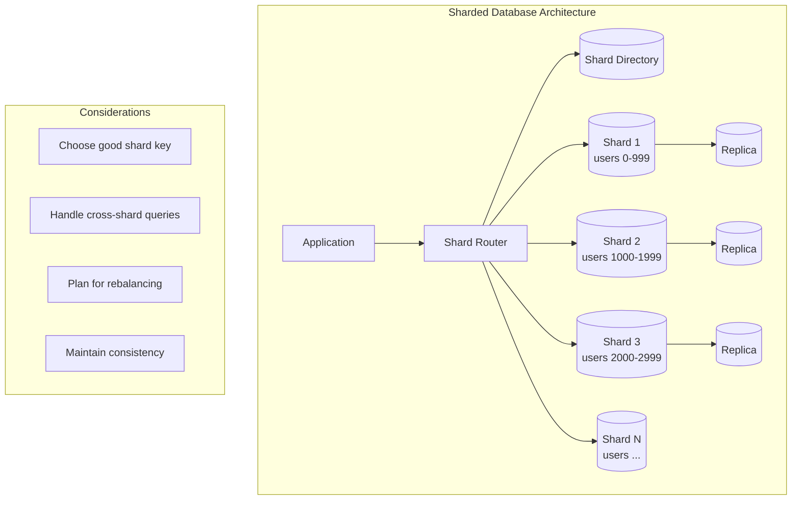

# Database Sharding

## Overview

Sharding (horizontal partitioning) splits data across multiple database servers. Each shard holds a subset of the data. This is essential for scaling beyond a single database server.

## What You Must Master

### 1. Why Sharding?

```
┌─────────────────────────────────────────────────────────────────────────┐
│                     When You Need Sharding                              │
│                                                                         │
│   Single DB limits:                                                     │
│   ├── Storage: ~10TB practical limit                                   │
│   ├── Connections: ~10K concurrent connections                         │
│   ├── Write throughput: ~100K writes/sec                               │
│   └── Query latency increases with data size                           │
│                                                                         │
│   Sharding enables:                                                     │
│   ├── Horizontal scaling (add more servers)                            │
│   ├── Higher throughput (parallel processing)                          │
│   ├── More storage (sum of all shards)                                 │
│   └── Better availability (shard isolation)                            │
└─────────────────────────────────────────────────────────────────────────┘
```

### 2. Sharding Strategies

## Strategy 1: Hash-Based Sharding

```
┌─────────────────────────────────────────────────────────────────────────┐
│                      Hash-Based Sharding                                │
│                                                                         │
│   shard_id = hash(user_id) % num_shards                                │
│                                                                         │
│   user_id=123 → hash(123) = 456789 → 456789 % 4 = shard 1             │
│   user_id=456 → hash(456) = 123456 → 123456 % 4 = shard 0             │
│                                                                         │
│   ┌─────────┐     ┌─────────┐     ┌─────────┐     ┌─────────┐         │
│   │ Shard 0 │     │ Shard 1 │     │ Shard 2 │     │ Shard 3 │         │
│   │user 456 │     │user 123 │     │   ...   │     │   ...   │         │
│   │user 888 │     │user 999 │     │         │     │         │         │
│   └─────────┘     └─────────┘     └─────────┘     └─────────┘         │
│                                                                         │
│   ✅ Pros: Even distribution                                           │
│   ❌ Cons: Adding shards remaps most keys!                             │
└─────────────────────────────────────────────────────────────────────────┘
```

## Strategy 2: Range-Based Sharding

```
┌─────────────────────────────────────────────────────────────────────────┐
│                      Range-Based Sharding                               │
│                                                                         │
│   Shard by ranges of the sharding key                                  │
│                                                                         │
│   ┌─────────────┐  ┌─────────────┐  ┌─────────────┐                    │
│   │   Shard 0   │  │   Shard 1   │  │   Shard 2   │                    │
│   │   A - H     │  │   I - P     │  │   Q - Z     │                    │
│   │ "Alice"     │  │ "John"      │  │ "Steve"     │                    │
│   │ "Bob"       │  │ "Kate"      │  │ "Zoe"       │                    │
│   └─────────────┘  └─────────────┘  └─────────────┘                    │
│                                                                         │
│   ✅ Pros: Range queries efficient, easy to add shards                 │
│   ❌ Cons: Hotspots if data is skewed (e.g., more J names)            │
└─────────────────────────────────────────────────────────────────────────┘
```

## Strategy 3: Directory-Based Sharding

```
┌─────────────────────────────────────────────────────────────────────────┐
│                    Directory-Based Sharding                             │
│                                                                         │
│   Lookup service maps keys to shards                                   │
│                                                                         │
│   ┌──────────────────────────────────┐                                 │
│   │       Shard Directory            │                                 │
│   │  ┌──────────┬─────────────────┐  │                                │
│   │  │   Key    │     Shard       │  │                                │
│   │  ├──────────┼─────────────────┤  │                                │
│   │  │  user_1  │  shard_a        │  │                                │
│   │  │  user_2  │  shard_b        │  │                                │
│   │  │  user_3  │  shard_a        │  │                                │
│   │  └──────────┴─────────────────┘  │                                │
│   └──────────────────────────────────┘                                 │
│              │                                                          │
│    ┌─────────┴─────────┐                                               │
│    ▼                   ▼                                                │
│  Shard A            Shard B                                            │
│                                                                         │
│   ✅ Pros: Flexible, can move data easily                              │
│   ❌ Cons: Single point of failure, extra lookup                       │
└─────────────────────────────────────────────────────────────────────────┘
```

## Architecture Diagram



### 3. Choosing the Shard Key

This is the **most critical decision** in sharding.

| Criteria | Good Key | Bad Key |
|----------|----------|---------|
| Cardinality | High (many unique values) | Low (few values) |
| Distribution | Even across shards | Skewed |
| Query patterns | Most queries include key | Queries need scatter-gather |
| Growth | Stable over time | Changes frequently |

### Examples

| System | Good Shard Key | Why |
|--------|---------------|-----|
| Twitter | user_id | Most queries are user-specific |
| E-commerce | order_id | Orders are independent |
| Multi-tenant SaaS | tenant_id | Data isolation |
| Chat | conversation_id | Messages stay together |
| Geo app | region | Locality |

### Bad Shard Keys

```
timestamp        → All new data goes to one shard (hotspot)
status          → Only few values, uneven distribution
auto_increment   → Sequential, all new data to last shard
```

## Cross-Shard Operations

The hard problem with sharding.

```
┌─────────────────────────────────────────────────────────────────────────┐
│                    Cross-Shard Query Problem                            │
│                                                                         │
│   Query: "Get all orders for user_123 in last 30 days"                 │
│   Sharded by: order_id                                                  │
│                                                                         │
│   ┌─────────┐    ┌─────────┐    ┌─────────┐    ┌─────────┐            │
│   │ Shard 1 │    │ Shard 2 │    │ Shard 3 │    │ Shard 4 │            │
│   │ query   │    │ query   │    │ query   │    │ query   │            │
│   └────┬────┘    └────┬────┘    └────┬────┘    └────┬────┘            │
│        │              │              │              │                   │
│        └──────────────┴──────────────┴──────────────┘                   │
│                              │                                          │
│                       ┌──────▼──────┐                                  │
│                       │   Merge &   │                                  │
│                       │    Sort     │                                  │
│                       └─────────────┘                                  │
│                                                                         │
│   This is expensive! Must be avoided if possible.                      │
│   Solution: Shard by user_id if user queries are common                │
└─────────────────────────────────────────────────────────────────────────┘
```

## Rebalancing Shards

When shards become uneven:

```
┌─────────────────────────────────────────────────────────────────────────┐
│                      Rebalancing Strategies                             │
│                                                                         │
│   1. Consistent Hashing                                                │
│      - Add virtual nodes on ring                                       │
│      - Only K/N keys move when adding node                             │
│      - Used by: DynamoDB, Cassandra                                    │
│                                                                         │
│   2. Dynamic Partitioning                                              │
│      - Split hot shards when too large                                 │
│      - Merge cold shards when too small                                │
│      - Used by: HBase, MongoDB                                         │
│                                                                         │
│   3. Fixed Partitions                                                  │
│      - Create more partitions than nodes                               │
│      - Move whole partitions between nodes                             │
│      - Used by: Elasticsearch, Kafka                                   │
└─────────────────────────────────────────────────────────────────────────┘
```

## Interview Checklist

- [ ] **When to shard**: Identify when single DB isn't enough
- [ ] **Shard key choice**: Pick based on access patterns
- [ ] **Strategy**: Hash vs Range vs Directory
- [ ] **Cross-shard queries**: How to minimize/handle
- [ ] **Rebalancing**: Plan for adding shards
- [ ] **Consistency**: How to maintain across shards
- [ ] **Failures**: What happens when a shard goes down

## Common Mistakes

❌ Sharding too early (premature optimization)
❌ Choosing low-cardinality shard key
❌ Not considering cross-shard query cost
❌ Forgetting about joins becoming expensive
❌ No plan for rebalancing

✅ "Let's first see if we can vertically scale..."
✅ "user_id is a good shard key because most queries are per-user"
✅ "Cross-shard queries would be needed for global leaderboards, but those are rare"

## Key Numbers to Know

| Metric | Single Node Limit | Sharded |
|--------|------------------|---------|
| Storage | ~10 TB | Unlimited |
| Connections | ~10K | ~10K per shard |
| Writes/sec | ~100K | ~100K per shard |
| Reads/sec | ~500K | ~500K per shard |

## Sharding vs Replication

```
Sharding:  Different data on different servers (scale writes)
Replication: Same data on different servers (scale reads, availability)

Usually used together:
┌─────────────────┐     ┌─────────────────┐
│    Shard 1      │     │    Shard 2      │
│ ┌─────┐ ┌─────┐ │     │ ┌─────┐ ┌─────┐ │
│ │Mastr│→│Repl │ │     │ │Mastr│→│Repl │ │
│ └─────┘ └─────┘ │     │ └─────┘ └─────┘ │
└─────────────────┘     └─────────────────┘
```
