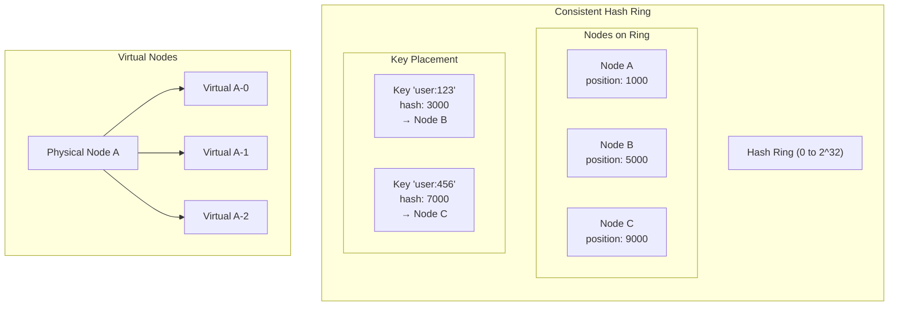

# Consistent Hashing

## Overview

Consistent hashing is a distributed systems technique that minimizes key remapping when nodes are added or removed. It's used in distributed caches, databases, and load balancers.

## What You Must Master

### 1. The Problem with Simple Hashing

Traditional hash-based sharding (`hash(key) % N`) has a fatal flaw:
when you add/remove servers, **almost all keys need to be remapped**.

```
Before: hash(key) % 3 = server 0, 1, or 2
After:  hash(key) % 4 = completely different mapping!
```

Consistent hashing solves this by only remapping `K/N` keys on average.

## Architecture Diagram



## How It Works

```
┌─────────────────────────────────────────────────────────┐
│                    Hash Ring (0 to 2^32)                │
│                                                         │
│                         Node A                          │
│                           ●                             │
│                      ╱         ╲                        │
│                 ╱                   ╲                   │
│            ●                           ●                │
│         Node D                       Node B             │
│            ╲                           ╱                │
│                 ╲                   ╱                   │
│                      ╲         ╱                        │
│                           ●                             │
│                         Node C                          │
│                                                         │
│   Key "user:123" → hash → lands between D and A → A     │
└─────────────────────────────────────────────────────────┘
```

## Virtual Nodes

Problem: With few physical nodes, keys can be unevenly distributed.

Solution: Each physical node gets multiple "virtual nodes" on the ring.

```
Physical Node A → Virtual: A-0, A-1, A-2, A-3, ...
Physical Node B → Virtual: B-0, B-1, B-2, B-3, ...
```

## Key Implementation Details

1. **Hash function**: Use MD5/SHA for uniform distribution
2. **Ring size**: Usually 2^32 (fits in u32)
3. **Virtual nodes**: 100-200 per physical node is common
4. **Lookup**: Binary search on sorted positions (O(log N))

## When to Use

- Distributed caches (Memcached, Redis Cluster)
- Load balancing (sticky sessions)
- Database sharding
- CDN edge selection

## Code Example

```rust
// Create ring with 3 nodes, 100 virtual nodes each
let mut ring = ConsistentHashRing::new(100);
ring.add_node("cache-1");
ring.add_node("cache-2");
ring.add_node("cache-3");

// Find which node handles a key
let node = ring.get_node("user:12345");  // Returns "cache-2"

// Remove a node - only ~33% of keys remap
ring.remove_node("cache-2");
```

## Interview Tips

1. **Draw the ring** - visualize hash space as a circle
2. **Explain virtual nodes** - solves uneven distribution
3. **Know the math**: adding 1 node to N remaps only 1/(N+1) keys
4. **Mention replication**: store on N consecutive nodes

Run the code:
```bash
cargo run --bin consistent-hashing
```
