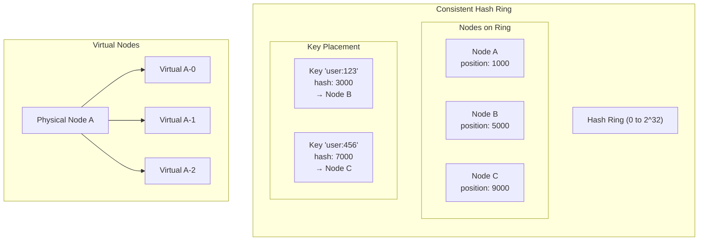

# Hashing — Comprehensive Guide

## Overview

Everything hash-related for system design and interviews — from the fundamentals
of hash functions to distributed hashing strategies, probabilistic structures,
spatial indexing, and integrity verification.

## Contents

| # | Module | What's Inside | Key Use Cases |
|---|--------|--------------|---------------|
| 1 | `hash_functions` | FNV-1a, DJB2, MurmurHash3, xxHash + avalanche/distribution tests | Hash table internals, choosing hash functions |
| 2 | `main.rs` (ring) | Consistent hash ring, virtual nodes, weighted, replication | Distributed caches, database sharding |
| 3 | `rendezvous` | Rendezvous / Highest Random Weight hashing | CDNs, load balancers, simpler alternative to rings |
| 4 | `jump_hash` | Google's Jump Consistent Hash | Numbered partitions, minimal memory |
| 5 | `maglev` | Google's Maglev hashing (O(1) lookup table) | Network load balancers, connection-level hashing |
| 6 | `probabilistic` | HyperLogLog, Count-Min Sketch, MinHash | Cardinality estimation, frequency counting, similarity |
| 7 | `geohash` | Geohash encode/decode, neighbors, spatial index | Location-based services, proximity search |
| 8 | `merkle` | Merkle tree, content-addressable storage, hash chains | Git, blockchain, anti-entropy, deduplication |

## When to Use What

```
Need to distribute keys across servers?
├─ Servers change frequently → Consistent Hash Ring (virtual nodes)
├─ Simple setup, < 1000 nodes → Rendezvous Hashing
├─ Sequential bucket numbers → Jump Consistent Hash
└─ Network load balancer, O(1) → Maglev Hashing

Need approximate counting?
├─ How many distinct users? → HyperLogLog
├─ How often does X appear? → Count-Min Sketch
└─ How similar are two sets? → MinHash / LSH

Need spatial queries?
└─ "Find nearby X" → Geohashing

Need data integrity / dedup?
├─ Verify data hasn't changed → Merkle Tree
├─ Deduplicate storage → Content-Addressable Storage
└─ Tamper-proof chain → Hash Chain
```

## Consistent Hashing — The Core Idea

Traditional hash-based sharding (`hash(key) % N`) breaks when you add/remove servers —
**almost all keys remap**. Consistent hashing solves this by only remapping `K/N` keys.

## Architecture Diagram



## How It Works

```
┌─────────────────────────────────────────────────────────┐
│                    Hash Ring (0 to 2^32)                │
│                                                         │
│                         Node A                          │
│                           ●                             │
│                      ╱         ╲                        │
│                 ╱                   ╲                   │
│            ●                           ●                │
│         Node D                       Node B             │
│            ╲                           ╱                │
│                 ╲                   ╱                   │
│                      ╲         ╱                        │
│                           ●                             │
│                         Node C                          │
│                                                         │
│   Key "user:123" → hash → lands between D and A → A     │
└─────────────────────────────────────────────────────────┘
```

## Virtual Nodes

Problem: With few physical nodes, keys can be unevenly distributed.

Solution: Each physical node gets multiple "virtual nodes" on the ring.

```
Physical Node A → Virtual: A-0, A-1, A-2, A-3, ...
Physical Node B → Virtual: B-0, B-1, B-2, B-3, ...
```

## Key Implementation Details

1. **Hash function**: Use MD5/SHA for uniform distribution
2. **Ring size**: Usually 2^32 (fits in u32)
3. **Virtual nodes**: 100-200 per physical node is common
4. **Lookup**: Binary search on sorted positions (O(log N))

## When to Use

- Distributed caches (Memcached, Redis Cluster)
- Load balancing (sticky sessions)
- Database sharding
- CDN edge selection

## Code Example

```rust
// Create ring with 3 nodes, 100 virtual nodes each
let mut ring = ConsistentHashRing::new(100);
ring.add_node("cache-1");
ring.add_node("cache-2");
ring.add_node("cache-3");

// Find which node handles a key
let node = ring.get_node("user:12345");  // Returns "cache-2"

// Remove a node - only ~33% of keys remap
ring.remove_node("cache-2");
```

## Interview Tips

1. **Draw the ring** - visualize hash space as a circle
2. **Explain virtual nodes** - solves uneven distribution
3. **Know the math**: adding 1 node to N remaps only 1/(N+1) keys
4. **Mention replication**: store on N consecutive nodes
5. **Know alternatives**: Rendezvous (simpler, no ring), Jump (zero memory), Maglev (O(1) lookup)
6. **HyperLogLog**: "count distinct users with 16KB memory and <1% error"
7. **Geohash**: "nearby queries by prefix matching"
8. **Merkle tree**: "efficiently detect which data blocks differ between replicas"

## Complexity Comparison

```
┌────────────────────┬──────────┬──────────┬──────────┬──────────────┐
│ Algorithm          │ Lookup   │ Add Node │ Memory   │ Balance      │
├────────────────────┼──────────┼──────────┼──────────┼──────────────┤
│ hash(k) % N        │ O(1)     │ O(K)     │ O(1)     │ Perfect      │
│ Consistent Ring    │ O(log V) │ O(V)     │ O(N·V)   │ Good w/ vnodes│
│ Rendezvous (HRW)  │ O(N)     │ O(1)     │ O(N)     │ Perfect      │
│ Jump Hash         │ O(ln N)  │ O(1)     │ O(1)     │ Perfect      │
│ Maglev            │ O(1)     │ O(M·N)   │ O(M)     │ Near-perfect │
└────────────────────┴──────────┴──────────┴──────────┴──────────────┘
N = nodes, V = virtual nodes per node, K = total keys, M = table size
```

Run the code:
```bash
cargo run --bin consistent-hashing
```
