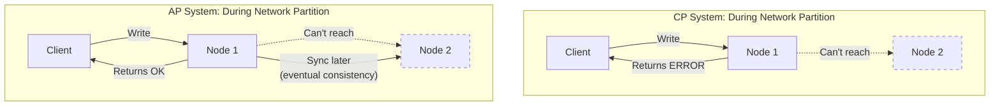

# CAP Theorem & Consistency Models

## Overview

CAP theorem is one of the most important concepts in distributed systems. Understanding it helps you make the right trade-offs when designing systems.

## What You Must Master

### 1. CAP Theorem Explained

```
┌─────────────────────────────────────────────────────────────────────────┐
│                         CAP Theorem                                     │
│                                                                         │
│   In a distributed system, you can only guarantee 2 of 3:             │
│                                                                         │
│                        Consistency                                      │
│                            ▲                                           │
│                           ╱ ╲                                          │
│                          ╱   ╲                                         │
│                         ╱     ╲                                        │
│                        ╱       ╲                                       │
│                       ╱    CA   ╲                                      │
│                      ╱  (single  ╲                                     │
│                     ╱   server)   ╲                                    │
│                    ╱               ╲                                   │
│                   ╱─────────────────╲                                  │
│                  ╱   CP        AP    ╲                                 │
│                 ╱  (MongoDB)  (Cass)  ╲                                │
│                ▼                       ▼                               │
│         Availability ◄─────────────► Partition Tolerance               │
│                                                                         │
│   Partition Tolerance = System works even if network splits            │
│   (In real distributed systems, P is non-negotiable)                   │
│                                                                         │
│   So the REAL choice is: Consistency OR Availability                   │
└─────────────────────────────────────────────────────────────────────────┘
```

### 2. What Each Property Means

| Property | Definition | In Practice |
|----------|------------|-------------|
| **Consistency** | All nodes see same data at same time | Read after write returns latest value |
| **Availability** | Every request gets a response | No timeouts or errors |
| **Partition Tolerance** | System works despite network failures | Network can drop/delay messages |

### 3. CP vs AP Trade-off

```
┌──────────────────────────────┬──────────────────────────────┐
│    CP (Consistency + P)      │    AP (Availability + P)     │
├──────────────────────────────┼──────────────────────────────┤
│ Rejects requests during      │ Accepts all requests         │
│ partition to ensure          │ May return stale data        │
│ consistency                  │ during partition             │
│                              │                              │
│ Examples:                    │ Examples:                    │
│ • MongoDB (default)          │ • Cassandra                  │
│ • HBase                      │ • DynamoDB                   │
│ • Zookeeper                  │ • CouchDB                    │
│ • Etcd                       │ • DNS                        │
│                              │                              │
│ Use when:                    │ Use when:                    │
│ • Banking, inventory         │ • Social media likes         │
│ • Leader election            │ • Shopping carts             │
│ • Distributed locks          │ • Caching                    │
└──────────────────────────────┴──────────────────────────────┘
```

## Architecture Diagram



## Consistency Models

### Strong Consistency

```
┌─────────────────────────────────────────────────────────────────────────┐
│                     Strong Consistency                                  │
│                                                                         │
│   Writer                     Readers                                   │
│   ┌───┐                      ┌───┐ ┌───┐ ┌───┐                        │
│   │ W │ ──write x=5──►       │ R │ │ R │ │ R │                        │
│   └───┘                      └─┬─┘ └─┬─┘ └─┬─┘                        │
│                                │     │     │                           │
│                           read x  read x  read x                       │
│                                │     │     │                           │
│                              ┌─▼─────▼─────▼─┐                         │
│                              │  ALL see 5    │                         │
│                              │  immediately  │                         │
│                              └───────────────┘                         │
│                                                                         │
│   Implementation: Synchronous replication, quorum writes               │
│   Cost: Higher latency, lower availability                             │
│   Use: Banking, inventory, critical transactions                       │
└─────────────────────────────────────────────────────────────────────────┘
```

### Eventual Consistency

```
┌─────────────────────────────────────────────────────────────────────────┐
│                    Eventual Consistency                                 │
│                                                                         │
│   Writer    Time=0     Time=1     Time=2     Time=3                    │
│   ┌───┐                                                                │
│   │ W │x=5   Node A: 5   Node A: 5   Node A: 5   Node A: 5            │
│   └───┘      Node B: 0   Node B: 0   Node B: 5   Node B: 5            │
│              Node C: 0   Node C: 0   Node C: 0   Node C: 5            │
│              ▲           ▲           ▲           ▲                     │
│              │           │           │           │                     │
│         Inconsistent  Propagating   Still...   All consistent!        │
│                                                                         │
│   "If no new updates, all replicas Eventually converge"               │
│                                                                         │
│   Implementation: Async replication, conflict resolution              │
│   Cost: May read stale data                                            │
│   Use: Social feeds, DNS, CDN cache                                    │
└─────────────────────────────────────────────────────────────────────────┘
```

### Read-Your-Writes Consistency

```
┌─────────────────────────────────────────────────────────────────────────┐
│                Read-Your-Writes Consistency                             │
│                                                                         │
│   User writes x=5                                                       │
│        │                                                                │
│        ▼                                                                │
│   Same user reads x                                                     │
│        │                                                                │
│        ▼                                                                │
│   MUST see 5 (their own write)                                         │
│                                                                         │
│   Other users may see stale data (that's OK)                           │
│                                                                         │
│   Implementation:                                                       │
│   • Read from the node you wrote to                                    │
│   • Or track write timestamp, ensure read is after                     │
│                                                                         │
│   Use: User profile updates, form submissions                          │
└─────────────────────────────────────────────────────────────────────────┘
```

## Consistency Levels Spectrum

```
Strong ◄────────────────────────────────────────────► Eventual
  │                                                        │
  │  • Linearizable                                        │
  │  • Sequential                                          │
  │      • Read-your-writes                                │
  │          • Monotonic reads                             │
  │              • Eventual                                │
  │                                                        │
  │  More consistent                      More available   │
  │  Higher latency                       Lower latency    │
  │  Lower throughput                     Higher throughput│
```

## PACELC Theorem

Extended version of CAP:

```
┌─────────────────────────────────────────────────────────────────────────┐
│                         PACELC                                          │
│                                                                         │
│   If there is a Partition (P):                                         │
│       Choose between Availability (A) and Consistency (C)              │
│                                                                         │
│   Else (E), when system is running normally:                           │
│       Choose between Latency (L) and Consistency (C)                   │
│                                                                         │
│   Examples:                                                             │
│   • DynamoDB: PA/EL (available during partition, low latency normally) │
│   • Cassandra: PA/EL                                                   │
│   • MongoDB: PC/EC (consistent always)                                 │
│   • Spanner: PC/EC (at cost of higher latency)                        │
└─────────────────────────────────────────────────────────────────────────┘
```

## Interview Checklist

- [ ] **Explain CAP**: What each letter means
- [ ] **Real trade-off**: It's really C vs A (P is required)
- [ ] **Examples**: Know which DBs are CP vs AP
- [ ] **Consistency models**: Strong, eventual, read-your-writes
- [ ] **When to choose**: Banking=CP, Social=AP
- [ ] **PACELC**: Extended trade-off during normal operation

## Common Interview Questions

### Q: "Is your system CP or AP?"

Good answer pattern:
```
"For the {X} service, we need CP because {reason - money/inventory}.
We'll use {DB} with synchronous replication.

For the {Y} service, AP is fine because {reason - can tolerate stale data}.
We'll use {DB} with eventual consistency."
```

### Q: "How do you handle network partitions?"

```
CP Approach:
- Reject writes to minority partition
- Return errors to users
- Resume when partition heals

AP Approach:
- Accept all writes
- Use version vectors/CRDTs for conflict resolution
- Merge conflicting writes after partition heals
```

## Key Concepts to Articulate

| Concept | One-Liner |
|---------|-----------|
| **Quorum** | Majority of replicas must agree (W+R > N) |
| **Split-brain** | Two nodes think they're leader during partition |
| **Vector clocks** | Track causality to detect conflicts |
| **CRDTs** | Data structures that auto-merge conflicts |
| **Consensus** | Agreement protocol (Paxos, Raft) |

## Real-World Examples

| System | Choice | Why |
|--------|--------|-----|
| Bank account | CP | Can't have wrong balance |
| Shopping cart | AP | Better to keep items than lose them |
| Session store | AP | User just logs in again |
| Inventory count | CP | Can't oversell |
| Like count | AP | Off by a few is fine |
| Leader election | CP | Must have exactly one leader |

## ACID vs BASE

CAP is about **distributed systems**. ACID is about **transactions** (usually single-node).
They're related: when you go distributed, you often trade ACID for BASE.

### ACID (Traditional Databases — PostgreSQL, MySQL)

```
┌─────────────────────────────────────────────────────────────────────────┐
│                            ACID                                         │
│                                                                         │
│   A — Atomicity                                                         │
│       All operations in a transaction succeed or ALL roll back.         │
│       Transfer $100: debit AND credit both happen, or neither.          │
│       No partial state.                                                 │
│                                                                         │
│   C — Consistency                                                       │
│       Transaction moves DB from one valid state to another.             │
│       Constraints (foreign keys, unique, CHECK) are always satisfied.   │
│       NOT the same "C" as in CAP.                                       │
│                                                                         │
│   I — Isolation                                                         │
│       Concurrent transactions don't interfere with each other.          │
│       As if they ran one at a time (serializable).                      │
│       Levels: READ UNCOMMITTED → READ COMMITTED → REPEATABLE READ      │
│               → SERIALIZABLE (strongest, slowest)                       │
│                                                                         │
│   D — Durability                                                        │
│       Once committed, data survives crashes (written to disk/WAL).      │
│       Even if power goes out 1ms after COMMIT.                          │
└─────────────────────────────────────────────────────────────────────────┘
```

### BASE (Distributed Databases — Cassandra, DynamoDB)

```
┌─────────────────────────────────────────────────────────────────────────┐
│                            BASE                                         │
│                                                                         │
│   BA — Basically Available                                              │
│        System always responds, even during failures.                    │
│        May return stale data, but never an error.                       │
│                                                                         │
│   S  — Soft state                                                       │
│        State may change over time, even without new writes.             │
│        Replicas are still converging in the background.                 │
│                                                                         │
│   E  — Eventually consistent                                            │
│        If no new writes, all replicas will eventually have same data.   │
│        "Eventually" = usually milliseconds, but no hard guarantee.      │
└─────────────────────────────────────────────────────────────────────────┘
```

### ACID vs BASE Comparison

| | ACID | BASE |
|---|------|------|
| **Model** | Pessimistic (lock, verify, commit) | Optimistic (write, fix conflicts later) |
| **Consistency** | Strong — read always returns latest write | Eventual — read may return stale data |
| **Availability** | May reject/block during contention | Always responds |
| **Scaling** | Vertical (bigger server) | Horizontal (more servers) |
| **Transactions** | Multi-row, multi-table | Usually single-row/partition |
| **Conflicts** | Prevented by locks | Detected and resolved after the fact |
| **Use when** | Correctness matters (money, inventory) | Availability matters (social feeds, caches) |

### The "C" in ACID ≠ the "C" in CAP

This confuses everyone:

| | ACID Consistency | CAP Consistency |
|---|---|---|
| **Means** | Data satisfies constraints (FK, unique, CHECK) | All nodes see the same data at the same time |
| **Scope** | Single database, single transaction | Distributed system, multiple replicas |
| **Example** | Can't insert order for non-existent user | Read from replica B returns what was just written to replica A |
| **Enforced by** | Database constraints | Replication protocol (Raft, 2PC) |

### Isolation Levels (the "I" in ACID, ranked)

```
  Weakest                                              Strongest
    │                                                      │
    ▼                                                      ▼
  READ          READ            REPEATABLE       SERIALIZABLE
  UNCOMMITTED   COMMITTED       READ
    │             │                │                  │
    │ Dirty       │ Non-          │ Phantom          │ Perfect
    │ reads       │ repeatable    │ reads            │ isolation
    │ possible    │ reads         │ possible         │ (slowest)
    │             │ possible      │                  │
    ▼             ▼               ▼                  ▼
  Fastest ─────────────────────────────────── Slowest

  Most DBs default to READ COMMITTED (PostgreSQL) or REPEATABLE READ (MySQL InnoDB).
  SERIALIZABLE is rarely used — too slow for most workloads.
```

## How databases implement SERIALIZABLE (three approaches):
1. ACTUAL SERIAL EXECUTION (simplest)
   Run one transaction at a time. Literally no concurrency.

   Queue: [T1] [T2] [T3] → execute one by one

   Used by: Redis (single-threaded), VoltDB
   Works because: transactions are fast (< 1ms).
   Doesn't work when: transactions are slow or do I/O.

2. TWO-PHASE LOCKING (2PL) — pessimistic
   Growing phase:  acquire locks on everything you touch (rows, ranges)
   Shrinking phase: release all locks at commit

   T1 locks row A → T2 wants row A → T2 BLOCKS until T1 commits.
   Guaranteed serializable but lots of BLOCKING + possible DEADLOCKS.

   Used by: MySQL InnoDB (when you explicitly request SERIALIZABLE)

3. SERIALIZABLE SNAPSHOT ISOLATION (SSI) — optimistic
   Let transactions run concurrently (no blocking!).
   Track what each transaction reads and writes.
   At commit: check if there was a conflict.
   If conflict detected → ABORT and retry one transaction.

   No blocking → higher throughput. But wasted work on aborts.

   Used by: PostgreSQL (SERIALIZABLE level), CockroachDB


WITHOUT TrueTime (traditional approaches):

  Option A: Lock everything (2PL)
    T1 locks row A → T2 BLOCKED → slow, deadlocks possible

  Option B: Optimistic (SSI)
    T1 and T2 both run → conflict detected at commit → one ABORTED → wasted work

  Both have a cost: blocking OR retries.


WITH TrueTime (Spanner's approach):

  No locks on reads. No aborts. Just timestamps.

  T1 starts at TrueTime [10:00:00.001, 10:00:00.005]
  T1 commits → assigned timestamp 10:00:00.005 (pick latest)
  T1 waits until TrueTime.earliest > 10:00:00.005 (~7ms), then commit
  → NOW we're certain: any future transaction ANYWHERE will have
    a timestamp > 10:00:00.005

  T2 starts after T1 finished (wall-clock reality)
  T2's timestamp = 10:00:00.013 (guaranteed > T1's 10:00:00.005)
  T2 reads data → sees T1's write (because T1's timestamp < T2's)

  Result: T1 ordered before T2. Always. On every replica. Globally.
  No locks. No aborts. Just time.

  ┌──────────────────────────────────────────────────────────────┐
  │                                                               │
  │  Traditional DB (PostgreSQL SERIALIZABLE):                    │
  │    T1 and T2 touch same row → one blocks or one aborts       │
  │    Throughput drops under contention                          │
  │                                                               │
  │  Spanner with TrueTime:                                       │
  │    T1 commits at timestamp 100                                │
  │    T2 commits at timestamp 107                                │
  │    Order is determined by timestamps, not locks               │
  │    Reads just check: "show me data as of timestamp T"         │
  │    → snapshot read, no locking needed                         │
  │                                                               │
  └──────────────────────────────────────────────────────────────┘

### When to use what

| Scenario | Model | Why |
|----------|-------|-----|
| Bank transfer | ACID + CP | Can't lose money or double-spend |
| Shopping cart | BASE + AP | Better to keep items than lose the cart |
| User profile | ACID (single-node) or BASE (multi-region) | Depends on scale |
| Analytics writes | BASE | High volume, eventual accuracy is fine |
| Inventory decrement | ACID | Can't oversell (negative stock) |
| Like/view counts | BASE | Off by a few is acceptable |
| Distributed config | CP + consensus (Raft) | All nodes must see same config |

---

## MVCC — How Databases Implement ACID Isolation

MVCC (Multi-Version Concurrency Control) is the **implementation mechanism** for the
**I (Isolation)** in ACID. It lets multiple transactions run concurrently without
interfering with each other — by keeping multiple versions of each row.

### The Problem MVCC Solves

```
Two transactions running at the same time:

  T1: Transfer $100 from Alice to Bob
      read(Alice) → $500, write(Alice, $400)
      read(Bob) → $200, write(Bob, $300)

  T2: Generate account report
      read(Alice) → ???, read(Bob) → ???
      report: total = Alice + Bob

  WITHOUT isolation:
    T2 reads Alice = $400 (after T1's write)
    T2 reads Bob   = $200 (before T1's write)
    Report: total = $600. But real total is $700!
    T2 saw a PARTIAL state of T1. WRONG.

  WITH LOCKS (old approach):
    T1 locks Alice and Bob rows.
    T2 tries to read Alice → BLOCKED until T1 finishes.
    CORRECT but SLOW. Readers block on writers.

  WITH MVCC (modern approach):
    T1 writes new VERSIONS: Alice_v2=$400, Bob_v2=$300
    T2 started before T1 committed → T2 sees the OLD versions:
      Alice_v1=$500, Bob_v1=$200
    Report: total = $700. CORRECT!
    T2 was NEVER blocked. Both ran in parallel.

  ┌──────────────────────────────────────────────────────────┐
  │  MVCC: writers create NEW versions, readers read OLD ones│
  │  Writers never block readers. Readers never block writers.│
  │  Each transaction sees a CONSISTENT SNAPSHOT of the data.│
  └──────────────────────────────────────────────────────────┘
```

### How MVCC Works (PostgreSQL Example)

```
PostgreSQL stores multiple versions of each row IN THE SAME TABLE:

  Table "accounts":
  ┌────────┬────────┬───────┬──────────┬──────────┐
  │ row_id │ name   │balance│ xmin     │ xmax     │
  ├────────┼────────┼───────┼──────────┼──────────┤
  │ 1      │ Alice  │ 500   │ txid=100 │ txid=200 │ ← old version (dead)
  │ 1      │ Alice  │ 400   │ txid=200 │ -        │ ← current version
  │ 2      │ Bob    │ 200   │ txid=100 │ txid=200 │ ← old version (dead)
  │ 2      │ Bob    │ 300   │ txid=200 │ -        │ ← current version
  └────────┴────────┴───────┴──────────┴──────────┘

  xmin = "created by transaction #"
  xmax = "deleted/replaced by transaction #" (- = still alive)

  Transaction 150 (started before T1=200):
    Visibility rule: show rows where xmin ≤ 150 AND (xmax is null OR xmax > 150)
    → Sees: Alice=$500, Bob=$200 (old versions). Consistent snapshot.

  Transaction 250 (started after T1=200 committed):
    → Sees: Alice=$400, Bob=$300 (new versions).

  Both reading at the SAME TIME. Neither blocks. This IS MVCC.
```

### How MVCC Provides Different Isolation Levels

```
MVCC doesn't give ONE isolation level — it implements different levels
depending on when you take the snapshot:

  READ COMMITTED (PostgreSQL default):
    New snapshot per STATEMENT.
    Each SELECT sees the latest committed data at that instant.
    Two SELECTs in the same transaction might see different data.

  REPEATABLE READ (MySQL InnoDB default):
    ONE snapshot for the entire TRANSACTION (taken at first read).
    All reads see data as of transaction start. Consistent view.
    Even if other transactions commit during yours, you don't see them.

  SERIALIZABLE (strongest):
    Like REPEATABLE READ + conflict detection.
    If your reads would be invalidated by concurrent writes → ABORT.
    PostgreSQL uses SSI (Serializable Snapshot Isolation) for this.
```

### How MVCC Fits Into Full ACID

```
┌──────────────┬──────────────────────────────────────────────────────┐
│ ACID property│ Implementation                                       │
├──────────────┼──────────────────────────────────────────────────────┤
│ Atomicity    │ WAL (Write-Ahead Log) + undo log.                   │
│ (all or      │ Crash mid-transaction → replay WAL, undo incomplete.│
│  nothing)    │ MVCC helps: abort = leave old version, mark new dead.│
│              │ No physical undo needed.                             │
├──────────────┼──────────────────────────────────────────────────────┤
│ Consistency  │ Constraint checks (PK, FK, UNIQUE, CHECK).         │
│ (valid state)│ MVCC not directly involved.                         │
├──────────────┼──────────────────────────────────────────────────────┤
│ Isolation    │ ★ MVCC ★                                            │
│ (no          │ Writers create new versions. Readers see old ones.  │
│  interference)│ Each transaction sees a consistent snapshot.        │
│              │ Readers never block writers. Writers never block readers.│
├──────────────┼──────────────────────────────────────────────────────┤
│ Durability   │ WAL + fsync.                                        │
│ (survives    │ WAL fsynced to disk before COMMIT returns.          │
│  crash)      │ MVCC not directly involved.                         │
└──────────────┴──────────────────────────────────────────────────────┘
```

### MVCC Cleanup — Why VACUUM Exists

```
MVCC creates old versions that pile up. Must clean them.

  PostgreSQL: VACUUM
    Old row versions where no active transaction can see them → dead.
    VACUUM removes dead rows, reclaims space. autovacuum runs in background.

  MySQL InnoDB: purge thread
    Undo log entries for old versions → purged automatically.

  etcd: COMPACTION
    Old revisions → deleted. Simpler (monotonic counter, no concurrent txns).

  The cost of MVCC:
    • Extra storage for old versions (table bloat)
    • Background cleanup needed (VACUUM / purge)
    • Long-running transactions prevent cleanup!
      T1 holds snapshot for 2 hours → ALL versions from those 2 hours
      can't be cleaned → table bloats → queries slow down.
      This is the #1 operational MVCC problem.
```

### MVCC vs Locking

```
┌──────────────────────┬──────────────────────┬─────────────────────┐
│                      │ MVCC                  │ Locking (2PL)       │
├──────────────────────┼──────────────────────┼─────────────────────┤
│ Readers block writers│ NO                   │ YES                 │
│ Writers block readers│ NO                   │ YES                 │
│ Writers block writers│ YES (same row)       │ YES                 │
│ Deadlocks            │ Rare (write-write)   │ Common              │
│ Storage overhead     │ Multiple versions    │ None (in-place)     │
│ Cleanup needed       │ Yes (VACUUM)         │ No                  │
│ Concurrency          │ HIGH                 │ LOW                 │
│ Used by              │ PostgreSQL, MySQL,   │ SQL Server (older), │
│                      │ Oracle, CockroachDB  │ some MySQL modes    │
└──────────────────────┴──────────────────────┴─────────────────────┘

MVCC won. Every modern database uses it.
```

---

## Data Integrity — What ACID Covers (and What It Doesn't)

ACID protects against **software-level failures**. But data corruption can happen
at every layer of the stack — disk, memory, filesystem, network. ACID alone is
NOT enough for full data integrity.

### What ACID Protects Against

```
┌──────────────────────────────────┬───────────┬─────────────────────────┐
│ Threat                           │ ACID?     │ What protects            │
├──────────────────────────────────┼───────────┼─────────────────────────┤
│ Partial write (crash mid-write)  │ YES (A+D) │ WAL + fsync. Atomicity  │
│                                  │           │ ensures all-or-nothing.  │
│ Constraint violation             │ YES (C)   │ PK, FK, UNIQUE, CHECK.  │
│ (invalid data inserted)          │           │ DB rejects bad data.     │
│ Concurrent modification          │ YES (I)   │ MVCC / locks prevent    │
│ (two writers corrupt each other) │           │ lost updates, dirty reads│
│ Power loss / crash               │ YES (D)   │ WAL fsynced before      │
│                                  │           │ COMMIT returns.          │
├──────────────────────────────────┼───────────┼─────────────────────────┤
│ Bit rot (silent disk corruption) │ NO        │ Checksums (ZFS, btrfs,  │
│                                  │           │ PG page checksums)       │
│ Disk sector failure              │ NO        │ RAID, replication        │
│ Torn page (partial page write)   │ PARTIALLY │ Full-page writes in WAL │
│                                  │           │ (PG), doublewrite (MySQL)│
│ Firmware bug (disk lies about    │ NO        │ Enterprise SSDs with    │
│ fsync — says flushed, didn't)    │           │ power-loss protection   │
│ Memory corruption (RAM bit flip) │ NO        │ ECC RAM                 │
│ Software bug (DB has a bug)      │ NO        │ Testing, backups        │
│ Malicious tampering              │ NO        │ Encryption, access ctrl │
└──────────────────────────────────┴───────────┴─────────────────────────┘
```

### What Durability ACTUALLY Guarantees

```
Durability says: "once COMMIT returns, the data survives a crash."

  HOW:
    1. Write changes to WAL (sequential append)
    2. fsync() the WAL to disk (force OS to flush to physical media)
    3. THEN return "COMMIT OK" to client
    4. Later: write data pages to disk (checkpoint)

  If crash AFTER commit: WAL has changes → replay on restart → recovered ✓
  If crash BEFORE commit: transaction never committed → discarded ✓

  Durability DOES protect against:
    ✓ Power loss, OS crash, database process crash
    ✓ Partial writes (WAL entries are checksummed)

  Durability does NOT protect against:
    ✗ Disk dies completely (need replication/backup)
    ✗ Silent data corruption on disk (need checksums)
    ✗ Data center fire (need geo-replication)
    ✗ Disk firmware lying about fsync (hardware trust issue)
```

### The Torn Page Problem

```
Database page = 8 KB (PostgreSQL) or 16 KB (MySQL InnoDB).
Disk sector = 4 KB. Writing 8 KB = two 4 KB disk writes.
Power dies between the two writes:

  Page before: [AAAA AAAA]  (8 KB, old data)
  Writing new: [BBBB BBBB]  (8 KB, new data)
  Power loss:  [BBBB AAAA]  (4 KB new + 4 KB old = TORN PAGE!)

  This page is CORRUPT. Neither old nor new.

  PostgreSQL fix: FULL PAGE WRITES
    First modification after checkpoint → write ENTIRE page to WAL.
    Torn on disk → restore full page from WAL.

  MySQL InnoDB fix: DOUBLEWRITE BUFFER
    Write pages to doublewrite buffer FIRST → then to actual location.
    Torn at actual location → recover from doublewrite buffer.
```

### Defense in Depth — The Full Stack

```
Real data integrity requires MULTIPLE layers. ACID is just one:

  ┌──────────────────────────────────────────────────────────────────┐
  │  Layer 1: APPLICATION                                            │
  │    Input validation, business logic.                             │
  │    "Amount must be positive. Can't transfer to yourself."        │
  │                                                                   │
  │  Layer 2: DATABASE (ACID)                                        │
  │    Constraints (PK, FK, UNIQUE, CHECK)         ← Consistency    │
  │    WAL + fsync                                  ← Atomicity + D  │
  │    MVCC                                         ← Isolation      │
  │    Page checksums, WAL checksums                ← corruption det │
  │                                                                   │
  │  Layer 3: FILESYSTEM                                             │
  │    ZFS / btrfs: checksums on every block, detect silent corruption│
  │    ext4: NO checksums by default. Silent corruption possible!    │
  │                                                                   │
  │  Layer 4: HARDWARE                                               │
  │    ECC RAM: detects + corrects single-bit memory errors.         │
  │    Enterprise SSDs: power-loss protection (capacitors flush cache)│
  │    RAID: survives individual disk failure.                        │
  │                                                                   │
  │  Layer 5: REPLICATION                                            │
  │    Streaming replication (PostgreSQL) → hot standby.             │
  │    Raft consensus (CockroachDB, etcd) → majority survives.      │
  │    Survives: machine failure, even data center failure.          │
  │                                                                   │
  │  Layer 6: BACKUPS                                                │
  │    Point-in-time recovery (PITR). Last resort.                   │
  │    Protects against: bugs, accidental deletes, ransomware.       │
  └──────────────────────────────────────────────────────────────────┘

  No single layer covers everything:
    ACID alone:  crash-safe but NOT disk-failure-safe
    + Checksums: detects corruption but can't FIX it
    + RAID:      survives 1 disk failure, not 2
    + Replication: survives machine failure, not software bug
    + Backups:   survives everything, but has recovery lag

  This is why production databases run ALL layers together.
```

---

## Separation of Storage and Compute

### The Problem — Coupled Architecture

```
Traditional database (PostgreSQL, MySQL, old Redshift):

  ┌──────────────────────────────────────────────┐
  │  Node 0                                       │
  │  ┌────────────────┐  ┌────────────────────┐  │
  │  │ COMPUTE (CPU)  │  │ STORAGE (local SSD)│  │
  │  │ query engine   │──│ data lives HERE     │  │
  │  │ 64 cores       │  │ 2 TB NVMe          │  │
  │  └────────────────┘  └────────────────────┘  │
  └──────────────────────────────────────────────┘

  Compute and storage are ON THE SAME MACHINE.
  They scale TOGETHER — you can't add more of one without the other.

  Problems:

  1. WASTED RESOURCES
     You need 10 TB of storage but only 8 CPU cores?
     Too bad — buy a big machine with CPU you won't use.
     You need 128 cores for a heavy query but only 500 GB data?
     Too bad — buy expensive storage you don't need.

     ┌───────────────────────────────────────────────────────┐
     │  "I need more storage" → must buy more compute too    │
     │  "I need more compute" → must buy more storage too    │
     │  You always pay for the resource you DON'T need.      │
     └───────────────────────────────────────────────────────┘

  2. IDLE COMPUTE IS EXPENSIVE
     Data warehouse cluster: 20 nodes × $10/hr = $200/hr.
     Analysts query 8 hours/day. Cluster idle 16 hours.
     Paying $200/hr × 16 hours = $3,200/day for NOTHING.

  3. SCALING IS SLOW
     Need more compute for Black Friday?
     Add nodes → must redistribute data across them (hours/days).
     Black Friday ends → remove nodes → redistribute again.

  4. STORAGE IS LIMITED BY NODE
     Single node max: ~10-50 TB.
     Need 500 TB? → 50 nodes minimum, even if you don't need 50 nodes of compute.
```

### The Solution — Separated Architecture

```
Modern systems (BigQuery, Snowflake, Databricks, Aurora, Neon):

  ┌──────────────────────┐     ┌──────────────────────────────┐
  │  COMPUTE              │     │  STORAGE                      │
  │  (stateless, elastic) │     │  (durable, always on)         │
  │                       │     │                               │
  │  ┌────┐ ┌────┐ ┌────┐│     │  S3 / GCS / Colossus / EBS   │
  │  │CPU ││CPU ││CPU ││     │                               │
  │  │ 0  ││ 1  ││ 2  ││     │  Stores: data files, WAL,     │
  │  └────┘ └────┘ └────┘│     │  metadata, indexes            │
  │                       │     │                               │
  │  Scale up/down in     │     │  Always available.            │
  │  seconds. Pay only    │     │  Pay per GB/month.            │
  │  when running queries.│     │  ($0.02/GB on S3)             │
  └───────────┬───────────┘     └──────────────┬───────────────┘
              │                                │
              └────────── NETWORK ─────────────┘
                   (fast: 10-100 Gbps)

  Compute nodes READ from remote storage over the network.
  They DON'T have local data (or use local SSD only as CACHE).

  SCALE INDEPENDENTLY:
    Need more compute? → spin up more CPU nodes (seconds).
    Need more storage? → just store more files on S3 (infinite).
    Neither affects the other.

  IDLE COMPUTE = FREE:
    No queries running? → zero compute nodes → $0 compute cost.
    Storage: still there, still costs $0.02/GB/month.
    Start a query → compute spins up → runs → spins down.
```

### How It Works — The Network Must Be Fast Enough

```
The obvious concern: "If data is REMOTE, won't reads be slow?"

  Local NVMe SSD:  ~3 GB/s, ~100 µs latency
  S3 / remote:     ~1 GB/s per stream, ~10 ms first-byte latency

  10-100x slower! How can this work?

  Answer: CACHING + PARALLELISM + COLUMNAR

  1. LOCAL SSD CACHE
     Compute node has local SSD, but uses it as a CACHE (not primary storage).
     First read: fetch from S3 (~10 ms). Cache on local SSD.
     Second read: local SSD (~100 µs). Same speed as coupled architecture.

     Hot data = cached = fast. Cold data = S3 = slower first time.

  2. MASSIVE PARALLELISM
     S3 is slow PER-stream but supports UNLIMITED parallel streams.
     Want 10 GB/s? → open 10 streams × 1 GB/s each.
     Want 100 GB/s? → 100 streams. S3 doesn't care.

     Traditional disk: limited by one machine's I/O bandwidth.
     S3: limited only by how many compute nodes you have.

  3. COLUMNAR FORMAT (Parquet)
     Query touches 3 columns out of 100?
     Read only those 3 columns from S3. Skip 97%.
     Even with S3 latency, reading 3% of the data is fast.

  4. PREDICATE PUSHDOWN
     Only need rows where date = '2024-07-15'?
     Parquet metadata tells you which files to skip.
     Maybe read 1% of all files. S3 latency on 1% is negligible.

  ┌──────────────────────────────────────────────────────────────┐
  │  Coupled (local SSD):                                        │
  │    Read 1 TB, 3 GB/s = 333 seconds. But from ONE disk.     │
  │                                                               │
  │  Separated (S3 + 100 parallel streams):                      │
  │    Read 1 TB, 100 × 1 GB/s = 10 seconds. Faster!           │
  │    + column pruning: read 30 GB instead of 1 TB = <1 second │
  │                                                               │
  │  Separation can actually be FASTER than local for analytics. │
  └──────────────────────────────────────────────────────────────┘
```

### Who Does What

```
┌────────────────────┬──────────────┬──────────────┬─────────────────────┐
│ System             │ Architecture │ Storage      │ How compute scales  │
├────────────────────┼──────────────┼──────────────┼─────────────────────┤
│ PostgreSQL         │ COUPLED      │ Local disk   │ Vertical (bigger    │
│ MySQL              │              │              │ machine)            │
│ Redis              │              │              │                     │
├────────────────────┼──────────────┼──────────────┼─────────────────────┤
│ BigQuery           │ SEPARATED    │ Colossus     │ Auto (per-query)    │
│ Snowflake          │              │ S3/Azure/GCS │ Manual (warehouses) │
│ Databricks (Spark) │              │ S3/ADLS/GCS  │ Auto/manual clusters│
│ Athena             │              │ S3           │ Auto (serverless)   │
│ Redshift Serverless│              │ Managed S3   │ Auto (serverless)   │
├────────────────────┼──────────────┼──────────────┼─────────────────────┤
│ Aurora             │ PARTIALLY    │ Shared storage│ Read replicas scale │
│ Neon (Postgres)    │ SEPARATED    │ layer (custom)│ Compute scales     │
│ CockroachDB        │              │ Separate but  │ independently      │
│ TiDB               │              │ coupled in node│(somewhat)         │
└────────────────────┴──────────────┴──────────────┴─────────────────────┘

Note: OLTP databases (PostgreSQL, MySQL) are HARDER to separate because:
  - They need sub-millisecond latency (S3's 10ms is too slow)
  - Random I/O patterns (not sequential scans like analytics)
  - Write-heavy (S3 writes are slow and expensive)

  This is why OLTP mostly stays coupled (local SSD).
  OLAP (analytics) is where separation shines.

  Aurora/Neon compromise: custom shared storage layer (not S3),
  optimized for OLTP patterns, faster than S3 but still separated.
```

### The Cost Comparison

```
Example: 10 TB data warehouse, analysts query 8 hours/day.

  COUPLED (old Redshift, on-prem):
    10 nodes × $3,000/month = $30,000/month
    Running 24/7 whether querying or not.
    Need more compute for month-end reports? Buy more nodes.
    Wait days for provisioning. Redistribute data.

  SEPARATED (Snowflake / BigQuery):
    Storage: 10 TB × $23/TB/month (S3) = $230/month
    Compute: 8 hours/day × $50/hour = $400/day × 30 = $12,000/month
    Total: ~$12,230/month (60% savings)

    Month-end reports need 10x compute?
    → Scale up for 2 days, scale back. Pay only for those 2 days.
    No data redistribution. Instant scaling.

  SERVERLESS (BigQuery on-demand, Athena):
    Storage: 10 TB × $23/TB/month = $230/month
    Compute: pay per query ($5/TB scanned)
    Light usage (scan 500 GB/day): $2.50/day × 30 = $75/month
    Total: ~$305/month (99% savings if usage is light!)

  ┌──────────────────────────────────────────────────────────┐
  │  The takeaway:                                            │
  │    Coupled:    pay for peak capacity 24/7.               │
  │    Separated:  pay for average usage.                    │
  │    Serverless: pay for actual usage.                     │
  │                                                           │
  │    Most workloads are bursty → separation saves 50-90%.  │
  └──────────────────────────────────────────────────────────┘
```

### When Separation Doesn't Work

```
  ✗ OLTP (PostgreSQL, MySQL):
    Need <1ms latency. S3 first-byte = 10ms. Too slow.
    Random reads (index lookups). S3 optimized for sequential.
    → Stay coupled. Local SSD is necessary.
    (Aurora/Neon: partial separation with custom fast storage layer.)

  ✗ Redis / in-memory stores:
    Data IS the compute (it's in RAM). Can't separate.
    Separation means "read from remote on every access" = defeats purpose.

  ✗ Very small datasets (<100 GB):
    The overhead of separation (network, caching, metadata) isn't worth it.
    Just put it all on one machine. PostgreSQL is fine.

  ✓ OLAP / Analytics:
    Sequential scans, column pruning, massive parallelism.
    Separation shines. BigQuery, Snowflake, Databricks.

  ✓ Data lakes:
    Storage = S3 (cheap, infinite). Compute = Spark/Trino (elastic).
    The original "separated" architecture.

  ✓ ML training data:
    Write once (dump to S3), read many times (GPU nodes pull data).
    3FS, Lustre, S3 — all separated storage + elastic compute.
```
