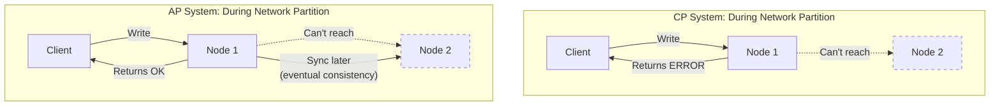

# CAP Theorem & Consistency Models

## Overview

CAP theorem is one of the most important concepts in distributed systems. Understanding it helps you make the right trade-offs when designing systems.

## What You Must Master

### 1. CAP Theorem Explained

```
┌─────────────────────────────────────────────────────────────────────────┐
│                         CAP Theorem                                     │
│                                                                         │
│   In a distributed system, you can only guarantee 2 of 3:             │
│                                                                         │
│                        Consistency                                      │
│                            ▲                                           │
│                           ╱ ╲                                          │
│                          ╱   ╲                                         │
│                         ╱     ╲                                        │
│                        ╱       ╲                                       │
│                       ╱    CA   ╲                                      │
│                      ╱  (single  ╲                                     │
│                     ╱   server)   ╲                                    │
│                    ╱               ╲                                   │
│                   ╱─────────────────╲                                  │
│                  ╱   CP        AP    ╲                                 │
│                 ╱  (MongoDB)  (Cass)  ╲                                │
│                ▼                       ▼                               │
│         Availability ◄─────────────► Partition Tolerance               │
│                                                                         │
│   Partition Tolerance = System works even if network splits            │
│   (In real distributed systems, P is non-negotiable)                   │
│                                                                         │
│   So the REAL choice is: Consistency OR Availability                   │
└─────────────────────────────────────────────────────────────────────────┘
```

### 2. What Each Property Means

| Property | Definition | In Practice |
|----------|------------|-------------|
| **Consistency** | All nodes see same data at same time | Read after write returns latest value |
| **Availability** | Every request gets a response | No timeouts or errors |
| **Partition Tolerance** | System works despite network failures | Network can drop/delay messages |

### 3. CP vs AP Trade-off

```
┌──────────────────────────────┬──────────────────────────────┐
│    CP (Consistency + P)      │    AP (Availability + P)     │
├──────────────────────────────┼──────────────────────────────┤
│ Rejects requests during      │ Accepts all requests         │
│ partition to ensure          │ May return stale data        │
│ consistency                  │ during partition             │
│                              │                              │
│ Examples:                    │ Examples:                    │
│ • MongoDB (default)          │ • Cassandra                  │
│ • HBase                      │ • DynamoDB                   │
│ • Zookeeper                  │ • CouchDB                    │
│ • Etcd                       │ • DNS                        │
│                              │                              │
│ Use when:                    │ Use when:                    │
│ • Banking, inventory         │ • Social media likes         │
│ • Leader election            │ • Shopping carts             │
│ • Distributed locks          │ • Caching                    │
└──────────────────────────────┴──────────────────────────────┘
```

## Architecture Diagram



## Consistency Models

### Strong Consistency

```
┌─────────────────────────────────────────────────────────────────────────┐
│                     Strong Consistency                                  │
│                                                                         │
│   Writer                     Readers                                   │
│   ┌───┐                      ┌───┐ ┌───┐ ┌───┐                        │
│   │ W │ ──write x=5──►       │ R │ │ R │ │ R │                        │
│   └───┘                      └─┬─┘ └─┬─┘ └─┬─┘                        │
│                                │     │     │                           │
│                           read x  read x  read x                       │
│                                │     │     │                           │
│                              ┌─▼─────▼─────▼─┐                         │
│                              │  ALL see 5    │                         │
│                              │  immediately  │                         │
│                              └───────────────┘                         │
│                                                                         │
│   Implementation: Synchronous replication, quorum writes               │
│   Cost: Higher latency, lower availability                             │
│   Use: Banking, inventory, critical transactions                       │
└─────────────────────────────────────────────────────────────────────────┘
```

### Eventual Consistency

```
┌─────────────────────────────────────────────────────────────────────────┐
│                    Eventual Consistency                                 │
│                                                                         │
│   Writer    Time=0     Time=1     Time=2     Time=3                    │
│   ┌───┐                                                                │
│   │ W │x=5   Node A: 5   Node A: 5   Node A: 5   Node A: 5            │
│   └───┘      Node B: 0   Node B: 0   Node B: 5   Node B: 5            │
│              Node C: 0   Node C: 0   Node C: 0   Node C: 5            │
│              ▲           ▲           ▲           ▲                     │
│              │           │           │           │                     │
│         Inconsistent  Propagating   Still...   All consistent!        │
│                                                                         │
│   "If no new updates, all replicas Eventually converge"               │
│                                                                         │
│   Implementation: Async replication, conflict resolution              │
│   Cost: May read stale data                                            │
│   Use: Social feeds, DNS, CDN cache                                    │
└─────────────────────────────────────────────────────────────────────────┘
```

### Read-Your-Writes Consistency

```
┌─────────────────────────────────────────────────────────────────────────┐
│                Read-Your-Writes Consistency                             │
│                                                                         │
│   User writes x=5                                                       │
│        │                                                                │
│        ▼                                                                │
│   Same user reads x                                                     │
│        │                                                                │
│        ▼                                                                │
│   MUST see 5 (their own write)                                         │
│                                                                         │
│   Other users may see stale data (that's OK)                           │
│                                                                         │
│   Implementation:                                                       │
│   • Read from the node you wrote to                                    │
│   • Or track write timestamp, ensure read is after                     │
│                                                                         │
│   Use: User profile updates, form submissions                          │
└─────────────────────────────────────────────────────────────────────────┘
```

## Consistency Levels Spectrum

```
Strong ◄────────────────────────────────────────────► Eventual
  │                                                        │
  │  • Linearizable                                        │
  │  • Sequential                                          │
  │      • Read-your-writes                                │
  │          • Monotonic reads                             │
  │              • Eventual                                │
  │                                                        │
  │  More consistent                      More available   │
  │  Higher latency                       Lower latency    │
  │  Lower throughput                     Higher throughput│
```

## PACELC Theorem

Extended version of CAP:

```
┌─────────────────────────────────────────────────────────────────────────┐
│                         PACELC                                          │
│                                                                         │
│   If there is a Partition (P):                                         │
│       Choose between Availability (A) and Consistency (C)              │
│                                                                         │
│   Else (E), when system is running normally:                           │
│       Choose between Latency (L) and Consistency (C)                   │
│                                                                         │
│   Examples:                                                             │
│   • DynamoDB: PA/EL (available during partition, low latency normally) │
│   • Cassandra: PA/EL                                                   │
│   • MongoDB: PC/EC (consistent always)                                 │
│   • Spanner: PC/EC (at cost of higher latency)                        │
└─────────────────────────────────────────────────────────────────────────┘
```

## Interview Checklist

- [ ] **Explain CAP**: What each letter means
- [ ] **Real trade-off**: It's really C vs A (P is required)
- [ ] **Examples**: Know which DBs are CP vs AP
- [ ] **Consistency models**: Strong, eventual, read-your-writes
- [ ] **When to choose**: Banking=CP, Social=AP
- [ ] **PACELC**: Extended trade-off during normal operation

## Common Interview Questions

### Q: "Is your system CP or AP?"

Good answer pattern:
```
"For the {X} service, we need CP because {reason - money/inventory}.
We'll use {DB} with synchronous replication.

For the {Y} service, AP is fine because {reason - can tolerate stale data}.
We'll use {DB} with eventual consistency."
```

### Q: "How do you handle network partitions?"

```
CP Approach:
- Reject writes to minority partition
- Return errors to users
- Resume when partition heals

AP Approach:
- Accept all writes
- Use version vectors/CRDTs for conflict resolution
- Merge conflicting writes after partition heals
```

## Key Concepts to Articulate

| Concept | One-Liner |
|---------|-----------|
| **Quorum** | Majority of replicas must agree (W+R > N) |
| **Split-brain** | Two nodes think they're leader during partition |
| **Vector clocks** | Track causality to detect conflicts |
| **CRDTs** | Data structures that auto-merge conflicts |
| **Consensus** | Agreement protocol (Paxos, Raft) |

## Real-World Examples

| System | Choice | Why |
|--------|--------|-----|
| Bank account | CP | Can't have wrong balance |
| Shopping cart | AP | Better to keep items than lose them |
| Session store | AP | User just logs in again |
| Inventory count | CP | Can't oversell |
| Like count | AP | Off by a few is fine |
| Leader election | CP | Must have exactly one leader |
