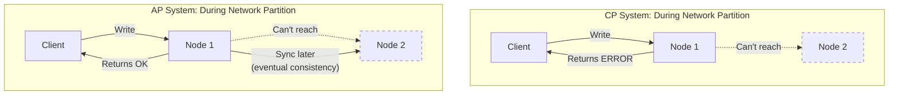

# CAP Theorem & Consistency Models

## Overview

CAP theorem is one of the most important concepts in distributed systems. Understanding it helps you make the right trade-offs when designing systems.

## What You Must Master

### 1. CAP Theorem Explained

```
┌─────────────────────────────────────────────────────────────────────────┐
│                         CAP Theorem                                     │
│                                                                         │
│   In a distributed system, you can only guarantee 2 of 3:             │
│                                                                         │
│                        Consistency                                      │
│                            ▲                                           │
│                           ╱ ╲                                          │
│                          ╱   ╲                                         │
│                         ╱     ╲                                        │
│                        ╱       ╲                                       │
│                       ╱    CA   ╲                                      │
│                      ╱  (single  ╲                                     │
│                     ╱   server)   ╲                                    │
│                    ╱               ╲                                   │
│                   ╱─────────────────╲                                  │
│                  ╱   CP        AP    ╲                                 │
│                 ╱  (MongoDB)  (Cass)  ╲                                │
│                ▼                       ▼                               │
│         Availability ◄─────────────► Partition Tolerance               │
│                                                                         │
│   Partition Tolerance = System works even if network splits            │
│   (In real distributed systems, P is non-negotiable)                   │
│                                                                         │
│   So the REAL choice is: Consistency OR Availability                   │
└─────────────────────────────────────────────────────────────────────────┘
```

### 2. What Each Property Means

| Property | Definition | In Practice |
|----------|------------|-------------|
| **Consistency** | All nodes see same data at same time | Read after write returns latest value |
| **Availability** | Every request gets a response | No timeouts or errors |
| **Partition Tolerance** | System works despite network failures | Network can drop/delay messages |

### 3. CP vs AP Trade-off

```
┌──────────────────────────────┬──────────────────────────────┐
│    CP (Consistency + P)      │    AP (Availability + P)     │
├──────────────────────────────┼──────────────────────────────┤
│ Rejects requests during      │ Accepts all requests         │
│ partition to ensure          │ May return stale data        │
│ consistency                  │ during partition             │
│                              │                              │
│ Examples:                    │ Examples:                    │
│ • MongoDB (default)          │ • Cassandra                  │
│ • HBase                      │ • DynamoDB                   │
│ • Zookeeper                  │ • CouchDB                    │
│ • Etcd                       │ • DNS                        │
│                              │                              │
│ Use when:                    │ Use when:                    │
│ • Banking, inventory         │ • Social media likes         │
│ • Leader election            │ • Shopping carts             │
│ • Distributed locks          │ • Caching                    │
└──────────────────────────────┴──────────────────────────────┘
```

## Architecture Diagram



## Consistency Models

### Strong Consistency

```
┌─────────────────────────────────────────────────────────────────────────┐
│                     Strong Consistency                                  │
│                                                                         │
│   Writer                     Readers                                   │
│   ┌───┐                      ┌───┐ ┌───┐ ┌───┐                        │
│   │ W │ ──write x=5──►       │ R │ │ R │ │ R │                        │
│   └───┘                      └─┬─┘ └─┬─┘ └─┬─┘                        │
│                                │     │     │                           │
│                           read x  read x  read x                       │
│                                │     │     │                           │
│                              ┌─▼─────▼─────▼─┐                         │
│                              │  ALL see 5    │                         │
│                              │  immediately  │                         │
│                              └───────────────┘                         │
│                                                                         │
│   Implementation: Synchronous replication, quorum writes               │
│   Cost: Higher latency, lower availability                             │
│   Use: Banking, inventory, critical transactions                       │
└─────────────────────────────────────────────────────────────────────────┘
```

### Eventual Consistency

```
┌─────────────────────────────────────────────────────────────────────────┐
│                    Eventual Consistency                                 │
│                                                                         │
│   Writer    Time=0     Time=1     Time=2     Time=3                    │
│   ┌───┐                                                                │
│   │ W │x=5   Node A: 5   Node A: 5   Node A: 5   Node A: 5            │
│   └───┘      Node B: 0   Node B: 0   Node B: 5   Node B: 5            │
│              Node C: 0   Node C: 0   Node C: 0   Node C: 5            │
│              ▲           ▲           ▲           ▲                     │
│              │           │           │           │                     │
│         Inconsistent  Propagating   Still...   All consistent!        │
│                                                                         │
│   "If no new updates, all replicas Eventually converge"               │
│                                                                         │
│   Implementation: Async replication, conflict resolution              │
│   Cost: May read stale data                                            │
│   Use: Social feeds, DNS, CDN cache                                    │
└─────────────────────────────────────────────────────────────────────────┘
```

### Read-Your-Writes Consistency

```
┌─────────────────────────────────────────────────────────────────────────┐
│                Read-Your-Writes Consistency                             │
│                                                                         │
│   User writes x=5                                                       │
│        │                                                                │
│        ▼                                                                │
│   Same user reads x                                                     │
│        │                                                                │
│        ▼                                                                │
│   MUST see 5 (their own write)                                         │
│                                                                         │
│   Other users may see stale data (that's OK)                           │
│                                                                         │
│   Implementation:                                                       │
│   • Read from the node you wrote to                                    │
│   • Or track write timestamp, ensure read is after                     │
│                                                                         │
│   Use: User profile updates, form submissions                          │
└─────────────────────────────────────────────────────────────────────────┘
```

## Consistency Levels Spectrum

```
Strong ◄────────────────────────────────────────────► Eventual
  │                                                        │
  │  • Linearizable                                        │
  │  • Sequential                                          │
  │      • Read-your-writes                                │
  │          • Monotonic reads                             │
  │              • Eventual                                │
  │                                                        │
  │  More consistent                      More available   │
  │  Higher latency                       Lower latency    │
  │  Lower throughput                     Higher throughput│
```

## PACELC Theorem

Extended version of CAP:

```
┌─────────────────────────────────────────────────────────────────────────┐
│                         PACELC                                          │
│                                                                         │
│   If there is a Partition (P):                                         │
│       Choose between Availability (A) and Consistency (C)              │
│                                                                         │
│   Else (E), when system is running normally:                           │
│       Choose between Latency (L) and Consistency (C)                   │
│                                                                         │
│   Examples:                                                             │
│   • DynamoDB: PA/EL (available during partition, low latency normally) │
│   • Cassandra: PA/EL                                                   │
│   • MongoDB: PC/EC (consistent always)                                 │
│   • Spanner: PC/EC (at cost of higher latency)                        │
└─────────────────────────────────────────────────────────────────────────┘
```

## Interview Checklist

- [ ] **Explain CAP**: What each letter means
- [ ] **Real trade-off**: It's really C vs A (P is required)
- [ ] **Examples**: Know which DBs are CP vs AP
- [ ] **Consistency models**: Strong, eventual, read-your-writes
- [ ] **When to choose**: Banking=CP, Social=AP
- [ ] **PACELC**: Extended trade-off during normal operation

## Common Interview Questions

### Q: "Is your system CP or AP?"

Good answer pattern:
```
"For the {X} service, we need CP because {reason - money/inventory}.
We'll use {DB} with synchronous replication.

For the {Y} service, AP is fine because {reason - can tolerate stale data}.
We'll use {DB} with eventual consistency."
```

### Q: "How do you handle network partitions?"

```
CP Approach:
- Reject writes to minority partition
- Return errors to users
- Resume when partition heals

AP Approach:
- Accept all writes
- Use version vectors/CRDTs for conflict resolution
- Merge conflicting writes after partition heals
```

## Key Concepts to Articulate

| Concept | One-Liner |
|---------|-----------|
| **Quorum** | Majority of replicas must agree (W+R > N) |
| **Split-brain** | Two nodes think they're leader during partition |
| **Vector clocks** | Track causality to detect conflicts |
| **CRDTs** | Data structures that auto-merge conflicts |
| **Consensus** | Agreement protocol (Paxos, Raft) |

## Real-World Examples

| System | Choice | Why |
|--------|--------|-----|
| Bank account | CP | Can't have wrong balance |
| Shopping cart | AP | Better to keep items than lose them |
| Session store | AP | User just logs in again |
| Inventory count | CP | Can't oversell |
| Like count | AP | Off by a few is fine |
| Leader election | CP | Must have exactly one leader |

## ACID vs BASE

CAP is about **distributed systems**. ACID is about **transactions** (usually single-node).
They're related: when you go distributed, you often trade ACID for BASE.

### ACID (Traditional Databases — PostgreSQL, MySQL)

```
┌─────────────────────────────────────────────────────────────────────────┐
│                            ACID                                         │
│                                                                         │
│   A — Atomicity                                                         │
│       All operations in a transaction succeed or ALL roll back.         │
│       Transfer $100: debit AND credit both happen, or neither.          │
│       No partial state.                                                 │
│                                                                         │
│   C — Consistency                                                       │
│       Transaction moves DB from one valid state to another.             │
│       Constraints (foreign keys, unique, CHECK) are always satisfied.   │
│       NOT the same "C" as in CAP.                                       │
│                                                                         │
│   I — Isolation                                                         │
│       Concurrent transactions don't interfere with each other.          │
│       As if they ran one at a time (serializable).                      │
│       Levels: READ UNCOMMITTED → READ COMMITTED → REPEATABLE READ      │
│               → SERIALIZABLE (strongest, slowest)                       │
│                                                                         │
│   D — Durability                                                        │
│       Once committed, data survives crashes (written to disk/WAL).      │
│       Even if power goes out 1ms after COMMIT.                          │
└─────────────────────────────────────────────────────────────────────────┘
```

### BASE (Distributed Databases — Cassandra, DynamoDB)

```
┌─────────────────────────────────────────────────────────────────────────┐
│                            BASE                                         │
│                                                                         │
│   BA — Basically Available                                              │
│        System always responds, even during failures.                    │
│        May return stale data, but never an error.                       │
│                                                                         │
│   S  — Soft state                                                       │
│        State may change over time, even without new writes.             │
│        Replicas are still converging in the background.                 │
│                                                                         │
│   E  — Eventually consistent                                            │
│        If no new writes, all replicas will eventually have same data.   │
│        "Eventually" = usually milliseconds, but no hard guarantee.      │
└─────────────────────────────────────────────────────────────────────────┘
```

### ACID vs BASE Comparison

| | ACID | BASE |
|---|------|------|
| **Model** | Pessimistic (lock, verify, commit) | Optimistic (write, fix conflicts later) |
| **Consistency** | Strong — read always returns latest write | Eventual — read may return stale data |
| **Availability** | May reject/block during contention | Always responds |
| **Scaling** | Vertical (bigger server) | Horizontal (more servers) |
| **Transactions** | Multi-row, multi-table | Usually single-row/partition |
| **Conflicts** | Prevented by locks | Detected and resolved after the fact |
| **Use when** | Correctness matters (money, inventory) | Availability matters (social feeds, caches) |

### The "C" in ACID ≠ the "C" in CAP

This confuses everyone:

| | ACID Consistency | CAP Consistency |
|---|---|---|
| **Means** | Data satisfies constraints (FK, unique, CHECK) | All nodes see the same data at the same time |
| **Scope** | Single database, single transaction | Distributed system, multiple replicas |
| **Example** | Can't insert order for non-existent user | Read from replica B returns what was just written to replica A |
| **Enforced by** | Database constraints | Replication protocol (Raft, 2PC) |

### Isolation Levels (the "I" in ACID, ranked)

```
  Weakest                                              Strongest
    │                                                      │
    ▼                                                      ▼
  READ          READ            REPEATABLE       SERIALIZABLE
  UNCOMMITTED   COMMITTED       READ
    │             │                │                  │
    │ Dirty       │ Non-          │ Phantom          │ Perfect
    │ reads       │ repeatable    │ reads            │ isolation
    │ possible    │ reads         │ possible         │ (slowest)
    │             │ possible      │                  │
    ▼             ▼               ▼                  ▼
  Fastest ─────────────────────────────────── Slowest

  Most DBs default to READ COMMITTED (PostgreSQL) or REPEATABLE READ (MySQL InnoDB).
  SERIALIZABLE is rarely used — too slow for most workloads.
```

## How databases implement SERIALIZABLE (three approaches):
1. ACTUAL SERIAL EXECUTION (simplest)
   Run one transaction at a time. Literally no concurrency.

   Queue: [T1] [T2] [T3] → execute one by one

   Used by: Redis (single-threaded), VoltDB
   Works because: transactions are fast (< 1ms).
   Doesn't work when: transactions are slow or do I/O.

2. TWO-PHASE LOCKING (2PL) — pessimistic
   Growing phase:  acquire locks on everything you touch (rows, ranges)
   Shrinking phase: release all locks at commit

   T1 locks row A → T2 wants row A → T2 BLOCKS until T1 commits.
   Guaranteed serializable but lots of BLOCKING + possible DEADLOCKS.

   Used by: MySQL InnoDB (when you explicitly request SERIALIZABLE)

3. SERIALIZABLE SNAPSHOT ISOLATION (SSI) — optimistic
   Let transactions run concurrently (no blocking!).
   Track what each transaction reads and writes.
   At commit: check if there was a conflict.
   If conflict detected → ABORT and retry one transaction.

   No blocking → higher throughput. But wasted work on aborts.

   Used by: PostgreSQL (SERIALIZABLE level), CockroachDB


WITHOUT TrueTime (traditional approaches):

  Option A: Lock everything (2PL)
    T1 locks row A → T2 BLOCKED → slow, deadlocks possible

  Option B: Optimistic (SSI)
    T1 and T2 both run → conflict detected at commit → one ABORTED → wasted work

  Both have a cost: blocking OR retries.


WITH TrueTime (Spanner's approach):

  No locks on reads. No aborts. Just timestamps.

  T1 starts at TrueTime [10:00:00.001, 10:00:00.005]
  T1 commits → assigned timestamp 10:00:00.005 (pick latest)
  T1 waits until TrueTime.earliest > 10:00:00.005 (~7ms), then commit
  → NOW we're certain: any future transaction ANYWHERE will have
    a timestamp > 10:00:00.005

  T2 starts after T1 finished (wall-clock reality)
  T2's timestamp = 10:00:00.013 (guaranteed > T1's 10:00:00.005)
  T2 reads data → sees T1's write (because T1's timestamp < T2's)

  Result: T1 ordered before T2. Always. On every replica. Globally.
  No locks. No aborts. Just time.

  ┌──────────────────────────────────────────────────────────────┐
  │                                                               │
  │  Traditional DB (PostgreSQL SERIALIZABLE):                    │
  │    T1 and T2 touch same row → one blocks or one aborts       │
  │    Throughput drops under contention                          │
  │                                                               │
  │  Spanner with TrueTime:                                       │
  │    T1 commits at timestamp 100                                │
  │    T2 commits at timestamp 107                                │
  │    Order is determined by timestamps, not locks               │
  │    Reads just check: "show me data as of timestamp T"         │
  │    → snapshot read, no locking needed                         │
  │                                                               │
  └──────────────────────────────────────────────────────────────┘

### When to use what

| Scenario | Model | Why |
|----------|-------|-----|
| Bank transfer | ACID + CP | Can't lose money or double-spend |
| Shopping cart | BASE + AP | Better to keep items than lose the cart |
| User profile | ACID (single-node) or BASE (multi-region) | Depends on scale |
| Analytics writes | BASE | High volume, eventual accuracy is fine |
| Inventory decrement | ACID | Can't oversell (negative stock) |
| Like/view counts | BASE | Off by a few is acceptable |
| Distributed config | CP + consensus (Raft) | All nodes must see same config |
