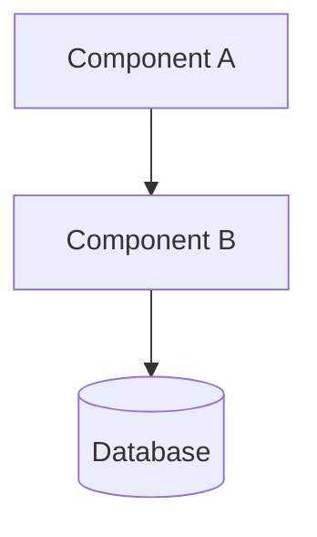
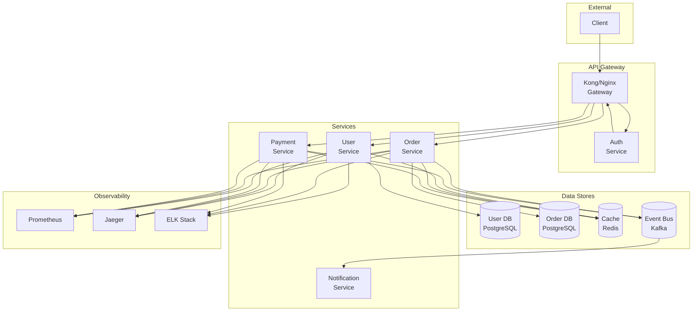
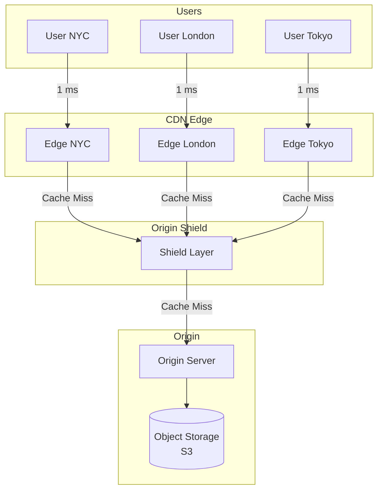

# Architecture Diagrams Index

Diagrams have been moved to each project's README for better organization.

## Where to Find Diagrams

### Core Concepts
| Topic | Location |
|-------|----------|
| Networking | [core-concepts/01-networking/README.md](../core-concepts/01-networking/README.md) |
| API Design | [core-concepts/02-api-design/README.md](../core-concepts/02-api-design/README.md) |
| Data Modeling | [core-concepts/03-data-modeling/README.md](../core-concepts/03-data-modeling/README.md) |
| Caching | [core-concepts/04-caching/README.md](../core-concepts/04-caching/README.md) |
| Sharding | [core-concepts/05-sharding/README.md](../core-concepts/05-sharding/README.md) |
| Consistent Hashing | [core-concepts/06-consistent-hashing/README.md](../core-concepts/06-consistent-hashing/README.md) |
| CAP Theorem | [core-concepts/07-cap-theorem/README.md](../core-concepts/07-cap-theorem/README.md) |
| Database Indexing | [core-concepts/08-database-indexing/README.md](../core-concepts/08-database-indexing/README.md) |

### Real Designs
| System | Location |
|--------|----------|
| URL Shortener | [real-designs/01-url-shortener/README.md](../real-designs/01-url-shortener/README.md) |
| Rate Limiter | [real-designs/02-rate-limiter/README.md](../real-designs/02-rate-limiter/README.md) |
| Distributed Cache | [real-designs/03-distributed-cache/README.md](../real-designs/03-distributed-cache/README.md) |
| Message Queue | [real-designs/04-message-queue/README.md](../real-designs/04-message-queue/README.md) |
| Web Crawler | [real-designs/05-web-crawler/README.md](../real-designs/05-web-crawler/README.md) |
| Key-Value Store | [real-designs/06-key-value-store/README.md](../real-designs/06-key-value-store/README.md) |
| Load Balancer | [real-designs/07-load-balancer/README.md](../real-designs/07-load-balancer/README.md) |
| Chat System | [real-designs/08-chat-system/README.md](../real-designs/08-chat-system/README.md) |
| News Feed | [real-designs/09-news-feed/README.md](../real-designs/09-news-feed/README.md) |
| Ticket Booking | [real-designs/10-ticket-booking/README.md](../real-designs/10-ticket-booking/README.md) |

### Key Technologies
| Technology | Location |
|------------|----------|
| Redis | [key-technologies/redis/README.md](../key-technologies/redis/README.md) |
| Kafka | [key-technologies/kafka/README.md](../key-technologies/kafka/README.md) |
| Elasticsearch | [key-technologies/elasticsearch/README.md](../key-technologies/elasticsearch/README.md) |
| ZooKeeper | [key-technologies/zookeeper/README.md](../key-technologies/zookeeper/README.md) |

## Diagram Types Used

All diagrams use **Mermaid** syntax for GitHub/VSCode rendering:



For complex systems, we also use ASCII art for terminal/text environments.
            end
        end
    end

    subgraph "Consumer Group"
        C1[Consumer 1<br/>P0]
        C2[Consumer 2<br/>P1]
    end

    subgraph Coordination
        ZK[(ZooKeeper)]
    end

    P1 & P2 --> B1_P0 & B2_P1
    B1_P0 --> B2_P0
    B2_P1 --> B3_P1
    B1_P0 --> C1
    B2_P1 --> C2
    B1_P0 & B2_P1 --> ZK
```

## Microservices Architecture



## CDN Architecture



## How to View These Diagrams

1. **VS Code**: Install "Markdown Preview Mermaid Support" extension
2. **GitHub**: Automatically renders Mermaid in markdown
3. **Online**: Use [mermaid.live](https://mermaid.live) to edit/view

## Color Legend

```
Blue boxes:     Services/Compute
Cylinders:      Databases/Storage
Diamonds:       Decision points
Dashed lines:   Async/WebSocket connections
Solid lines:    Sync/HTTP connections
```
