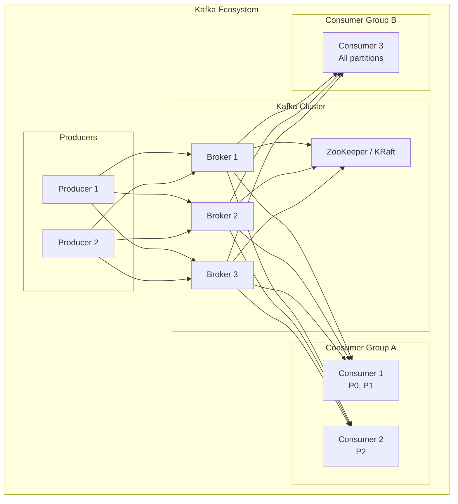

# Apache Kafka Deep Dive

## Overview

Kafka is a distributed event streaming platform. It's the backbone of modern data pipelines, real-time processing, and event-driven architectures. You MUST understand Kafka for staff+ interviews.

## Why Message Queues Exist — The System Design Motivation

The fundamental problem message queues solve: **what happens when two services
run at different speeds, or one goes down?**

Without a queue, services talk directly to each other — synchronous, coupled:

```
User clicks "Place Order"
  │
  ▼
Order Service ──HTTP──→ Payment Service ──HTTP──→ Inventory Service ──HTTP──→ Notification Service
                              │                         │                          │
                        If this is slow,          If this is down,          If this fails,
                        user waits.               entire order fails.       user never knows.

Problems:
  1. COUPLING: Order Service must know about Payment, Inventory, Notification.
     Add a new consumer (analytics)? Modify Order Service. N producers × M consumers = N×M connections.

  2. SPEED MISMATCH: Payment takes 2s, Inventory takes 50ms. The whole chain
     runs at the speed of the SLOWEST service. User waits for all of them.

  3. AVAILABILITY: If Inventory Service is down for 5 minutes, ALL orders fail
     for 5 minutes. Your uptime = product of ALL services' uptimes.
     99.9% × 99.9% × 99.9% = 99.7% — each service you add makes it worse.

  4. LOAD SPIKES: Black Friday, 10× normal traffic. Every downstream service
     must handle 10× or the whole system falls over.
```

A message queue decouples this into: **producer writes to the queue, consumer reads at its own pace**:

```
User clicks "Place Order"
  │
  ▼
Order Service ──write──→ [ Kafka: "orders" topic ]
                               │         │         │
                               ▼         ▼         ▼
                          Payment    Inventory   Notification
                          Service    Service     Service
                          (reads     (reads      (reads
                           when       when        when
                           ready)     ready)      ready)
```

This fixes **all four problems**:

```
1. DECOUPLING
   Order Service writes one message. Done. It doesn't know or care who reads it.
   Add analytics? Just add a new consumer group. Zero changes to Order Service.
   N producers + M consumers = N + M connections (not N × M).

2. ASYNC / SPEED MISMATCH (buffering)
   Order Service writes to Kafka in 5ms and returns 200 to the user.
   Payment can take 2 seconds — that's fine, it reads at its own pace.
   User doesn't wait. The queue BUFFERS the speed difference.

   Fast producer, slow consumer:
     Producer: ████████████████████ 1000 msg/s
     Queue:    [msg][msg][msg][msg][msg][msg]...  ← buffer grows
     Consumer: ████████ 500 msg/s                 ← catches up eventually

3. AVAILABILITY (resilience)
   Inventory Service down for 5 minutes? Messages sit in Kafka, waiting.
   When it comes back, it reads from where it left off. No data lost.
   Order Service never noticed.

   Without queue: downstream outage = YOUR outage
   With queue:    downstream outage = delayed processing (acceptable)

4. LOAD LEVELING (absorb spikes)
   Black Friday: 10× write spike.

   Without queue:
     Every service must instantly handle 10× or crash.

   With queue:
     Kafka absorbs the 10× burst (it's just appending to a log — fast).
     Consumers process at their max throughput.
     The queue depth grows during the spike, drains after.

     Traffic ▲
            │    ╱╲
            │   ╱  ╲  spike
            │  ╱    ╲
            │ ╱      ╲──────── consumer's steady pace
            │╱                  (queue drains the backlog)
            └──────────────→ time
```

There's also a fifth reason most people miss — **replay and event sourcing**:

```
5. REPLAYABILITY
   Traditional queue (RabbitMQ): message is DELETED after consumption.
   Kafka: messages are RETAINED (days/weeks/forever). Any consumer can
   re-read old messages by resetting its offset.

   Why this matters:
   - Deploy a buggy consumer that processes 100K messages wrong?
     Fix the bug, reset offset, replay. Try that with a delete-on-read queue.
   - Add a new analytics service 6 months later?
     It can read ALL historical events from Kafka. No backfill pipeline needed.
   - Event sourcing: the Kafka log IS your source of truth.
     Current state = replay all events from the beginning.
```

When you do **NOT** need Kafka:

```
- Request/response patterns (user needs an answer NOW) → use HTTP/gRPC
- Simple task queues with ≤1 consumer → Redis or SQS are simpler
- Small scale (<1K msg/s) → Kafka's operational overhead isn't worth it
- You need exactly one delivery with no duplicates and can't handle
  idempotency → queues make exactly-once hard
```

**The one-line summary**: A message queue turns a fragile chain of synchronous
calls into a resilient system where producers and consumers operate independently,
at different speeds, and survive each other's failures.

---

## History & Why It Exists

```
The problem (2010):
  LinkedIn had a mess of point-to-point data pipelines:
    App A → push to MySQL
    App B → push to Hadoop
    App C → push to monitoring
    Every new data consumer = new pipeline to build and maintain.
    N producers × M consumers = N×M connections. Unmaintainable.

  Existing messaging systems (RabbitMQ, ActiveMQ) couldn't handle:
    - Millions of messages per second (LinkedIn's scale)
    - Durable storage (messages disappear after consumption)
    - Replay (can't re-read old messages)
    - Horizontal scaling

  Jay Kreps, Neha Narkhede, and Jun Rao at LinkedIn built Kafka:
    A distributed commit log where producers APPEND events and
    consumers READ at their own pace. Messages are PERSISTENT
    (stored on disk, not deleted after reading) and REPLAYABLE.

  The insight: treat the MESSAGE LOG as the source of truth.
    Not a queue (consume-and-delete), but a LOG (append-and-keep).

Timeline:
  2010  Built at LinkedIn (named after author Franz Kafka)
  2011  Open-sourced
  2012  Apache top-level project
  2014  Confluent founded by Kafka creators (commercial support)
  2017  Kafka Streams (stream processing library)
  2018  KSQL/ksqlDB (SQL over Kafka streams)
  2023  KRaft mode replaces ZooKeeper (self-managed metadata)
  2024  Kafka 4.0 — ZooKeeper fully removed

Key design decisions that made Kafka fast:
  - Sequential I/O: append-only log, no random disk seeks
  - Zero-copy: sendfile() syscall, kernel sends data directly to NIC
  - Batching: messages grouped before network send
  - Partitioning: topics split across brokers for parallelism
  - Consumer pull model: consumers read at their own speed
  - Page cache: relies on OS page cache, not JVM heap

Who uses it:
  Every large tech company. Netflix (event processing), Uber (ride tracking),
  Airbnb (analytics pipeline), Goldman Sachs (trading), New York Times.
  LinkedIn processes 7+ trillion messages per day through Kafka.
```

## What You Must Master

### 1. Core Architecture

```
┌─────────────────────────────────────────────────────────────────────────┐
│                    Kafka Cluster Architecture                            │
│                                                                          │
│   ┌────────────────────────────────────────────────────────────────┐    │
│   │                         Topic: orders                           │    │
│   │                                                                 │    │
│   │   Partition 0    Partition 1    Partition 2                    │    │
│   │   ┌─────────┐    ┌─────────┐    ┌─────────┐                   │    │
│   │   │ 0 1 2 3 │    │ 0 1 2 3 │    │ 0 1 2 3 │                   │    │
│   │   └─────────┘    └─────────┘    └─────────┘                   │    │
│   │       │              │              │                          │    │
│   │       ▼              ▼              ▼                          │    │
│   │   Broker 1       Broker 2       Broker 3                       │    │
│   │   (Leader)       (Leader)       (Leader)                       │    │
│   │   P0 R1 R2       P1 R2 R0       P2 R0 R1                      │    │
│   │                                                                 │    │
│   │   P = Partition Leader, R = Replica                            │    │
│   └────────────────────────────────────────────────────────────────┘    │
│                                                                          │
│   Key concepts:                                                          │
│   • Topic: Category of messages (like a DB table)                       │
│   • Partition: Ordered, immutable log                                   │
│   • Offset: Position within partition                                   │
│   • Broker: Kafka server                                                │
│   • Producer: Writes messages                                           │
│   • Consumer: Reads messages                                            │
│   • Consumer Group: Parallel consumers                                  │
│                                                                          │
└─────────────────────────────────────────────────────────────────────────┘
```

### 2. Partitions & Ordering

```
┌─────────────────────────────────────────────────────────────────────────┐
│                    Partition Ordering Guarantees                         │
│                                                                          │
│   WITHIN a partition: Messages are strictly ordered                     │
│   ACROSS partitions: No ordering guarantee                              │
│                                                                          │
│   Partition 0: [msg1] [msg2] [msg3] → Ordered by offset                │
│   Partition 1: [msg4] [msg5] [msg6] → Ordered by offset                │
│                                                                          │
│   But msg1 and msg4? No guaranteed order!                              │
│                                                                          │
│   To ensure ordering:                                                    │
│   Use same partition key → hash(key) % partitions → same partition     │
│                                                                          │
│   Example:                                                               │
│   • Order events for user_123 → key="user_123" → always partition 2   │
│   • All user_123 events are ordered                                    │
│                                                                          │
└─────────────────────────────────────────────────────────────────────────┘
```

## Architecture Diagram



### 3. Consumer Groups

```
┌─────────────────────────────────────────────────────────────────────────┐
│                    Consumer Groups                                       │
│                                                                          │
│   Topic "orders" with 3 partitions                                      │
│                                                                          │
│   Consumer Group A (3 consumers):                                        │
│   ┌────────────┐  ┌────────────┐  ┌────────────┐                       │
│   │ Consumer 1 │  │ Consumer 2 │  │ Consumer 3 │                       │
│   │     P0     │  │     P1     │  │     P2     │                       │
│   └────────────┘  └────────────┘  └────────────┘                       │
│   → Each consumer gets 1 partition (perfect balance)                   │
│                                                                          │
│   Consumer Group A (2 consumers):                                        │
│   ┌────────────┐  ┌────────────┐                                        │
│   │ Consumer 1 │  │ Consumer 2 │                                        │
│   │   P0, P1   │  │     P2     │                                        │
│   └────────────┘  └────────────┘                                        │
│   → 1 consumer gets 2 partitions                                        │
│                                                                          │
│   Consumer Group A (4 consumers):                                        │
│   ┌───────┐ ┌───────┐ ┌───────┐ ┌───────┐                              │
│   │  C1   │ │  C2   │ │  C3   │ │  C4   │                              │
│   │  P0   │ │  P1   │ │  P2   │ │ IDLE! │                              │
│   └───────┘ └───────┘ └───────┘ └───────┘                              │
│   → 1 consumer is idle (more consumers than partitions)                │
│                                                                          │
│   Key insight: #consumers > #partitions → some consumers idle          │
│                                                                          │
└─────────────────────────────────────────────────────────────────────────┘
```

### 4. Delivery Semantics

```
┌─────────────────────────────────────────────────────────────────────────┐
│                    Delivery Guarantees                                   │
│                                                                          │
│   Producer Semantics(Write path):                                                    │
│   ┌─────────────────────────────────────────────────────────────────┐   │
│   │ acks=0  : Fire and forget (fastest, may lose data)             │   │
│   │ acks=1  : Leader acknowledged (default, may lose on failover)  │   │
│   │ acks=all: All replicas acknowledged (safest, slowest)          │   │
│   └─────────────────────────────────────────────────────────────────┘   │
│                                                                          │
│   Consumer Semantics(Read path):                                                    │
│   ┌─────────────────────────────────────────────────────────────────┐   │
│   │ At-most-once(<=1):  Commit offset BEFORE processing                 │   │
│   │                → May miss messages if crash during processing  │   │
│   │                                                                 │   │
│   │ At-least-once(>=1): Commit offset AFTER processing (default)        │   │
│   │                → May process duplicates if crash after process │   │
│   │                → Consumer must be IDEMPOTENT!                   │   │
│   │                                                                 │   │
│   │ Exactly-once(==1):  Transactional processing                        │   │
│   │                → Kafka transactions + idempotent producer      │   │
│   │                → Most complex, some performance overhead       │   │
│   └─────────────────────────────────────────────────────────────────┘   │
│                                                                          │
└─────────────────────────────────────────────────────────────────────────┘
```

### 5. Replication

```
┌─────────────────────────────────────────────────────────────────────────┐
│                    Replication Factor                                    │
│                                                                          │
│   replication.factor = 3                                                │
│                                                                          │
│   Partition 0:                                                           │
│   ┌─────────┐    ┌─────────┐    ┌─────────┐                            │
│   │ Broker1 │    │ Broker2 │    │ Broker3 │                            │
│   │ LEADER  │───►│Follower │───►│Follower │                            │
│   │    P0   │    │   P0    │    │   P0    │                            │
│   └─────────┘    └─────────┘    └─────────┘                            │
│                                                                          │
│   ISR (In-Sync Replicas):                                               │
│   • Replicas that are caught up with leader                            │
│   • Leader only considers message "committed" when all ISR have it     │
│   • min.insync.replicas = 2 → need 2 replicas to accept writes        │
│                                                                          │
│   Leader Election:                                                       │
│   • If leader fails, a follower in ISR becomes new leader              │
│   • Unclean leader election: Allow non-ISR as leader (data loss risk)  │
│                                                                          │
└─────────────────────────────────────────────────────────────────────────┘
```

## Common Use Cases

| Use Case | Why Kafka |
|----------|-----------|
| Event sourcing | Immutable log of events |
| Stream processing | With Kafka Streams / Flink |
| Log aggregation | Collect logs from services |
| Metrics pipeline | High throughput ingestion |
| Message queue | Decoupling services |
| CDC (Change Data Capture) | Database event streaming |
| Commit log | Replicating data between systems |

## Key Configuration

```properties
# Producer
acks=all                              # Durability
retries=3                             # Retry on transient failures
linger.ms=5                           # Batch for better throughput
batch.size=16384                      # 16KB batches

# Consumer
enable.auto.commit=false              # Manual commit for at-least-once
auto.offset.reset=earliest            # Start from beginning if no offset
max.poll.records=500                  # Batch size per poll
session.timeout.ms=30000              # Consumer heartbeat timeout

# Topic
retention.ms=604800000                # 7 days retention
replication.factor=3                  # 3 copies
min.insync.replicas=2                 # 2 must ack
```

## Interview Checklist

- [ ] **Partitions**: Ordering, parallelism, partition key
- [ ] **Consumer groups**: Partition assignment, rebalancing
- [ ] **Offsets**: How consumers track position
- [ ] **Delivery semantics**: At-most, at-least, exactly-once
- [ ] **Replication**: ISR, leader election
- [ ] **Retention**: Time-based vs size-based
- [ ] **When NOT to use**: Real-time queries (use Redis)

## Kafka vs Other Queues

| Feature | Kafka | RabbitMQ | SQS |
|---------|-------|----------|-----|
| Ordering | Per partition | Per queue | FIFO optional |
| Retention | Configurable | Until consumed | 14 days |
| Replay | ✅ Yes | ❌ No | ❌ No |
| Throughput | Very high | Medium | Medium |
| Exactly-once | ✅ Supported | ❌ No | ❌ No |

## Key Numbers

```
Throughput: 100K-2M messages/sec per broker (depends on message size)
Latency: 2-10ms (99th percentile)
Partitions: ~4000 per broker (practical limit)
Message size: Default 1MB max (can increase)
Retention: Days to months (storage dependent)
```
