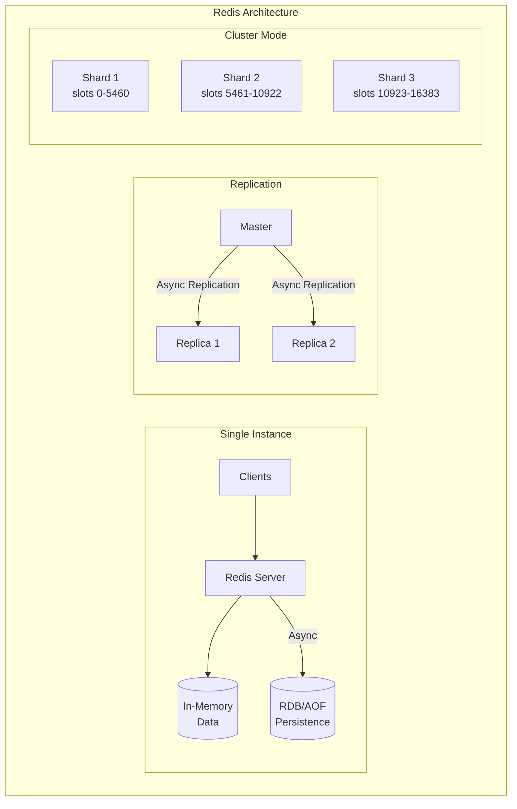

# Redis Deep Dive

## Overview

Redis (Remote Dictionary Server) is an in-memory data structure store used as cache, database, message broker, and session store. Understanding Redis internals is essential for staff+ level interviews.

## History & Why It Exists

```
The problem (2009):
  Salvatore Sanfilippo ("antirez") was building a real-time web
  analytics system. He needed to track millions of events per second
  with instant reads. MySQL was too slow.

  He built Redis: an in-memory data structure server.
  Not just a key-value cache — it supports RICH DATA STRUCTURES:
  strings, lists, sets, sorted sets, hashes, bitmaps, streams,
  HyperLogLogs — all operated on server-side with atomic commands.

  The key insight: memcached is just key-value strings.
  Redis gives you data structures, so you can do operations like
  "add to sorted set" or "increment hash field" atomically on the
  server, instead of read-modify-write from the client.

Timeline:
  2009  Salvatore Sanfilippo releases Redis
  2010  VMware sponsors Redis development
  2013  Redis Cluster (horizontal scaling, automatic sharding)
  2015  Redis Labs (now Redis Inc.) founded, becomes primary sponsor
  2018  Redis 5.0 (Streams — Kafka-like log data structure)
  2020  Redis 6.0 (ACLs, threaded I/O, SSL)
  2022  Redis 7.0 (functions, sharded pub/sub)
  2024  Redis license changes to dual SSPL/RSALv2 (not open source)
  2024  Valkey — Linux Foundation fork under BSD license

Redis vs Valkey (2024+):
  After Redis changed license, Linux Foundation forked it → Valkey.
  AWS, Google Cloud, Oracle back Valkey. API-compatible.
  Like the Elasticsearch → OpenSearch fork situation.
  In interviews, the concepts are identical. Say "Redis" unless asked.

Key design philosophy:
  - SINGLE-THREADED event loop: no locks, no race conditions
    (I/O threading added in 6.0, but core logic is still single-threaded)
  - EVERYTHING in memory: reads and writes in microseconds
  - Rich data structures: not just set/get, but ZADD, LPUSH, HINCRBY
  - Persistence is optional: RDB snapshots + AOF append-only file
  - Simplicity: ~100K lines of C, easy to reason about

Who uses it:
  Twitter, GitHub, StackOverflow, Pinterest, Snapchat,
  basically every web application uses Redis for caching.
```

## What You Must Master

| Concept | Why It Matters |
|---------|----------------|
| Data structures | Choose right structure for use case |
| Persistence (RDB/AOF) | Understand durability trade-offs |
| Replication | Master-replica for HA |
| Cluster mode | Sharding for scale |
| Pub/Sub | Real-time messaging |
| Lua scripts | Atomic operations |

## Architecture Diagram



## Why Redis is Fast

```
┌─────────────────────────────────────────────────────────────────┐
│                    Why Redis is Fast                             │
│                                                                  │
│  1. In-Memory Storage                                           │
│     └── No disk I/O for reads                                   │
│                                                                  │
│  2. Single-Threaded Event Loop                                  │
│     └── No lock contention, context switches                    │
│                                                                  │
│  3. Optimized Data Structures                                   │
│     └── Ziplist, intset, quicklist for small data              │
│                                                                  │
│  4. IO Multiplexing (epoll/kqueue)                             │
│     └── Handle thousands of connections efficiently             │
│                                                                  │
│  Typical: 100,000+ operations/second on single node            │
└─────────────────────────────────────────────────────────────────┘
```

## Data Structures

### 1. Strings
```redis
SET user:1:name "Alice"
GET user:1:name           # "Alice"
INCR page:views           # Atomic increment
SETEX session:abc 3600 "data"  # Expires in 1 hour
```

### 2. Hashes
```redis
HSET user:1 name "Alice" age 30 city "NYC"
HGET user:1 name          # "Alice"
HGETALL user:1            # name, Alice, age, 30, city, NYC
```

### 3. Lists (Linked List)
```redis
RPUSH queue:jobs "job1" "job2"  # Push right
LPOP queue:jobs                  # Pop left (FIFO queue)
BRPOP queue:jobs 0               # Blocking pop (for workers)
```

### 4. Sets
```redis
SADD user:1:friends 2 3 4
SADD user:2:friends 3 4 5
SINTER user:1:friends user:2:friends  # {3, 4}
```

### 5. Sorted Sets
```redis
ZADD leaderboard 100 "alice" 200 "bob" 150 "charlie"
ZRANGE leaderboard 0 -1 WITHSCORES   # alice, bob, charlie
ZRANK leaderboard "bob"              # 2 (0-indexed)
```

## Use Cases

### 1. Caching
```
┌─────────────────────────────────────────────────────────────────┐
│  App → Check Redis → Cache Hit? → Return                        │
│                    → Cache Miss → Query DB → Store in Redis     │
│                                                                  │
│  SET user:123 "{json}" EX 3600   # Cache for 1 hour            │
└─────────────────────────────────────────────────────────────────┘
```

### 2. Rate Limiting
```redis
# Sliding window rate limiter
INCR requests:user:123:minute
EXPIRE requests:user:123:minute 60
# If > limit, reject
```

### 3. Session Storage
```redis
SET session:abc123 "{user_id: 1, ...}" EX 86400
```

### 4. Pub/Sub
```redis
SUBSCRIBE channel:news
PUBLISH channel:news "Breaking news!"
```

### 5. Distributed Lock
```redis
SET lock:resource1 "owner1" NX PX 30000
# NX = only if not exists
# PX = expire in 30 seconds
```

### 6. Leaderboards
```redis
ZADD game:scores 1000 "player1" 850 "player2"
ZREVRANGE game:scores 0 9  # Top 10 players
```

## Persistence Options

| Mode | Description | Trade-offs |
|------|-------------|------------|
| **RDB** | Point-in-time snapshots | Fast restart, may lose recent data |
| **AOF** | Append log of every write | More durable, larger files |
| **Both** | Combined approach | Best durability |

## Redis Cluster

```
┌─────────────────────────────────────────────────────────────────┐
│                      Redis Cluster                               │
│                                                                  │
│  Hash Slots: 0-16383 distributed across masters                 │
│                                                                  │
│  ┌─────────┐     ┌─────────┐     ┌─────────┐                   │
│  │Master 1 │     │Master 2 │     │Master 3 │                   │
│  │Slots    │     │Slots    │     │Slots    │                   │
│  │0-5460   │     │5461-10922│    │10923-16383│                 │
│  └────┬────┘     └────┬────┘     └────┬────┘                   │
│       │              │              │                           │
│       ▼              ▼              ▼                           │
│  ┌─────────┐     ┌─────────┐     ┌─────────┐                   │
│  │Replica 1│     │Replica 2│     │Replica 3│                   │
│  └─────────┘     └─────────┘     └─────────┘                   │
│                                                                  │
│  Key → CRC16(key) % 16384 → slot → master                       │
└─────────────────────────────────────────────────────────────────┘
```
---

## Deep Internals

### Event Loop — How Single-Threaded Handles 100K+ ops/sec

```
Redis's core is a single-threaded event loop using epoll/kqueue
(same as Nginx, Node.js). ONE thread handles ALL commands.

  ┌──────────────────────────────────────────────────────────────┐
  │  Redis Main Loop (simplified):                                │
  │                                                               │
  │  loop {                                                       │
  │    // 1. Check for time events (expire keys, bgsave timer)   │
  │    process_time_events();                                     │
  │                                                               │
  │    // 2. Wait for I/O events (client data ready to read)     │
  │    ready_fds = epoll_wait(epfd, events, timeout);            │
  │                                                               │
  │    // 3. Process each ready connection                       │
  │    for fd in ready_fds {                                      │
  │      if fd.readable() {                                       │
  │        read_command(fd);    // read RESP protocol bytes       │
  │        execute_command(fd); // run GET/SET/ZADD etc.          │
  │        write_response(fd);  // send result back              │
  │      }                                                        │
  │    }                                                          │
  │                                                               │
  │    // 4. Handle background tasks (replication, AOF flush)    │
  │    before_sleep();                                            │
  │  }                                                            │
  │                                                               │
  │  WHY this is fast:                                           │
  │    - No lock contention (one thread, no mutexes ever)       │
  │    - No context switches (no thread scheduling overhead)    │
  │    - Commands are FAST (~1 µs each for simple ops)           │
  │    - 1 µs × 100K commands = 100 ms of work per second       │
  │      = 10% CPU utilization. Plenty of headroom.             │
  │                                                               │
  │  WHY single-threaded works:                                  │
  │    Redis is MEMORY-BOUND, not CPU-bound.                    │
  │    Each command: hash lookup + pointer follow + return.      │
  │    No disk I/O. No parsing (data is already in memory).     │
  │    A single core can do millions of hash lookups per second. │
  │                                                               │
  │  WHEN it doesn't work (CPU-bound commands):                 │
  │    KEYS * (scan all keys): O(N), blocks everything.         │
  │    Lua scripts with loops: blocks event loop.               │
  │    SORT on large sets: expensive computation.               │
  │    → These block ALL other clients. Avoid in production.    │
  └──────────────────────────────────────────────────────────────┘

Threaded I/O (Redis 6.0+):

  The event loop is still single-threaded for COMMAND EXECUTION.
  But network I/O (read bytes from socket, write bytes back) is offloaded
  to I/O threads:

  ┌──────────────────────────────────────────────────────────────┐
  │  I/O Thread 1: read bytes from clients 1-100                 │
  │  I/O Thread 2: read bytes from clients 101-200               │
  │  I/O Thread 3: read bytes from clients 201-300               │
  │  I/O Thread 4: read bytes from clients 301-400               │
  │       │ (parse RESP protocol, buffer the command)            │
  │       ▼                                                      │
  │  Main Thread: execute ALL commands sequentially (no locks!)  │
  │       │                                                      │
  │       ▼                                                      │
  │  I/O Thread 1-4: write responses back to clients             │
  │                                                               │
  │  The LOGIC is still single-threaded. Only the network        │
  │  read/write is parallelized. No data race possible.          │
  └──────────────────────────────────────────────────────────────┘
```

### Memory Encoding — Why Redis Uses Less RAM Than You'd Expect

```
Redis uses COMPACT ENCODINGS for small data structures.
The "public" data structure (list, hash, sorted set) has MULTIPLE
internal representations chosen by size:

  ┌──────────────────┬──────────────────────────────────────────────┐
  │ Public type      │ Internal encoding                            │
  ├──────────────────┼──────────────────────────────────────────────┤
  │ String           │ int (if fits in 64-bit) → 0 bytes overhead  │
  │                  │ embstr (≤44 bytes) → single allocation       │
  │                  │ raw (>44 bytes) → separate allocation        │
  │                  │                                               │
  │ List             │ listpack (≤128 elements, each ≤64 bytes)    │
  │                  │ quicklist (linked list of listpacks)         │
  │                  │                                               │
  │ Hash             │ listpack (≤128 fields, each ≤64 bytes)      │
  │                  │ hashtable (when large)                       │
  │                  │                                               │
  │ Set              │ intset (all integers, ≤512 elements)         │
  │                  │ listpack (small, ≤128 elements)              │
  │                  │ hashtable (when large)                       │
  │                  │                                               │
  │ Sorted Set      │ listpack (≤128 elements, each ≤64 bytes)    │
  │                  │ skiplist + hashtable (when large)            │
  └──────────────────┴──────────────────────────────────────────────┘

LISTPACK (formerly ziplist): THE key to Redis memory efficiency.

  A listpack is a CONTIGUOUS BYTE ARRAY that stores all entries
  sequentially. No pointers. No per-element allocation.

  Normal linked list for 5 elements:
    5 malloc'd nodes × (prev_ptr + next_ptr + value_ptr + value)
    = 5 × ~48 bytes = 240 bytes + allocator overhead

  Listpack for 5 elements:
    One contiguous byte array: [header][entry0][entry1]...[entry4][end]
    = ~60 bytes total. No pointers. No malloc overhead.
    4× less memory!

  ┌──────────────────────────────────────────────────────────────┐
  │  Listpack for HSET user:1 name "Alice" age "30":            │
  │                                                               │
  │  [total_bytes=28][num_entries=4]                              │
  │  [len=4]["name"][backlen][len=5]["Alice"][backlen]            │
  │  [len=3]["age"][backlen][len=2]["30"][backlen]                │
  │  [0xFF end marker]                                            │
  │                                                               │
  │  ALL in one contiguous allocation. ~28 bytes.                │
  │  A regular hash table with 2 entries: ~200+ bytes.           │
  │                                                               │
  │  Tradeoff: O(N) access (must scan). Fine for ≤128 entries.  │
  │  When it grows past 128: Redis converts to a real hash table.│
  └──────────────────────────────────────────────────────────────┘

SKIPLIST (for large sorted sets):

  Redis uses a skiplist (not a B+ tree) for sorted sets.
  Why? Easier to implement range queries and concurrent-friendly.

  Level 3:  H ─────────────────────────────────── T
  Level 2:  H ────── 3 ────────── 7 ──────────── T
  Level 1:  H ── 1 ── 3 ── 5 ── 7 ── 9 ── 11 ── T

  O(log N) lookup, insertion, deletion.
  Each sorted set also has a HASH TABLE for O(1) score lookup by member.
  ZRANGEBYSCORE: walk the skiplist. ZSCORE: hash table lookup.
```

### Persistence Internals — RDB and AOF

```
RDB (Redis Database Backup) — Point-in-time snapshot:

  ┌──────────────────────────────────────────────────────────────┐
  │  How BGSAVE works:                                            │
  │                                                               │
  │  1. Redis calls fork()                                       │
  │     → Child process: copy-on-write snapshot of ALL memory.   │
  │     → Parent: continues serving commands (no downtime!)      │
  │                                                               │
  │  2. Child serializes entire dataset to dump.rdb (binary).    │
  │     Iterates every key, writes type + key + value + expiry.  │
  │     Applies LZF compression per-entry.                       │
  │                                                               │
  │  3. Child writes to temp file, then atomic rename → dump.rdb.│
  │     Parent receives signal: "save done."                     │
  │                                                               │
  │  Copy-on-Write is critical:                                  │
  │    Parent modifies a page → OS copies it (4 KB) for child.  │
  │    Child still sees the OLD page (its snapshot at fork time).│
  │    If workload is read-heavy: almost no pages copied.        │
  │    If workload is write-heavy: pages copied = extra memory.  │
  │    Peak memory during BGSAVE: up to 2× (worst case, all     │
  │    pages modified while child is saving).                    │
  │                                                               │
  │  Recovery: load dump.rdb on startup. Fast (binary, bulk load)│
  │  Data loss: up to last_save_interval (e.g., 5 min) of writes.│
  └──────────────────────────────────────────────────────────────┘

AOF (Append-Only File) — Every write logged:

  ┌──────────────────────────────────────────────────────────────┐
  │  Every write command appended to appendonly.aof:              │
  │                                                               │
  │  *3\r\n$3\r\nSET\r\n$5\r\nhello\r\n$5\r\nworld\r\n        │
  │  *3\r\n$3\r\nSET\r\n$4\r\nname\r\n$5\r\nAlice\r\n         │
  │  *2\r\n$4\r\nINCR\r\n$7\r\ncounter\r\n                     │
  │  ...                                                          │
  │                                                               │
  │  fsync policies:                                              │
  │    always:    fsync after EVERY command (safest, slowest)    │
  │    everysec:  fsync once per second (default, ≤1s data loss) │
  │    no:        let OS decide (fastest, up to 30s data loss)   │
  │                                                               │
  │  AOF Rewrite (compaction):                                   │
  │    AOF grows forever (every SET key X is logged separately). │
  │    BGREWRITEAOF: fork, scan current state, write MINIMAL AOF.│
  │    Instead of: SET x 1, SET x 2, SET x 3 (3 entries)        │
  │    Rewritten:  SET x 3 (1 entry — just the final state)     │
  │    Same fork() + COW trick as BGSAVE.                        │
  │    New writes during rewrite → appended to a buffer,         │
  │    then spliced onto the new AOF after rewrite completes.    │
  └──────────────────────────────────────────────────────────────┘

  RDB vs AOF:
  ┌──────────────────┬──────────────────┬──────────────────────┐
  │                  │ RDB              │ AOF                   │
  ├──────────────────┼──────────────────┼──────────────────────┤
  │ Data loss        │ Minutes          │ ≤1 second (everysec)  │
  │ File size        │ Compact (binary) │ Large (text commands) │
  │ Recovery speed   │ Fast (bulk load) │ Slow (replay commands)│
  │ CPU during save  │ fork() overhead  │ fork() for rewrite    │
  │ Best for         │ Backups, replicas│ Durability            │
  └──────────────────┴──────────────────┴──────────────────────┘
```

### Replication — How Master-Replica Sync Works

```
Initial sync (full resynchronization):

  Replica connects → Master: "I need all your data"
  1. Master triggers BGSAVE (creates RDB in background).
  2. Master buffers ALL new writes in a replication backlog.
  3. BGSAVE completes → Master sends RDB file to replica.
  4. Replica loads RDB (discards its old data).
  5. Master sends buffered writes → replica applies them.
  6. Replica is now caught up. Enters streaming mode.

Streaming replication (ongoing):
  Every write command executed on master → sent to replicas.
  Replicas apply commands in order. Eventually consistent.
  Replication is ASYNCHRONOUS by default:
    Master returns OK to client BEFORE replica confirms.
    → If master crashes, recent writes may be lost.
    → WAIT command can make it semi-synchronous.

Partial resynchronization (after brief disconnect):
  Replica reconnects. Sends its last replication offset.
  Master checks: "is that offset still in my backlog buffer?"
  YES → send just the missed commands (partial sync). Fast.
  NO  → backlog overwritten. Must do full resync. Slow.

  ┌──────────────────────────────────────────────────────────────┐
  │  Replication backlog (ring buffer, default 1 MB):            │
  │                                                               │
  │  [cmd_5000][cmd_5001][cmd_5002]...[cmd_5999][cmd_6000]...   │
  │       ↑                                          ↑           │
  │   oldest in buffer                        newest (write ptr) │
  │                                                               │
  │  If replica disconnects for 2 seconds and master does 500 KB │
  │  of writes/sec: 1 MB backlog covers ~2 seconds.             │
  │  Reconnect within 2s → partial sync. Beyond → full resync.  │
  │                                                               │
  │  Tuning: increase repl-backlog-size if replicas often        │
  │  reconnect and trigger expensive full resyncs.               │
  └──────────────────────────────────────────────────────────────┘
```

### Cluster Internals — Gossip Protocol + Resharding

```
Redis Cluster uses a GOSSIP PROTOCOL for node discovery and failure detection:

  Every node:
    - Knows the full slot→node mapping (16384 slots)
    - Pings random nodes every second
    - Shares its view of cluster state in each ping

  Failure detection:
    Node A pings Node B → no response for cluster-node-timeout (15s default)
    → Node A marks B as PFAIL (possible failure)
    → Node A gossips to others: "I think B is down"
    → When MAJORITY of masters agree B is PFAIL → mark as FAIL
    → B's replica is promoted to master automatically

  Client routing:
    Client sends command to ANY node.
    If that node owns the slot: execute.
    If not: respond with MOVED <slot> <correct_node_ip:port>
    Client caches the mapping and sends directly next time.

    During resharding: respond with ASK (temporary redirect, don't cache).

Resharding (moving slots between nodes):

  Moving slot 1234 from Node A → Node B:
  1. Mark slot 1234 as MIGRATING on A, IMPORTING on B.
  2. For each key in slot 1234 on A:
     MIGRATE host port key 0 timeout → atomically moves to B.
  3. After all keys moved: update cluster config.
     Slot 1234 now belongs to B. All nodes notified via gossip.

  During migration:
    Client asks A for key in slot 1234:
      If key is still on A → serve it.
      If key already moved → respond ASK → client asks B.
    No downtime. Just some redirects during the migration window.
```

### Memory Management & Eviction

```
Redis keeps everything in memory. What happens when memory is full?

  maxmemory 4gb   ← configured limit
  maxmemory-policy allkeys-lru   ← what to evict

  Eviction policies:
  ┌─────────────────────────┬──────────────────────────────────────┐
  │ Policy                  │ Behavior                             │
  ├─────────────────────────┼──────────────────────────────────────┤
  │ noeviction              │ Return error on writes. Never delete.│
  │ allkeys-lru             │ Evict least recently used key.       │
  │ allkeys-lfu             │ Evict least frequently used key.     │
  │ volatile-lru            │ Evict LRU among keys WITH expiry set.│
  │ volatile-lfu            │ Evict LFU among keys WITH expiry set.│
  │ volatile-ttl            │ Evict key closest to expiring.       │
  │ allkeys-random          │ Evict random key.                    │
  │ volatile-random         │ Evict random key that has expiry set.│
  └─────────────────────────┴──────────────────────────────────────┘

  Redis LRU is APPROXIMATE (not exact):
    Exact LRU needs a linked list of all keys (expensive to maintain).
    Redis samples 5 random keys, evicts the one with oldest access time.
    Close enough to true LRU with O(1) overhead.
    Configurable: maxmemory-samples 10 (more samples = more accurate).

  LFU (Redis 4.0+):
    Each key has a frequency counter (logarithmic, fits in 8 bits).
    Counter decays over time (so old-hot keys don't stick forever).
    Better than LRU for workloads with uneven popularity.

Key expiration implementation:

  Two mechanisms working together:

  1. LAZY EXPIRATION:
     When you access a key: check its TTL. Expired? Delete it now.
     Keys never accessed can sit expired in memory forever...

  2. ACTIVE EXPIRATION (background, in event loop):
     Every 100ms: sample 20 random keys from the "expires" dict.
     Delete any that are expired.
     If >25% were expired: repeat immediately (keys expiring faster
     than sampling can find them).
     Stop when <25% of sample is expired (caught up).

  This probabilistic approach means:
    - No dedicated thread scanning all keys
    - ~99% of expired keys cleaned within a few seconds
    - Some expired keys linger briefly until sampled or accessed
```

### Pipelining — Why Batch Requests Are 10x Faster

```
Without pipelining (typical):

  Client: SET key1 value1 ──►  (wait for response)
  Server:                  ◄── OK
  Client: SET key2 value2 ──►  (wait for response)
  Server:                  ◄── OK
  Client: SET key3 value3 ──►  (wait for response)
  Server:                  ◄── OK

  3 commands × (1 RTT each) = 3 RTTs.
  If RTT = 0.5 ms: 3 × 0.5 = 1.5 ms for 3 commands.
  Throughput limited by network latency, not Redis speed.

With pipelining:

  Client: SET key1 value1 ──►
          SET key2 value2 ──►  (send all without waiting)
          SET key3 value3 ──►
  Server:                  ◄── OK
                           ◄── OK
                           ◄── OK (all responses come back together)

  3 commands in 1 RTT = 0.5 ms total. 3x faster!
  With 1000 commands pipelined: 1000 commands in 1 RTT.
  Throughput: 1,000,000+ ops/sec (limited by CPU, not network).

  Why Redis is often benchmarked at 100K ops/sec WITHOUT pipelining
  but 1M+ ops/sec WITH pipelining.
```

### Lua Scripts — Atomic Multi-Command Operations

```
Redis Lua scripts execute ATOMICALLY on the server:

  EVAL "
    local current = redis.call('GET', KEYS[1])
    if current == ARGV[1] then
      redis.call('SET', KEYS[1], ARGV[2])
      return 1
    end
    return 0
  " 1 mykey expected_value new_value

  This is a CAS (compare-and-swap) in one atomic operation.
  No other client can see the intermediate state.
  The entire script runs WITHOUT interruption in the event loop.

  WHY atomic: single-threaded. While Lua runs, nothing else does.
  WHY dangerous: if Lua loops forever → blocks ALL clients forever.
  Protection: lua-time-limit 5000 (kill after 5 seconds, but doesn't
  roll back — leaves partial state!)

  Redis 7.0 Functions: replace EVAL with registered functions.
  Same atomicity, but stored server-side (not sent each call).
```

### Streams — Kafka-Like Log in Redis

```
Streams (Redis 5.0+): append-only log with consumer groups.
Like a mini-Kafka, but in-memory, single-node.

  XADD mystream * sensor_id 1234 temperature 19.8
  XADD mystream * sensor_id 1234 temperature 20.1

  Stream entries:
    1609459200000-0: {sensor_id: 1234, temperature: 19.8}
    1609459200001-0: {sensor_id: 1234, temperature: 20.1}

  Consumer groups (like Kafka consumer groups):
    XGROUP CREATE mystream mygroup $ MKSTREAM
    XREADGROUP GROUP mygroup consumer1 COUNT 10 BLOCK 1000 STREAMS mystream >

  Features:
    - Persistent (survives restart via AOF/RDB)
    - Consumer groups with ACK (at-least-once delivery)
    - Multiple consumers in a group (load balancing)
    - Message IDs are timestamps (naturally ordered)
    - XTRIM for capping stream length (memory management)

  When to use streams vs Kafka:
    Streams: small-scale, low-latency, already using Redis, <10K msg/sec.
    Kafka: large-scale, durable, distributed, millions of msg/sec.
```

### Key Numbers (Internal Perspective)

```
Command execution:         ~1 µs (simple GET/SET)
Hash lookup:               ~100 ns (dict.c, hash table)
Skiplist lookup:           ~1-5 µs (O(log N), N elements)
Listpack scan:             ~500 ns (small, ≤128 entries)
fork() for BGSAVE:         ~10-100 ms (depending on dataset size)
  + COW pages during save: up to 2× peak memory
AOF rewrite:               same fork() cost as BGSAVE
Replication lag:           ~1 ms (same datacenter, async)
Cluster redirect (MOVED):  1 extra RTT (then client caches)
Pipelining gain:           10-50× throughput (amortize RTT)
Memory per key overhead:   ~50-70 bytes (dict entry + expiry + LRU clock)
Listpack entry overhead:   ~5-10 bytes per entry (vs ~50 bytes in hash table)
```
