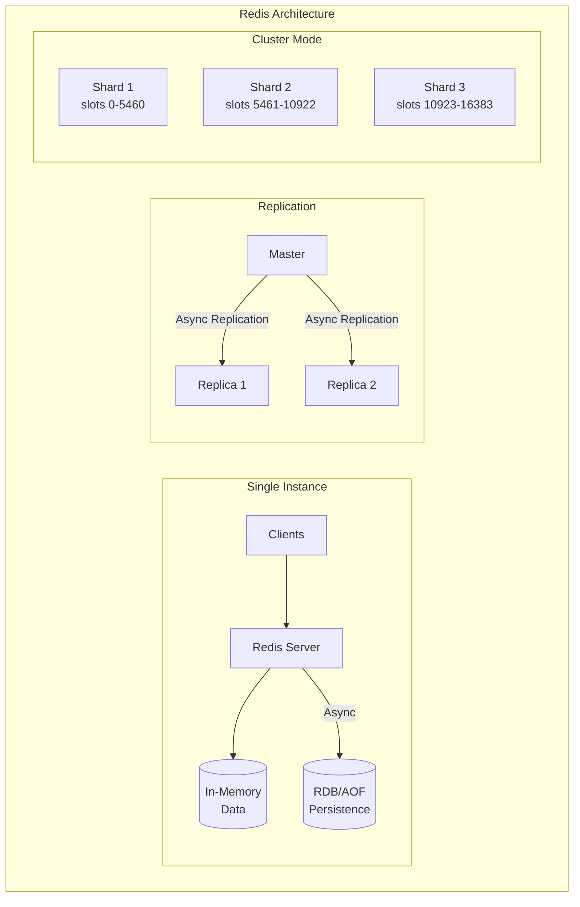

# Redis Deep Dive

## Overview

Redis (Remote Dictionary Server) is an in-memory data structure store used as cache, database, message broker, and session store. Understanding Redis internals is essential for staff+ level interviews.

## History & Why It Exists

```
The problem (2009):
  Salvatore Sanfilippo ("antirez") was building a real-time web
  analytics system. He needed to track millions of events per second
  with instant reads. MySQL was too slow.

  He built Redis: an in-memory data structure server.
  Not just a key-value cache — it supports RICH DATA STRUCTURES:
  strings, lists, sets, sorted sets, hashes, bitmaps, streams,
  HyperLogLogs — all operated on server-side with atomic commands.

  The key insight: memcached is just key-value strings.
  Redis gives you data structures, so you can do operations like
  "add to sorted set" or "increment hash field" atomically on the
  server, instead of read-modify-write from the client.

Timeline:
  2009  Salvatore Sanfilippo releases Redis
  2010  VMware sponsors Redis development
  2013  Redis Cluster (horizontal scaling, automatic sharding)
  2015  Redis Labs (now Redis Inc.) founded, becomes primary sponsor
  2018  Redis 5.0 (Streams — Kafka-like log data structure)
  2020  Redis 6.0 (ACLs, threaded I/O, SSL)
  2022  Redis 7.0 (functions, sharded pub/sub)
  2024  Redis license changes to dual SSPL/RSALv2 (not open source)
  2024  Valkey — Linux Foundation fork under BSD license

Redis vs Valkey (2024+):
  After Redis changed license, Linux Foundation forked it → Valkey.
  AWS, Google Cloud, Oracle back Valkey. API-compatible.
  Like the Elasticsearch → OpenSearch fork situation.
  In interviews, the concepts are identical. Say "Redis" unless asked.

Key design philosophy:
  - SINGLE-THREADED event loop: no locks, no race conditions
    (I/O threading added in 6.0, but core logic is still single-threaded)
  - EVERYTHING in memory: reads and writes in microseconds
  - Rich data structures: not just set/get, but ZADD, LPUSH, HINCRBY
  - Persistence is optional: RDB snapshots + AOF append-only file
  - Simplicity: ~100K lines of C, easy to reason about

Who uses it:
  Twitter, GitHub, StackOverflow, Pinterest, Snapchat,
  basically every web application uses Redis for caching.
```

## What You Must Master

| Concept | Why It Matters |
|---------|----------------|
| Data structures | Choose right structure for use case |
| Persistence (RDB/AOF) | Understand durability trade-offs |
| Replication | Master-replica for HA |
| Cluster mode | Sharding for scale |
| Pub/Sub | Real-time messaging |
| Lua scripts | Atomic operations |

## Architecture Diagram



## Why Redis is Fast

```
┌─────────────────────────────────────────────────────────────────┐
│                    Why Redis is Fast                             │
│                                                                  │
│  1. In-Memory Storage                                           │
│     └── No disk I/O for reads                                   │
│                                                                  │
│  2. Single-Threaded Event Loop                                  │
│     └── No lock contention, context switches                    │
│                                                                  │
│  3. Optimized Data Structures                                   │
│     └── Ziplist, intset, quicklist for small data              │
│                                                                  │
│  4. IO Multiplexing (epoll/kqueue)                             │
│     └── Handle thousands of connections efficiently             │
│                                                                  │
│  Typical: 100,000+ operations/second on single node            │
└─────────────────────────────────────────────────────────────────┘
```

## Data Structures

### 1. Strings
```redis
SET user:1:name "Alice"
GET user:1:name           # "Alice"
INCR page:views           # Atomic increment
SETEX session:abc 3600 "data"  # Expires in 1 hour
```

### 2. Hashes
```redis
HSET user:1 name "Alice" age 30 city "NYC"
HGET user:1 name          # "Alice"
HGETALL user:1            # name, Alice, age, 30, city, NYC
```

### 3. Lists (Linked List)
```redis
RPUSH queue:jobs "job1" "job2"  # Push right
LPOP queue:jobs                  # Pop left (FIFO queue)
BRPOP queue:jobs 0               # Blocking pop (for workers)
```

### 4. Sets
```redis
SADD user:1:friends 2 3 4
SADD user:2:friends 3 4 5
SINTER user:1:friends user:2:friends  # {3, 4}
```

### 5. Sorted Sets
```redis
ZADD leaderboard 100 "alice" 200 "bob" 150 "charlie"
ZRANGE leaderboard 0 -1 WITHSCORES   # alice, bob, charlie
ZRANK leaderboard "bob"              # 2 (0-indexed)
```

## Use Cases

### 1. Caching
```
┌─────────────────────────────────────────────────────────────────┐
│  App → Check Redis → Cache Hit? → Return                        │
│                    → Cache Miss → Query DB → Store in Redis     │
│                                                                  │
│  SET user:123 "{json}" EX 3600   # Cache for 1 hour            │
└─────────────────────────────────────────────────────────────────┘
```

### 2. Rate Limiting
```redis
# Sliding window rate limiter
INCR requests:user:123:minute
EXPIRE requests:user:123:minute 60
# If > limit, reject
```

### 3. Session Storage
```redis
SET session:abc123 "{user_id: 1, ...}" EX 86400
```

### 4. Pub/Sub
```redis
SUBSCRIBE channel:news
PUBLISH channel:news "Breaking news!"
```

### 5. Distributed Lock
```redis
SET lock:resource1 "owner1" NX PX 30000
# NX = only if not exists
# PX = expire in 30 seconds
```

### 6. Leaderboards
```redis
ZADD game:scores 1000 "player1" 850 "player2"
ZREVRANGE game:scores 0 9  # Top 10 players
```

## Persistence Options

| Mode | Description | Trade-offs |
|------|-------------|------------|
| **RDB** | Point-in-time snapshots | Fast restart, may lose recent data |
| **AOF** | Append log of every write | More durable, larger files |
| **Both** | Combined approach | Best durability |

## Redis Cluster

```
┌─────────────────────────────────────────────────────────────────┐
│                      Redis Cluster                               │
│                                                                  │
│  Hash Slots: 0-16383 distributed across masters                 │
│                                                                  │
│  ┌─────────┐     ┌─────────┐     ┌─────────┐                   │
│  │Master 1 │     │Master 2 │     │Master 3 │                   │
│  │Slots    │     │Slots    │     │Slots    │                   │
│  │0-5460   │     │5461-10922│    │10923-16383│                 │
│  └────┬────┘     └────┬────┘     └────┬────┘                   │
│       │              │              │                           │
│       ▼              ▼              ▼                           │
│  ┌─────────┐     ┌─────────┐     ┌─────────┐                   │
│  │Replica 1│     │Replica 2│     │Replica 3│                   │
│  └─────────┘     └─────────┘     └─────────┘                   │
│                                                                  │
│  Key → CRC16(key) % 16384 → slot → master                       │
└─────────────────────────────────────────────────────────────────┘
```

## Implementation

Our mini Redis demonstrates:
1. String commands (GET, SET, DEL)
2. Hash commands (HSET, HGET, HGETALL)
3. List commands (LPUSH, RPUSH, LPOP, RPOP)
4. TTL/Expiration
5. Basic pub/sub

Run the demo:
```bash
cargo run --bin mini-redis
```
