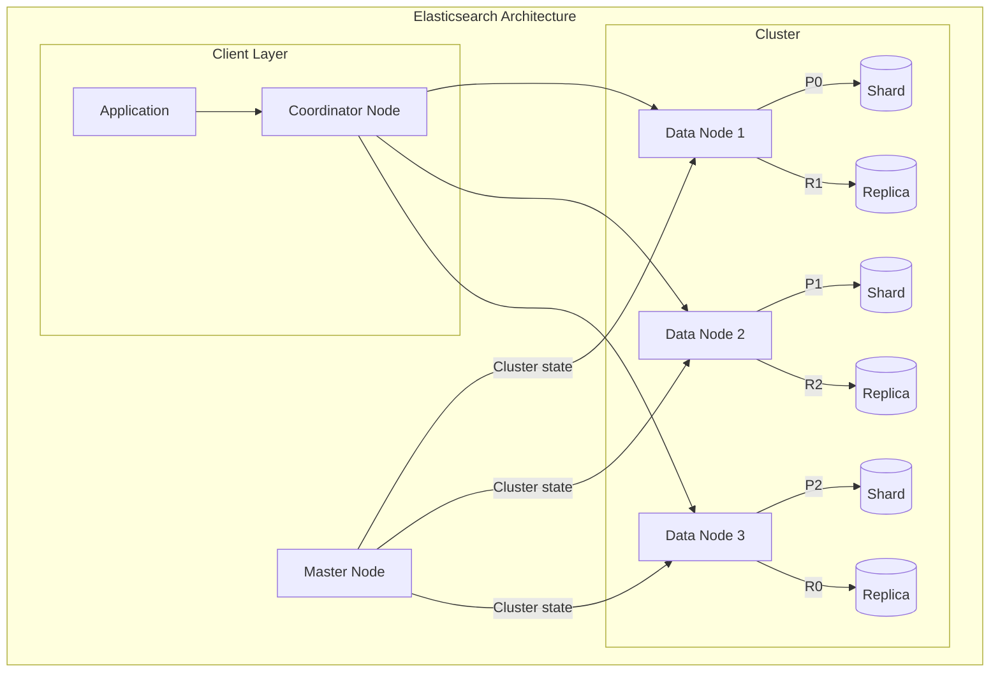

# Elasticsearch Deep Dive

## Overview

Elasticsearch is a distributed search and analytics engine. Understanding it is crucial for designing search systems, log analysis, and full-text search features.

## History & Why It Exists

```
The problem (2004-2010):
  Full-text search is HARD. You can't just use SQL LIKE '%term%':
    - It scans every row (no index)
    - No relevance ranking
    - No fuzzy matching, synonyms, stemming
    - Not distributed (single PostgreSQL can't index the web)

  Apache Lucene (1999, Doug Cutting) solved the core search problem:
    Inverted index + BM25 scoring. Fast, accurate full-text search.
    But Lucene is a Java LIBRARY, not a distributed system.

  Apache Solr (2004) wrapped Lucene in an HTTP server.
  But Solr's distributed mode (SolrCloud) was bolted on later and complex.

  Shay Banon built Elasticsearch (2010): Lucene + distributed from day one.
    - Every index is automatically sharded and replicated
    - REST API (JSON in, JSON out, easy to use)
    - Schema-free (auto-detect field types)
    - Near real-time search (documents searchable within 1 second)

Timeline:
  1999  Doug Cutting creates Apache Lucene (search library)
  2004  Apache Solr — first Lucene-based search server
  2010  Elasticsearch 0.4 released by Shay Banon
  2012  Elastic company founded (originally called Elasticsearch BV)
  2015  ELK stack (Elasticsearch + Logstash + Kibana) dominates log analysis
  2019  Elastic IPO (NYSE: ESTC)
  2021  License change: Elastic License / SSPL (no longer Apache 2.0)
  2021  AWS forks → OpenSearch (Apache 2.0 licensed)
  2024  Elasticsearch returns to open source (AGPL)

Elasticsearch vs OpenSearch:
  After the license change, AWS forked Elasticsearch → OpenSearch.
  Both are actively developed. OpenSearch is drop-in compatible.
  In interviews, the concepts (inverted index, sharding, BM25) are identical.

Who uses it:
  Wikipedia (search), GitHub (code search), Netflix (logging),
  Uber (geosearch), Stack Overflow (search), every company with a search bar.
```

## What You Must Master

### 1. Core Architecture

```
┌─────────────────────────────────────────────────────────────────────────┐
│                    Elasticsearch Cluster                                 │
│                                                                          │
│   ┌─────────────────────────────────────────────────────────────────┐   │
│   │                        Cluster                                   │   │
│   │                                                                  │   │
│   │   ┌───────────┐    ┌───────────┐    ┌───────────┐              │   │
│   │   │  Node 1   │    │  Node 2   │    │  Node 3   │              │   │
│   │   │  Master   │    │  Data     │    │  Data     │              │   │
│   │   │           │    │           │    │           │              │   │
│   │   │ Shard P0  │    │ Shard P1  │    │ Shard P2  │              │   │
│   │   │ Shard R1  │    │ Shard R2  │    │ Shard R0  │              │   │
│   │   └───────────┘    └───────────┘    └───────────┘              │   │
│   │                                                                  │   │
│   │   P = Primary shard, R = Replica shard                          │   │
│   │   Index "products" has 3 primary shards + 1 replica each        │   │
│   │                                                                  │   │
│   └─────────────────────────────────────────────────────────────────┘   │
│                                                                          │
│   Key concepts:                                                          │
│   • Cluster: Collection of nodes                                        │
│   • Node: Single ES instance                                            │
│   • Index: Like a database table                                        │
│   • Shard: Partition of an index                                        │
│   • Document: Single record (JSON)                                      │
│                                                                          │
└─────────────────────────────────────────────────────────────────────────┘
```

### 2. Inverted Index (The Core Magic)

```
┌─────────────────────────────────────────────────────────────────────────┐
│                    Inverted Index                                        │
│                                                                          │
│   Documents:                                                             │
│   ┌────────────────────────────────────────────────────────────────┐    │
│   │ Doc 1: "The quick brown fox"                                   │    │
│   │ Doc 2: "The quick brown dog"                                   │    │
│   │ Doc 3: "The lazy brown fox"                                    │    │
│   └────────────────────────────────────────────────────────────────┘    │
│                                                                          │
│   Inverted Index:                                                        │
│   ┌──────────────────────────────────────────────────────────────┐      │
│   │   Term      │  Document IDs  │  Positions                    │      │
│   ├──────────────────────────────────────────────────────────────┤      │
│   │   the       │  [1, 2, 3]     │  [0], [0], [0]               │      │
│   │   quick     │  [1, 2]        │  [1], [1]                    │      │
│   │   brown     │  [1, 2, 3]     │  [2], [2], [2]               │      │
│   │   fox       │  [1, 3]        │  [3], [3]                    │      │
│   │   dog       │  [2]           │  [3]                         │      │
│   │   lazy      │  [3]           │  [1]                         │      │
│   └──────────────────────────────────────────────────────────────┘      │
│                                                                          │
│   Query "brown fox" → Find docs with both terms → [1, 3]               │
│   Scoring: TF-IDF or BM25 to rank results                              │
│                                                                          │
└─────────────────────────────────────────────────────────────────────────┘
```

## Architecture Diagram



### 3. Analyzers (Text Processing)

```
┌─────────────────────────────────────────────────────────────────────────┐
│                    Text Analysis Pipeline                                │
│                                                                          │
│   Input: "The QUICK Brown Foxes jumped!"                                │
│             │                                                            │
│             ▼                                                            │
│   ┌─────────────────────┐                                               │
│   │  Character Filters  │  Strip HTML, convert special chars           │
│   └─────────┬───────────┘                                               │
│             ▼                                                            │
│   ┌─────────────────────┐                                               │
│   │     Tokenizer       │  Split into tokens                           │
│   │  "The" "QUICK" ...  │                                               │
│   └─────────┬───────────┘                                               │
│             ▼                                                            │
│   ┌─────────────────────┐                                               │
│   │   Token Filters     │                                               │
│   │  • lowercase        │  "the" "quick" "brown" "foxes" "jumped"      │
│   │  • stemming         │  "the" "quick" "brown" "fox" "jump"          │
│   │  • stop words       │  "quick" "brown" "fox" "jump"                │
│   └─────────────────────┘                                               │
│                                                                          │
│   Output: ["quick", "brown", "fox", "jump"] → Stored in index          │
│                                                                          │
│   Common analyzers:                                                      │
│   • standard: Good default, lowercase + basic tokenization             │
│   • english: Stemming + stop words for English text                    │
│   • keyword: No tokenization, exact matching                           │
│                                                                          │
└─────────────────────────────────────────────────────────────────────────┘
```

### 4. Mapping (Schema)

```json
{
  "mappings": {
    "properties": {
      "title": {
        "type": "text",
        "analyzer": "english",
        "fields": {
          "keyword": { "type": "keyword" }  // Multi-field for exact match
        }
      },
      "price": { "type": "float" },
      "timestamp": { "type": "date" },
      "tags": { "type": "keyword" },
      "location": { "type": "geo_point" }
    }
  }
}
```

### 5. Query DSL

```json
// Full-text search
{
  "query": {
    "match": {
      "title": "quick brown fox"
    }
  }
}

// Boolean query (AND, OR, NOT)
{
  "query": {
    "bool": {
      "must": [
        { "match": { "title": "fox" } }
      ],
      "filter": [
        { "range": { "price": { "lte": 100 } } },
        { "term": { "status": "active" } }
      ],
      "must_not": [
        { "term": { "category": "archived" } }
      ]
    }
  }
}

// Aggregations (like GROUP BY)
{
  "aggs": {
    "by_category": {
      "terms": { "field": "category.keyword" }
    },
    "avg_price": {
      "avg": { "field": "price" }
    }
  }
}
```

## Use Cases and When to Use

| Use Case | Why Elasticsearch |
|----------|-------------------|
| Full-text search | Inverted index, relevance scoring |
| Log analysis | Fast aggregations, time-series |
| E-commerce search | Faceted search, suggestions |
| Autocomplete | Edge n-gram tokenizer |
| Geo search | Built-in geo queries |
| Analytics dashboards | Fast aggregations (with Kibana) |

## Interview Checklist

- [ ] **Inverted index**: How full-text search works
- [ ] **Shards vs Replicas**: Distribution and fault tolerance
- [ ] **Analyzers**: How text is processed
- [ ] **Relevance scoring**: TF-IDF, BM25
- [ ] **Near real-time**: 1 second refresh delay
- [ ] **Query vs Filter**: Scored vs yes/no
- [ ] **Scaling**: More shards for throughput, replicas for HA
- [ ] **When NOT to use**: Not a primary data store!

## Key Numbers

```
Index size: Start with small shards (~10-50GB each)
Shards: Don't over-shard! Few big shards > many small
Heap: 50% of RAM, max 32GB
Refresh: Every 1 second (can adjust for bulk indexing)
Bulk size: 5-15 MB is optimal
```

## Common Pitfalls

❌ Using ES as primary database (it can lose data!)
❌ Too many small shards (overhead)
❌ Not using filters for exact matches (wastes scoring)
❌ Mapping explosions (dynamic mapping in production)
❌ Not planning for reindexing

✅ Keep source of truth in primary database
✅ Use aliases for zero-downtime reindexing
✅ Explicit mappings in production
