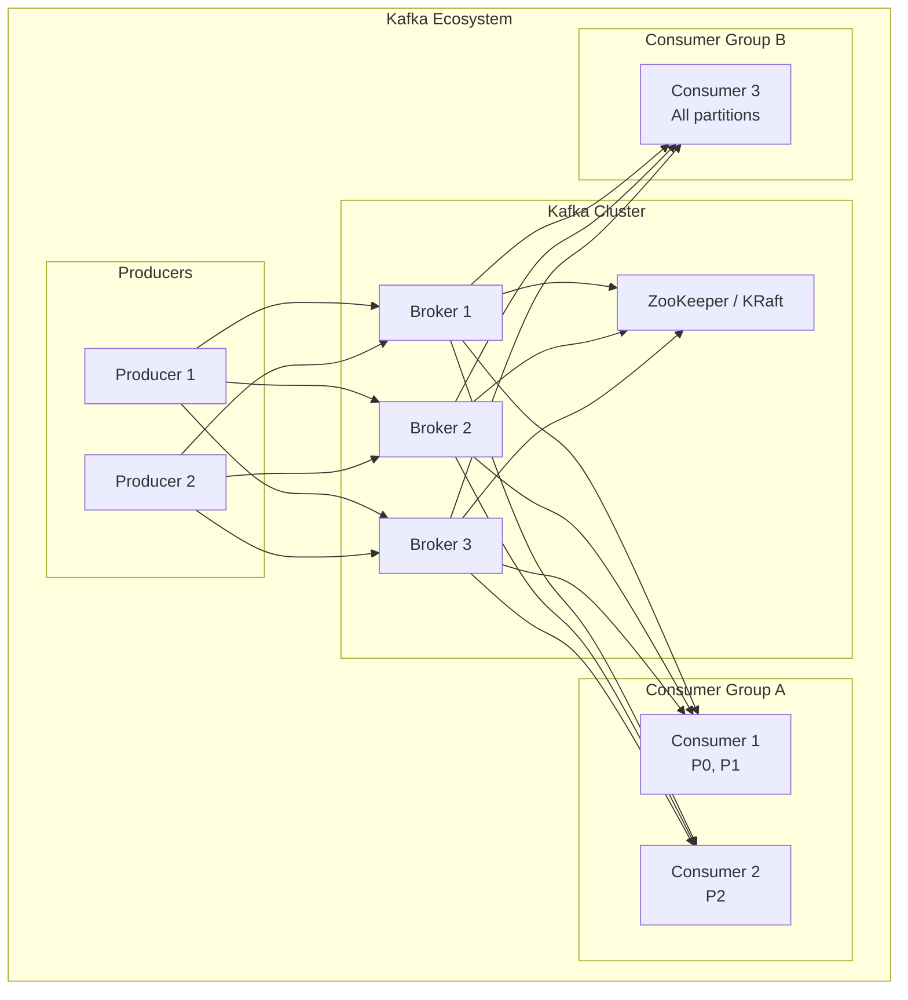

# Apache Kafka Deep Dive

## Overview

Kafka is a distributed event streaming platform. It's the backbone of modern data pipelines, real-time processing, and event-driven architectures. You MUST understand Kafka for staff+ interviews.

## What You Must Master

### 1. Core Architecture

```
┌─────────────────────────────────────────────────────────────────────────┐
│                    Kafka Cluster Architecture                            │
│                                                                          │
│   ┌────────────────────────────────────────────────────────────────┐    │
│   │                         Topic: orders                           │    │
│   │                                                                 │    │
│   │   Partition 0    Partition 1    Partition 2                    │    │
│   │   ┌─────────┐    ┌─────────┐    ┌─────────┐                   │    │
│   │   │ 0 1 2 3 │    │ 0 1 2 3 │    │ 0 1 2 3 │                   │    │
│   │   └─────────┘    └─────────┘    └─────────┘                   │    │
│   │       │              │              │                          │    │
│   │       ▼              ▼              ▼                          │    │
│   │   Broker 1       Broker 2       Broker 3                       │    │
│   │   (Leader)       (Leader)       (Leader)                       │    │
│   │   P0 R1 R2       P1 R2 R0       P2 R0 R1                      │    │
│   │                                                                 │    │
│   │   P = Partition Leader, R = Replica                            │    │
│   └────────────────────────────────────────────────────────────────┘    │
│                                                                          │
│   Key concepts:                                                          │
│   • Topic: Category of messages (like a DB table)                       │
│   • Partition: Ordered, immutable log                                   │
│   • Offset: Position within partition                                   │
│   • Broker: Kafka server                                                │
│   • Producer: Writes messages                                           │
│   • Consumer: Reads messages                                            │
│   • Consumer Group: Parallel consumers                                  │
│                                                                          │
└─────────────────────────────────────────────────────────────────────────┘
```

### 2. Partitions & Ordering

```
┌─────────────────────────────────────────────────────────────────────────┐
│                    Partition Ordering Guarantees                         │
│                                                                          │
│   WITHIN a partition: Messages are strictly ordered                     │
│   ACROSS partitions: No ordering guarantee                              │
│                                                                          │
│   Partition 0: [msg1] [msg2] [msg3] → Ordered by offset                │
│   Partition 1: [msg4] [msg5] [msg6] → Ordered by offset                │
│                                                                          │
│   But msg1 and msg4? No guaranteed order!                              │
│                                                                          │
│   To ensure ordering:                                                    │
│   Use same partition key → hash(key) % partitions → same partition     │
│                                                                          │
│   Example:                                                               │
│   • Order events for user_123 → key="user_123" → always partition 2   │
│   • All user_123 events are ordered                                    │
│                                                                          │
└─────────────────────────────────────────────────────────────────────────┘
```

## Architecture Diagram



### 3. Consumer Groups

```
┌─────────────────────────────────────────────────────────────────────────┐
│                    Consumer Groups                                       │
│                                                                          │
│   Topic "orders" with 3 partitions                                      │
│                                                                          │
│   Consumer Group A (3 consumers):                                        │
│   ┌────────────┐  ┌────────────┐  ┌────────────┐                       │
│   │ Consumer 1 │  │ Consumer 2 │  │ Consumer 3 │                       │
│   │     P0     │  │     P1     │  │     P2     │                       │
│   └────────────┘  └────────────┘  └────────────┘                       │
│   → Each consumer gets 1 partition (perfect balance)                   │
│                                                                          │
│   Consumer Group A (2 consumers):                                        │
│   ┌────────────┐  ┌────────────┐                                        │
│   │ Consumer 1 │  │ Consumer 2 │                                        │
│   │   P0, P1   │  │     P2     │                                        │
│   └────────────┘  └────────────┘                                        │
│   → 1 consumer gets 2 partitions                                        │
│                                                                          │
│   Consumer Group A (4 consumers):                                        │
│   ┌───────┐ ┌───────┐ ┌───────┐ ┌───────┐                              │
│   │  C1   │ │  C2   │ │  C3   │ │  C4   │                              │
│   │  P0   │ │  P1   │ │  P2   │ │ IDLE! │                              │
│   └───────┘ └───────┘ └───────┘ └───────┘                              │
│   → 1 consumer is idle (more consumers than partitions)                │
│                                                                          │
│   Key insight: #consumers > #partitions → some consumers idle          │
│                                                                          │
└─────────────────────────────────────────────────────────────────────────┘
```

### 4. Delivery Semantics

```
┌─────────────────────────────────────────────────────────────────────────┐
│                    Delivery Guarantees                                   │
│                                                                          │
│   Producer Semantics:                                                    │
│   ┌─────────────────────────────────────────────────────────────────┐   │
│   │ acks=0  : Fire and forget (fastest, may lose data)             │   │
│   │ acks=1  : Leader acknowledged (default, may lose on failover)  │   │
│   │ acks=all: All replicas acknowledged (safest, slowest)          │   │
│   └─────────────────────────────────────────────────────────────────┘   │
│                                                                          │
│   Consumer Semantics:                                                    │
│   ┌─────────────────────────────────────────────────────────────────┐   │
│   │ At-most-once:  Commit offset BEFORE processing                 │   │
│   │                → May miss messages if crash during processing  │   │
│   │                                                                 │   │
│   │ At-least-once: Commit offset AFTER processing (default)        │   │
│   │                → May process duplicates if crash after process │   │
│   │                → Consumer must be IDEMPOTENT!                   │   │
│   │                                                                 │   │
│   │ Exactly-once:  Transactional processing                        │   │
│   │                → Kafka transactions + idempotent producer      │   │
│   │                → Most complex, some performance overhead       │   │
│   └─────────────────────────────────────────────────────────────────┘   │
│                                                                          │
└─────────────────────────────────────────────────────────────────────────┘
```

### 5. Replication

```
┌─────────────────────────────────────────────────────────────────────────┐
│                    Replication Factor                                    │
│                                                                          │
│   replication.factor = 3                                                │
│                                                                          │
│   Partition 0:                                                           │
│   ┌─────────┐    ┌─────────┐    ┌─────────┐                            │
│   │ Broker1 │    │ Broker2 │    │ Broker3 │                            │
│   │ LEADER  │───►│Follower │───►│Follower │                            │
│   │    P0   │    │   P0    │    │   P0    │                            │
│   └─────────┘    └─────────┘    └─────────┘                            │
│                                                                          │
│   ISR (In-Sync Replicas):                                               │
│   • Replicas that are caught up with leader                            │
│   • Leader only considers message "committed" when all ISR have it     │
│   • min.insync.replicas = 2 → need 2 replicas to accept writes        │
│                                                                          │
│   Leader Election:                                                       │
│   • If leader fails, a follower in ISR becomes new leader              │
│   • Unclean leader election: Allow non-ISR as leader (data loss risk)  │
│                                                                          │
└─────────────────────────────────────────────────────────────────────────┘
```

## Common Use Cases

| Use Case | Why Kafka |
|----------|-----------|
| Event sourcing | Immutable log of events |
| Stream processing | With Kafka Streams / Flink |
| Log aggregation | Collect logs from services |
| Metrics pipeline | High throughput ingestion |
| Message queue | Decoupling services |
| CDC (Change Data Capture) | Database event streaming |
| Commit log | Replicating data between systems |

## Key Configuration

```properties
# Producer
acks=all                              # Durability
retries=3                             # Retry on transient failures
linger.ms=5                           # Batch for better throughput
batch.size=16384                      # 16KB batches

# Consumer
enable.auto.commit=false              # Manual commit for at-least-once
auto.offset.reset=earliest            # Start from beginning if no offset
max.poll.records=500                  # Batch size per poll
session.timeout.ms=30000              # Consumer heartbeat timeout

# Topic
retention.ms=604800000                # 7 days retention
replication.factor=3                  # 3 copies
min.insync.replicas=2                 # 2 must ack
```

## Interview Checklist

- [ ] **Partitions**: Ordering, parallelism, partition key
- [ ] **Consumer groups**: Partition assignment, rebalancing
- [ ] **Offsets**: How consumers track position
- [ ] **Delivery semantics**: At-most, at-least, exactly-once
- [ ] **Replication**: ISR, leader election
- [ ] **Retention**: Time-based vs size-based
- [ ] **When NOT to use**: Real-time queries (use Redis)

## Kafka vs Other Queues

| Feature | Kafka | RabbitMQ | SQS |
|---------|-------|----------|-----|
| Ordering | Per partition | Per queue | FIFO optional |
| Retention | Configurable | Until consumed | 14 days |
| Replay | ✅ Yes | ❌ No | ❌ No |
| Throughput | Very high | Medium | Medium |
| Exactly-once | ✅ Supported | ❌ No | ❌ No |

## Key Numbers

```
Throughput: 100K-2M messages/sec per broker (depends on message size)
Latency: 2-10ms (99th percentile)
Partitions: ~4000 per broker (practical limit)
Message size: Default 1MB max (can increase)
Retention: Days to months (storage dependent)
```
