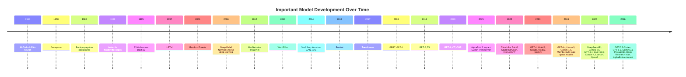

# ML Model Development Timeline — Important Models, Features & Highlights

> A curated map of major machine learning and AI model milestones: what changed, why it mattered, and what characteristics to remember.

> Updated through **May 2026**. Frontier model history moves fast, so the 2025-2026 rows should be refreshed regularly.

---

## 1. How to Use This Folder

This folder is a **model history index**. It is not meant to be a leaderboard; it is meant to answer:

- Which models changed the direction of ML?
- What architectural idea did each model introduce or popularize?
- What feature, scaling law, dataset, or training trick made it important?
- How did model design evolve from symbolic/statistical ML to deep learning, transformers, and foundation models?

Use it as a timeline when studying ML systems, model serving, training infrastructure, and LLM architecture.

```
Big picture evolution:

  Rules / neurons
      ↓
  Classical statistical ML
      ↓
  Deep neural networks
      ↓
  Sequence models + attention
      ↓
  Transformers + self-supervised pretraining
      ↓
  Foundation models
      ↓
  Multimodal + tool-using + reasoning-oriented systems
```

---

## 2. High-Level Timeline



---

## 3. Model Milestones by Era

### Era A — Foundations: Neurons, Learning Rules, Early Neural Nets

| Year | Model / Idea | Main Feature | Characteristics | Why It Mattered |
|---:|---|---|---|---|
| 1943 | McCulloch-Pitts neuron | Binary threshold neuron | Simple mathematical neuron; logic-like computation | First formal bridge between neurons and computation |
| 1958 | Perceptron | Linear classifier trained by updates | Single-layer; learns a separating hyperplane | First famous trainable neural model |
| 1969 | Perceptron limitations | XOR failure | Single-layer perceptrons cannot solve non-linear separability | Slowed early neural network optimism |
| 1982 | Hopfield Network | Associative memory | Recurrent energy-based network; converges to stored patterns | Early recurrent neural network and memory model |
| 1985 | Boltzmann Machine | Probabilistic energy model | Stochastic hidden units; learns distributions | Influenced generative modeling and energy-based learning |
| 1986 | Backpropagation for MLPs | Efficient gradient training | Multi-layer networks trained by chain rule | Made deep feed-forward networks practical in principle |
| 1989 | LeNet | Convolutional neural network | Local receptive fields, shared weights, pooling | First highly influential CNN for digit recognition |

**Key pattern:** early models established that learnable representations are possible, but compute and data were not yet sufficient for large-scale deep learning.

---

### Era B — Classical Statistical ML and Sequence Models

| Year | Model / Idea | Main Feature | Characteristics | Why It Mattered |
|---:|---|---|---|---|
| 1995 | Support Vector Machine | Maximum-margin classification | Kernel trick; strong convex optimization foundation | Dominant high-performing classifier before deep learning |
| 1997 | LSTM | Gated recurrent memory | Input, forget, and output gates; handles long dependencies better than vanilla RNNs | Became core model for speech, translation, and sequence tasks |
| 1998 | Hidden Markov Models at scale | Probabilistic sequence modeling | Latent states, transition probabilities, emission probabilities | Central to speech recognition and NLP before neural models |
| 2001 | Random Forest | Ensemble of decision trees | Bagging, feature randomness, robust tabular performance | Still a strong baseline for structured data |
| 2001 | Conditional Random Field | Discriminative sequence labeling | Models label dependencies; used for NER and tagging | Major NLP model before neural sequence labeling |
| 2006 | Deep Belief Network | Layer-wise unsupervised pretraining | Stacked RBMs; greedy pretraining | Helped revive interest in deep learning |
| 2009 | Matrix Factorization | Latent factor recommendation | Learns user/item embeddings | Netflix Prize era; core recommender systems idea |
| 2010 | Gradient Boosted Trees | Additive tree ensembles | XGBoost/LightGBM/CatBoost style later popularized | Best-in-class for many tabular prediction problems |

**Key pattern:** classical ML optimized carefully engineered features. Deep learning later replaced much feature engineering with learned representations.

---

### Era C — Deep Learning Breakthroughs

| Year | Model | Domain | Main Feature | Characteristics / Highlights |
|---:|---|---|---|---|
| 2012 | AlexNet | Vision | Deep CNN trained on GPUs | ReLU, dropout, data augmentation, GPU training; won ImageNet by a large margin |
| 2013 | Word2Vec | NLP | Dense word embeddings | Skip-gram/CBOW; semantic vector arithmetic; cheap self-supervised pretraining |
| 2014 | VGG | Vision | Very deep small-kernel CNN | Repeated 3x3 conv blocks; simple and influential architecture design |
| 2014 | GoogLeNet / Inception | Vision | Multi-scale convolution modules | Efficient compute use; parallel branches with different receptive fields |
| 2014 | Seq2Seq | NLP | Encoder-decoder RNN | Maps variable-length input to output; key for neural machine translation |
| 2014 | Attention for Seq2Seq | NLP | Dynamic context over source tokens | Removed fixed-vector bottleneck in RNN translation |
| 2014 | GAN | Generative | Generator vs discriminator game | Produced sharp samples; inspired adversarial generative modeling |
| 2014 | VAE | Generative | Latent variable model with variational inference | Smooth latent space; principled probabilistic generation |
| 2015 | ResNet | Vision | Residual connections | Enabled hundreds of layers; skip connections became universal |
| 2016 | WaveNet | Audio | Dilated causal convolutions | High-quality raw audio generation; autoregressive waveform modeling |
| 2016 | AlphaGo | RL / Search | Deep RL + Monte Carlo Tree Search | Demonstrated superhuman Go; combined learned policy/value with search |

**Key pattern:** deep learning won by combining more data, GPUs, end-to-end training, and architectures with better gradient flow.

---

### Era D — Transformers and Self-Supervised Pretraining

| Year | Model | Domain | Main Feature | Characteristics / Highlights |
|---:|---|---|---|---|
| 2017 | Transformer | NLP | Self-attention without recurrence | Parallelizable sequence modeling; encoder-decoder architecture; foundation of modern LLMs |
| 2018 | ELMo | NLP | Contextual word embeddings | BiLSTM representations vary by context; bridge from static embeddings to pretraining |
| 2018 | GPT-1 | NLP | Decoder-only transformer pretraining | Generative pretrain + task fine-tune recipe |
| 2018 | BERT | NLP | Masked language modeling | Bidirectional encoder; dominant for classification, retrieval, NER, QA |
| 2019 | GPT-2 | NLP | Larger decoder-only LM | Showed coherent long-form generation from scale |
| 2019 | XLNet | NLP | Permutation language modeling | Tried to combine autoregressive and bidirectional benefits |
| 2019 | T5 | NLP | Text-to-text transfer transformer | Every task framed as text input to text output |
| 2020 | GPT-3 | NLP / LLM | Few-shot prompting at scale | 175B parameters; in-context learning became a central capability |
| 2020 | Vision Transformer | Vision | Image patches as tokens | Showed transformers can replace CNNs with enough data |
| 2020 | DETR | Vision | Transformer object detection | End-to-end detection as set prediction |
| 2020 | CLIP | Multimodal | Contrastive image-text pretraining | Aligned images and text; enabled zero-shot image classification and retrieval |

**Key pattern:** self-supervised pretraining turned raw text, images, and audio into training signals. The model became a reusable base model rather than a one-task classifier.

---

### Era E — Foundation Models, Alignment, Multimodality, and Efficient Experts

| Year | Model | Organization | Main Feature | Characteristics / Highlights |
|---:|---|---|---|---|
| 2021 | Switch Transformer | Google | Sparse Mixture-of-Experts | Routes tokens to expert FFNs; scales parameters without proportional FLOPs |
| 2021 | Codex | OpenAI | Code-focused LLM | Strong code generation; powered early GitHub Copilot |
| 2021 | AlphaFold 2 | DeepMind | Protein structure prediction | Attention over multiple sequence alignments; major scientific impact |
| 2021 | DALL·E | OpenAI | Text-to-image generation | Early large-scale text-conditioned image generation |
| 2022 | InstructGPT | OpenAI | RLHF instruction following | Demonstrated alignment via human preference data and reinforcement learning |
| 2022 | Chinchilla | DeepMind | Compute-optimal scaling | Showed many large LMs were undertrained; data/parameter balance matters |
| 2022 | PaLM | Google | Large dense decoder LM | Strong multilingual, reasoning, and code performance at scale |
| 2022 | Stable Diffusion | Stability AI / CompVis | Latent diffusion | Efficient text-to-image generation in compressed latent space; open ecosystem |
| 2022 | Whisper | OpenAI | Speech recognition | Robust multilingual ASR trained on large weakly supervised data |
| 2023 | LLaMA | Meta | Efficient open-weight LLM family | Strong performance from high-quality data and compute-efficient training |
| 2023 | GPT-4 | OpenAI | Large multimodal/general model | Major jump in reasoning, coding, instruction following, and robustness |
| 2023 | Claude family | Anthropic | Constitutional AI emphasis | Alignment approach using written principles and preference training |
| 2023 | Falcon | TII | Open-weight LLM | Helped broaden open LLM competition |
| 2023 | Mistral 7B | Mistral AI | Efficient small LLM | Sliding-window attention; strong performance per parameter |
| 2023 | Mixtral 8x7B | Mistral AI | Sparse MoE LLM | Multiple experts with sparse routing; high quality at lower active compute |
| 2023 | Gemini | Google DeepMind | Multimodal foundation model | Built for text, image, audio, video, and tool use workflows |
| 2024 | Gemini 1.5 | Google DeepMind | Long-context multimodal model | Very large context windows; long-document and video understanding use cases |
| 2024 | GPT-4o | OpenAI | Native multimodal interaction | Low-latency text/audio/vision interaction; stronger real-time assistant interface |
| 2024 | Llama 3 | Meta | Strong open-weight LLM family | Improved tokenizer, data scale, instruction tuning, and open ecosystem impact |
| 2024 | OpenAI o1 | OpenAI | Reasoning-first model family | Test-time thinking for math, code, and complex multi-step tasks |
| 2024 | Gemini 2.0 Flash | Google DeepMind | Agentic multimodal model | Native tool use, low latency, multimodal input, and experimental multimodal output |
| 2024 | Mamba / SSM-style models | Research community | State space sequence modeling | Linear-time sequence processing alternative to attention for long contexts |
| 2025 | DeepSeek-R1 | DeepSeek | Open reasoning model | Popularized strong open reasoning models trained with large-scale RL-style reasoning recipes |
| 2025 | Claude 3.7 Sonnet | Anthropic | Hybrid reasoning | Combined near-instant responses with extended thinking for harder problems |
| 2025 | GPT-4.5 | OpenAI | Large GPT research preview | Scaled unsupervised learning; stronger world knowledge, writing, creativity, and lower hallucination tendency |
| 2025 | Gemini 2.5 Pro | Google DeepMind | Thinking model | Strong reasoning, coding, multimodality, and 1M-token context window |
| 2025 | GPT-4.1 | OpenAI | Developer-focused GPT family | 1M-token context, better coding, better instruction following, mini/nano variants for cost-latency tradeoffs |
| 2025 | OpenAI o3 / o4-mini | OpenAI | Multimodal reasoning + tools | Reasoning models that can use web, files, Python, images, and other tools more agentically |
| 2025 | Llama 4 Scout / Maverick | Meta | Open-weight native multimodal MoE | First Llama MoE generation; long context, early-fusion multimodality, strong performance-per-cost |
| 2025 | Qwen3 | Alibaba / Qwen | Hybrid thinking open-weight models | Thinking/non-thinking modes, MoE and dense variants, broad multilingual support, agentic/tool use focus |
| 2025 | Claude Opus 4 / Sonnet 4 | Anthropic | Coding and long-running agents | Strong software engineering, sustained multi-step work, tool use, memory improvements, and agent workflows |
| 2026 | GPT-5.3-Codex | OpenAI | Agentic coding model | Strong SWE-Bench Pro, Terminal-Bench, OSWorld, and long-running software lifecycle tasks |
| 2026 | GPT-5.5 | OpenAI | General agentic work model | Strong agentic coding, computer use, knowledge work, scientific research, long-context reasoning, and tool execution |
| 2026 | Gemini 3.1 Pro + Deep Research Max | Google DeepMind | Autonomous research agent stack | Web/custom-source research, MCP support, native visuals, extended test-time compute, cited reports |
| 2026 | Gemini 3.1 Flash TTS | Google DeepMind | Expressive speech generation | More controllable speech, audio tags, multi-speaker dialogue, 70+ languages, SynthID watermarking |
| 2026 | AlphaEvolve impact | Google DeepMind | Algorithm-discovery agent | Gemini-powered evolutionary coding agent used for optimized algorithms, scientific workflows, and infrastructure improvements |

**Key pattern:** model progress shifted from single-task accuracy to general-purpose capability, instruction following, tool use, long context, multimodal inputs, serving efficiency, reasoning at inference time, and long-running agentic work.

---

### Era F — Reasoning Models and Agentic Systems

| Year | Model / System | Main Feature | Characteristics | Why It Mattered |
|---:|---|---|---|---|
| 2024 | OpenAI o1 | Test-time reasoning | Model spends extra inference compute before answering | Made reasoning compute a first-class scaling axis |
| 2025 | DeepSeek-R1 | Open reasoning | Strong open reasoning model family; visible reasoning-style behavior; strong math/code impact | Accelerated open-source reasoning-model competition |
| 2025 | Gemini 2.5 Pro | Native thinking model | Reasoning, coding, long-context, multimodal understanding | Showed frontier models converging on built-in thinking modes |
| 2025 | OpenAI o3 / o4-mini | Reasoning with tools | Uses browsing, Python, files, images, and function calling inside reasoning workflows | Moved from answering questions to solving tasks with tools |
| 2025 | Claude 4 | Sustained coding agents | Long-running focus, better memory, coding workflows, IDE/terminal integrations | Turned LLMs into practical software collaborators |
| 2025 | Llama 4 | Open-weight multimodal MoE | Sparse experts, long context, native multimodality, open ecosystem | Brought MoE and multimodal frontier ideas into open-weight models |
| 2025 | Qwen3 | User-controllable thinking budget | `/think` and `/no_think` style modes, MoE variants, multilingual coverage | Made reasoning/cost tradeoffs explicit to developers |
| 2026 | GPT-5.3-Codex | Software lifecycle agent | Builds, edits, tests, debugs, reviews, deploys, and performs computer work | Coding models became long-running engineering agents |
| 2026 | GPT-5.5 | General computer-use agent | Coding, research, spreadsheets, documents, data analysis, scientific workflows | Agentic work expanded from coding into general knowledge work |
| 2026 | Deep Research Max | Autonomous research agent | Searches web and custom data, uses MCP/tools, produces cited reports and visualizations | Model product becomes a multi-step research workflow, not one completion |
| 2026 | AlphaEvolve | Algorithm discovery | LLM-guided evolutionary search for better algorithms and scientific procedures | Shows models designing optimized methods, not just generating text |

**Key pattern:** 2025-2026 is less about “bigger chatbot” and more about **models as workers**: they reason longer, call tools, inspect files, operate computers, run experiments, create artifacts, and continue over many steps.

---

## 4. Important Model Families and What Defines Them

### 4.1 Linear Models

```
Examples: Linear Regression, Logistic Regression, Perceptron, SVM

Core idea:
  y = w · x + b

Characteristics:
  - Fast to train and serve
  - Interpretable weights
  - Strong baseline for sparse/tabular features
  - Limited unless features are engineered or kernels are used

Remember:
  Linear models are still used in ranking, ads, fraud, and calibration layers.
```

### 4.2 Tree Ensembles

```
Examples: Random Forest, Gradient Boosted Trees, XGBoost, LightGBM, CatBoost

Core idea:
  Combine many weak decision trees into a strong predictor.

Characteristics:
  - Excellent for tabular data
  - Handles non-linear feature interactions
  - Less feature scaling required
  - Harder to use directly on raw images/text/audio

Remember:
  For business/tabular ML, boosted trees are often a harder baseline than neural nets.
```

### 4.3 Convolutional Neural Networks

```
Examples: LeNet, AlexNet, VGG, Inception, ResNet, EfficientNet

Core idea:
  Use local filters shared across spatial positions.

Characteristics:
  - Translation-friendly inductive bias
  - Parameter sharing
  - Hierarchical visual features
  - Efficient for images and spatial data

Remember:
  ResNet skip connections solved deep optimization problems and influenced almost every later deep architecture.
```

### 4.4 Recurrent Neural Networks

```
Examples: RNN, LSTM, GRU, Seq2Seq

Core idea:
  Process sequences step-by-step while carrying hidden state.

Characteristics:
  - Natural sequence modeling
  - Hard to parallelize across time
  - Long dependency issues partially solved by gates
  - Mostly replaced by transformers for large-scale NLP

Remember:
  LSTM was the workhorse of production NLP and speech before transformers.
```

### 4.5 Attention and Transformers

```
Examples: Transformer, BERT, GPT, T5, ViT, LLaMA, Gemini

Core idea:
  Every token can attend to other tokens and build context-aware representations.

Characteristics:
  - Highly parallel training
  - Scales well with data and compute
  - Captures long-range dependencies
  - Quadratic attention cost in sequence length unless optimized

Remember:
  The transformer is an architecture pattern, not just an NLP model.
```

### 4.6 Generative Models

```
Examples: VAE, GAN, Autoregressive Transformers, Diffusion Models

Core idea:
  Learn a distribution and sample from it.

Characteristics:
  - VAE: stable latent-variable model, often blurrier samples
  - GAN: sharp samples, unstable training, mode collapse risk
  - Autoregressive: factorizes output token-by-token; strong for text/code
  - Diffusion: denoise step-by-step; dominant for image generation

Remember:
  Text generation is mostly autoregressive transformers; image generation is often diffusion or multimodal autoregressive systems.
```

### 4.7 Mixture-of-Experts Models

```
Examples: Switch Transformer, GLaM, Mixtral

Core idea:
  Route each token to a small subset of expert networks.

Characteristics:
  - Many total parameters
  - Fewer active parameters per token
  - Requires routing and load balancing
  - More complex distributed training and serving

Remember:
  MoE is a way to increase capacity without paying full dense-compute cost on every token.
```

### 4.8 State Space and Long-Context Alternatives

```
Examples: S4, Mamba-style selective state space models

Core idea:
  Model long sequences with recurrent/state-space dynamics that can be more efficient than attention.

Characteristics:
  - Linear or near-linear sequence scaling
  - Strong long-context motivation
  - Different hardware and kernel optimization profile from attention
  - Often explored as transformer alternatives or hybrids

Remember:
  Attention is powerful but expensive; long-context research searches for better asymptotic and hardware efficiency.
```

---

## 5. What Changed at Each Inflection Point

| Inflection | Before | After | System Impact |
|---|---|---|---|
| Backprop | Manual feature/rule design | Multi-layer differentiable learning | Need for accelerators and autodiff |
| CNNs | Handcrafted image features | Learned visual hierarchies | GPU training became central |
| Word embeddings | Sparse one-hot text | Dense semantic vectors | Embedding stores and retrieval became common |
| Seq2Seq + attention | Fixed sequence representations | Dynamic token alignment | Neural translation became practical |
| Transformers | Sequential RNN training | Parallel attention training | Massive distributed training became viable |
| Pretraining | Task-specific models | Reusable base models | Fine-tuning, transfer, and model hubs |
| GPT-3-style prompting | Fine-tune for each task | In-context learning | Prompt engineering and API-based ML products |
| RLHF / instruction tuning | Raw next-token models | Assistant-like behavior | Alignment pipelines and eval systems |
| Diffusion | GAN-dominated image gen | Stable iterative denoising | Text-to-image product explosion |
| MoE | Dense parameter scaling | Sparse active compute | Complex routing, expert parallelism |
| Multimodal models | Separate modality models | Unified text/image/audio/video interfaces | New serving paths and safety constraints |
| Long context | Short prompts / chunking | Full documents, codebases, videos | KV-cache pressure and retrieval tradeoffs |
| Reasoning models | One-shot next-token response | Inference-time thinking and self-checking | Latency/cost becomes a controllable quality knob |
| Tool-using agents | Model only generates text | Model searches, runs code, edits files, calls APIs | Agent runtime, sandboxing, permissions, and audit logs matter |
| Agentic coding | Code snippets and autocomplete | Multi-file implementation, tests, debugging, PR workflows | Repo context, terminal access, CI integration, and review loops matter |
| Autonomous research | Summarization over provided text | Iterative search, citation, synthesis, charts, proprietary data connectors | Source quality, provenance, MCP/tool integrations, and evaluation become central |

---

## 6. Model Cheat Sheet for Interviews

```
If asked about model evolution:
  1. Classical ML used engineered features and convex/tree methods.
  2. Deep learning learned representations directly from data.
  3. CNNs dominated vision by exploiting spatial locality.
  4. RNN/LSTM handled sequences but were hard to scale.
  5. Attention removed the fixed-context bottleneck.
  6. Transformers made sequence training parallel and scalable.
  7. Self-supervised pretraining created reusable foundation models.
  8. Instruction tuning and RLHF made models usable as assistants.
  9. Multimodal and tool-using models expanded the interface.
  10. Reasoning models made inference-time compute a quality knob.
  11. Agentic models use tools, files, terminals, browsers, and APIs to complete work.
  12. Efficiency work now focuses on long context, MoE, quantization, speculative decoding, better kernels, and tool/runtime orchestration.
```

### Model Characteristics to Always Track

| Characteristic | Questions to Ask |
|---|---|
| Architecture | CNN, RNN, Transformer, Diffusion, MoE, SSM? |
| Objective | Supervised, contrastive, masked LM, next-token, denoising, RLHF? |
| Data | Labeled, self-supervised, web-scale, code, multimodal, synthetic? |
| Scaling | Dense, sparse, compute-optimal, data-optimal, long-context? |
| Strength | Accuracy, generation, reasoning, retrieval, coding, multimodal, low latency? |
| Weakness | Hallucination, compute cost, latency, context limits, domain brittleness? |
| Systems impact | GPU/TPU need, distributed training, memory pressure, inference serving design? |
| Agentic behavior | Can it plan, call tools, inspect artifacts, recover from errors, and continue over time? |
| Governance | What permissions, safety policies, audit logs, and human approval checkpoints are needed? |

---

## 7. Suggested Subfolders to Add Later

```
ml-models/
├── README.md                 # This timeline
├── llms/                     # GPT, BERT, T5, LLaMA, Gemini, Claude, Mistral
├── vision/                   # LeNet, AlexNet, ResNet, ViT, DETR
├── generative/               # VAE, GAN, Diffusion, autoregressive models
├── recommenders/             # Matrix factorization, two-tower models, ranking systems
├── speech-audio/             # HMMs, DeepSpeech, WaveNet, Whisper
├── reinforcement-learning/   # DQN, AlphaGo, AlphaZero, RLHF
├── reasoning-models/          # o-series, DeepSeek-R1, Gemini thinking, Qwen thinking modes
├── agents/                    # Codex, Claude Code, Deep Research, computer-use agents
└── efficient-architectures/   # MoE, SSM/Mamba, quantized and distilled models
```

---

## 8. Quick Memory Hooks

```
LeNet        → CNNs can read digits.
AlexNet      → GPUs + deep CNNs beat classical vision.
ResNet       → skip connections enable very deep nets.
Word2Vec     → words become semantic vectors.
Seq2Seq      → neural translation as encoder-decoder.
Attention    → model learns where to look.
Transformer  → attention-only, parallel, scalable sequence model.
BERT         → bidirectional encoder for understanding.
GPT          → decoder-only generation and in-context learning.
T5           → every NLP task is text-to-text.
CLIP         → images and text share an embedding space.
ViT          → images can be token sequences.
AlphaFold 2  → deep learning solves a major scientific prediction problem.
Stable Diffusion → text-to-image becomes widely accessible.
LLaMA        → strong open-weight LLMs reshape the ecosystem.
Mixtral      → sparse experts improve capacity/compute tradeoff.
Gemini/GPT-4o → multimodal interaction becomes first-class.
o1/o3        → inference-time reasoning becomes a product feature.
DeepSeek-R1  → open reasoning models become highly competitive.
GPT-4.1      → long-context developer model with stronger coding/instructions.
Gemini 2.5   → thinking + long context + multimodality converge.
Llama 4      → open-weight multimodal MoE with very long context.
Qwen3        → controllable thinking budget and multilingual open models.
Claude 4     → long-running coding agents become practical.
GPT-5.3-Codex → coding agent expands into full software lifecycle work.
GPT-5.5      → general agentic computer work, research, and coding.
Deep Research Max → autonomous cited research over web + custom data.
AlphaEvolve  → models discover and optimize algorithms.
```
