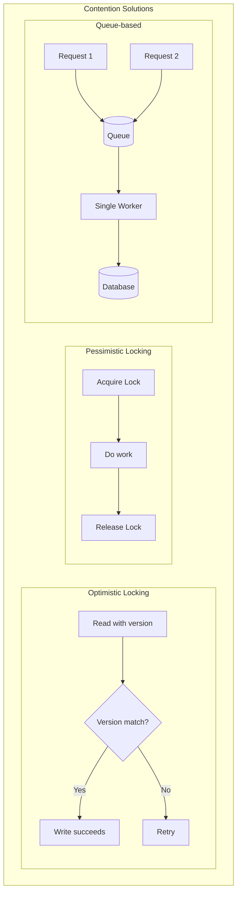

# Handling Contention

## Overview

Contention occurs when multiple processes try to access the same resource simultaneously. This is one of the hardest problems in distributed systems - getting it wrong leads to data corruption, deadlocks, or poor performance.

## What You Must Master

### 1. Types of Contention

```
┌─────────────────────────────────────────────────────────────────────────┐
│                    Contention Problems                                   │
│                                                                          │
│   1. Race Condition                                                      │
│   ┌─────────────────────────────────────────────────────────────────┐   │
│   │   Thread A: read balance (100)                                  │   │
│   │   Thread B: read balance (100)                                  │   │
│   │   Thread A: write balance = 100 - 50 = 50                      │   │
│   │   Thread B: write balance = 100 - 30 = 70                      │   │
│   │                                                                  │   │
│   │   Expected: 100 - 50 - 30 = 20                                 │   │
│   │   Actual: 70 (lost update!)                                    │   │
│   └─────────────────────────────────────────────────────────────────┘   │
│                                                                          │
│   2. Hot Key/Hot Spot                                                    │
│   ┌─────────────────────────────────────────────────────────────────┐   │
│   │   Viral tweet: 1M reads/sec to same cache key                  │   │
│   │   Flash sale: 100K writes/sec to same inventory row            │   │
│   │   → Single node becomes bottleneck                             │   │
│   └─────────────────────────────────────────────────────────────────┘   │
│                                                                          │
│   3. Deadlock                                                            │
│   ┌─────────────────────────────────────────────────────────────────┐   │
│   │   Thread A: Lock(X), waiting for Lock(Y)                       │   │
│   │   Thread B: Lock(Y), waiting for Lock(X)                       │   │
│   │   → Both wait forever                                          │   │
│   └─────────────────────────────────────────────────────────────────┘   │
│                                                                          │
└─────────────────────────────────────────────────────────────────────────┘
```

## Architecture Diagram



## Pattern 1: Optimistic Locking

```
┌─────────────────────────────────────────────────────────────────────────┐
│                    Optimistic Locking                                    │
│                                                                          │
│   "Assume no conflict, check at commit time"                            │
│                                                                          │
│   Database implementation (version column):                             │
│   ┌─────────────────────────────────────────────────────────────────┐   │
│   │   -- Read                                                        │   │
│   │   SELECT balance, version FROM accounts WHERE id = 1;           │   │
│   │   -- Returns: balance=100, version=5                            │   │
│   │                                                                  │   │
│   │   -- Update with version check                                  │   │
│   │   UPDATE accounts                                               │   │
│   │   SET balance = balance - 50, version = version + 1             │   │
│   │   WHERE id = 1 AND version = 5;                                 │   │
│   │                                                                  │   │
│   │   -- If rows_affected = 0, someone else modified it             │   │
│   │   -- Retry the whole operation                                  │   │
│   └─────────────────────────────────────────────────────────────────┘   │
│                                                                          │
│   Pros:                                                                  │
│   • No blocking/waiting                                                 │
│   • High throughput when conflicts are rare                            │
│   • Simple to implement                                                 │
│                                                                          │
│   Cons:                                                                  │
│   • Wasted work on retry                                               │
│   • Starvation under high contention                                   │
│                                                                          │
│   Best for: Low-medium contention, read-heavy workloads                │
│                                                                          │
└─────────────────────────────────────────────────────────────────────────┘
```

## Pattern 2: Pessimistic Locking

```
┌─────────────────────────────────────────────────────────────────────────┐
│                    Pessimistic Locking                                   │
│                                                                          │
│   "Lock first, then work"                                               │
│                                                                          │
│   Database implementation (SELECT FOR UPDATE):                          │
│   ┌─────────────────────────────────────────────────────────────────┐   │
│   │   BEGIN TRANSACTION;                                            │   │
│   │                                                                  │   │
│   │   -- Lock the row(s)                                            │   │
│   │   SELECT balance FROM accounts                                  │   │
│   │   WHERE id = 1 FOR UPDATE;                                      │   │
│   │   -- Other transactions trying to lock this row will WAIT      │   │
│   │                                                                  │   │
│   │   -- Do work                                                    │   │
│   │   UPDATE accounts SET balance = balance - 50 WHERE id = 1;     │   │
│   │                                                                  │   │
│   │   COMMIT;  -- Releases the lock                                │   │
│   └─────────────────────────────────────────────────────────────────┘   │
│                                                                          │
│   Distributed locks (Redis):                                            │
│   ┌─────────────────────────────────────────────────────────────────┐   │
│   │   -- Acquire lock (with timeout!)                               │   │
│   │   SET lock:order:123 {owner_id} NX EX 30                       │   │
│   │                                                                  │   │
│   │   -- Do work...                                                 │   │
│   │                                                                  │   │
│   │   -- Release lock (only if we own it - Lua script)             │   │
│   │   if redis.get("lock:order:123") == owner_id then              │   │
│   │       redis.del("lock:order:123")                              │   │
│   │   end                                                           │   │
│   └─────────────────────────────────────────────────────────────────┘   │
│                                                                          │
│   Pros:                                                                  │
│   • Guaranteed exclusive access                                         │
│   • No wasted work                                                      │
│                                                                          │
│   Cons:                                                                  │
│   • Blocking reduces throughput                                         │
│   • Deadlock risk                                                       │
│   • Lock holder can die (need timeouts)                                │
│                                                                          │
│   Best for: High contention, write-heavy, critical operations          │
│                                                                          │
└─────────────────────────────────────────────────────────────────────────┘
```

## Pattern 3: Queue-Based Serialization

```
┌─────────────────────────────────────────────────────────────────────────┐
│                    Queue-Based Serialization                             │
│                                                                          │
│   "Eliminate contention by processing one at a time"                    │
│                                                                          │
│   ┌─────────────────────────────────────────────────────────────────┐   │
│   │                                                                  │   │
│   │   Request 1 ──┐                                                 │   │
│   │   Request 2 ──┼──► [Queue] ──► [Single Worker] ──► Database    │   │
│   │   Request 3 ──┘                                                 │   │
│   │                                                                  │   │
│   │   No locking needed - only one worker processes inventory      │   │
│   │                                                                  │   │
│   └─────────────────────────────────────────────────────────────────┘   │
│                                                                          │
│   Kafka partition per resource:                                         │
│   ┌─────────────────────────────────────────────────────────────────┐   │
│   │   Topic: inventory-updates                                      │   │
│   │                                                                  │   │
│   │   Partition 0 (product A): → [Consumer 1]                      │   │
│   │   Partition 1 (product B): → [Consumer 2]                      │   │
│   │   Partition 2 (product C): → [Consumer 3]                      │   │
│   │                                                                  │   │
│   │   Key = product_id → All updates for same product go to        │   │
│   │                       same partition → single consumer         │   │
│   └─────────────────────────────────────────────────────────────────┘   │
│                                                                          │
│   Pros:                                                                  │
│   • No locking needed                                                   │
│   • Guaranteed ordering                                                 │
│   • Natural backpressure                                               │
│                                                                          │
│   Cons:                                                                  │
│   • Added latency (async)                                              │
│   • Queue can back up                                                  │
│   • Single point of failure (per partition)                            │
│                                                                          │
└─────────────────────────────────────────────────────────────────────────┘
```

## Pattern 4: Atomic Operations

```
┌─────────────────────────────────────────────────────────────────────────┐
│                    Atomic Operations                                     │
│                                                                          │
│   "Do it all in one operation - no race possible"                       │
│                                                                          │
│   Redis atomic increment:                                                │
│   ┌─────────────────────────────────────────────────────────────────┐   │
│   │   -- Instead of: GET, compute, SET (race condition!)           │   │
│   │   INCR page:views                                               │   │
│   │   DECR inventory:item:123                                       │   │
│   │                                                                  │   │
│   │   -- Conditional decrement (Lua for atomicity)                 │   │
│   │   local current = redis.call('GET', 'inventory:123')           │   │
│   │   if tonumber(current) > 0 then                                │   │
│   │       return redis.call('DECR', 'inventory:123')               │   │
│   │   else                                                          │   │
│   │       return -1  -- Out of stock                               │   │
│   │   end                                                           │   │
│   └─────────────────────────────────────────────────────────────────┘   │
│                                                                          │
│   Database atomic update:                                                │
│   ┌─────────────────────────────────────────────────────────────────┐   │
│   │   -- Instead of: SELECT then UPDATE (race condition!)          │   │
│   │   UPDATE inventory                                              │   │
│   │   SET quantity = quantity - 1                                  │   │
│   │   WHERE product_id = 123 AND quantity > 0;                     │   │
│   │                                                                  │   │
│   │   -- Check rows_affected to see if it worked                   │   │
│   └─────────────────────────────────────────────────────────────────┘   │
│                                                                          │
│   Compare-and-swap (CAS):                                               │
│   ┌─────────────────────────────────────────────────────────────────┐   │
│   │   while True:                                                   │   │
│   │       old = get(key)                                            │   │
│   │       new = compute(old)                                        │   │
│   │       if CAS(key, old, new):  # Atomic compare-and-swap        │   │
│   │           break               # Success!                        │   │
│   │       # Retry if value changed                                 │   │
│   └─────────────────────────────────────────────────────────────────┘   │
│                                                                          │
└─────────────────────────────────────────────────────────────────────────┘
```

## Pattern 5: Hot Key Mitigation

```
┌─────────────────────────────────────────────────────────────────────────┐
│                    Hot Key Solutions                                     │
│                                                                          │
│   Problem: One key gets 1000x more traffic                             │
│                                                                          │
│   Solution 1: Local caching                                             │
│   ┌─────────────────────────────────────────────────────────────────┐   │
│   │   Each server caches locally (1 second TTL)                    │   │
│   │   → 1M requests/sec becomes 50 origin requests/sec             │   │
│   │   → Trade-off: slightly stale data                             │   │
│   └─────────────────────────────────────────────────────────────────┘   │
│                                                                          │
│   Solution 2: Key prefixing/sharding                                    │
│   ┌─────────────────────────────────────────────────────────────────┐   │
│   │   Instead of: hot_key                                          │   │
│   │   Use: hot_key:0, hot_key:1, hot_key:2, ... hot_key:9          │   │
│   │                                                                  │   │
│   │   Read: random(hot_key:0..9)                                   │   │
│   │   Write: write to all shards or use background sync            │   │
│   └─────────────────────────────────────────────────────────────────┘   │
│                                                                          │
│   Solution 3: Rate limiting + queuing                                   │
│   ┌─────────────────────────────────────────────────────────────────┐   │
│   │   Flash sale: Only let N requests through to inventory         │   │
│   │   Rest get "please wait" or queued position                    │   │
│   └─────────────────────────────────────────────────────────────────┘   │
│                                                                          │
│   Solution 4: Pre-splitting inventory                                   │
│   ┌─────────────────────────────────────────────────────────────────┐   │
│   │   1000 tickets → 10 buckets of 100 each                        │   │
│   │   Each bucket on different shard                               │   │
│   │   Parallel reservation possible                                 │   │
│   └─────────────────────────────────────────────────────────────────┘   │
│                                                                          │
└─────────────────────────────────────────────────────────────────────────┘
```

## Decision Matrix

| Pattern | Contention Level | Throughput | Complexity | Best For |
|---------|-----------------|------------|------------|----------|
| Optimistic lock | Low-Medium | High | Low | Read-heavy |
| Pessimistic lock | High | Medium | Medium | Write-critical |
| Queue serialization | Any | Medium | Medium | Order matters |
| Atomic ops | Any | Highest | Low | Simple operations |

## Interview Checklist

- [ ] **Optimistic vs Pessimistic**: When to use each
- [ ] **Distributed locks**: Redis implementation, SETNX + expire
- [ ] **Deadlock prevention**: Lock ordering, timeouts
- [ ] **Atomic operations**: INCR, Lua scripts, CAS
- [ ] **Hot keys**: Detection and mitigation strategies
- [ ] **Queue-based**: Kafka partitioning for serialization

## Key Concepts to Articulate

| Concept | One-Liner |
|---------|-----------|
| **Optimistic locking** | Assume success, verify at commit |
| **Pessimistic locking** | Lock first, work, then release |
| **CAS** | Compare-and-swap, atomic read-modify-write |
| **Deadlock** | Circular wait for locks |
| **Lock timeout** | Auto-release if holder dies |
| **Fencing token** | Monotonic ID to detect stale locks |
