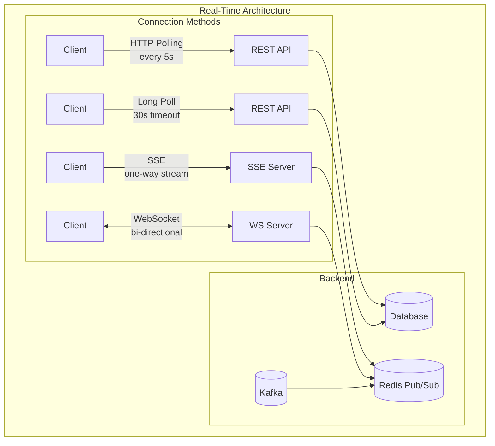

# Real-Time Updates

## Overview

Real-time updates push data to clients as soon as it changes, instead of clients polling for changes. Essential for chat, notifications, live dashboards, and collaborative apps.

## What You Must Master

### 1. Real-Time Communication Options

```
┌─────────────────────────────────────────────────────────────────────────┐
│                    Real-Time Communication Spectrum                      │
│                                                                          │
│   ◄─────────── Simpler ──────────────────────── More Complex ─────────► │
│                                                                          │
│   Polling         Long Polling      SSE             WebSocket            │
│   ┌─────┐        ┌─────┐           ┌─────┐         ┌─────┐             │
│   │     │        │     │           │     │         │     │             │
│   │ ↔   │        │  ↔  │           │  ←  │         │ ↔   │             │
│   │     │        │wait │           │push │         │full │             │
│   └─────┘        └─────┘           └─────┘         └─────┘             │
│                                                                          │
│   • Every Ns     • Server holds    • Server push   • Bi-directional    │
│   • High latency • Until data      • One-way       • Persistent        │
│   • Simple       • Medium latency  • Auto-reconnect• Complex           │
│                                                                          │
└─────────────────────────────────────────────────────────────────────────┘
```

## Architecture Diagram



## Pattern 1: Polling (Simple but Inefficient)

```
┌─────────────────────────────────────────────────────────────────────────┐
│                    Polling Pattern                                       │
│                                                                          │
│   Client                              Server                            │
│   ┌──────┐                           ┌──────┐                           │
│   │      │ ─── GET /messages ───────►│      │                           │
│   │      │ ◄── [] (no new) ──────────│      │                           │
│   │      │     (wait 5s)             │      │                           │
│   │      │ ─── GET /messages ───────►│      │                           │
│   │      │ ◄── [] (no new) ──────────│      │                           │
│   │      │     (wait 5s)             │      │                           │
│   │      │ ─── GET /messages ───────►│      │                           │
│   │      │ ◄── [msg1, msg2] ─────────│      │ ← Finally data!          │
│   └──────┘                           └──────┘                           │
│                                                                          │
│   Problems:                                                              │
│   • 99% of requests return empty (wasted)                              │
│   • High server load at scale                                          │
│   • Latency = up to polling interval                                   │
│                                                                          │
│   When to use:                                                           │
│   • Very simple requirements                                            │
│   • Updates are infrequent                                              │
│   • Browser compatibility critical                                      │
│                                                                          │
└─────────────────────────────────────────────────────────────────────────┘
```

## Pattern 2: Long Polling (Better)

```
┌─────────────────────────────────────────────────────────────────────────┐
│                    Long Polling Pattern                                  │
│                                                                          │
│   Client                              Server                            │
│   ┌──────┐                           ┌──────┐                           │
│   │      │ ─── GET /messages ───────►│      │                           │
│   │      │         (server holds request until data available)          │
│   │      │               ...waiting 25 seconds...                       │
│   │      │ ◄── [msg1] ───────────────│      │ ← Data! Respond now      │
│   │      │                           │      │                           │
│   │      │ ─── GET /messages ───────►│      │ ← Immediately reconnect  │
│   │      │               ...waiting...                                  │
│   └──────┘                           └──────┘                           │
│                                                                          │
│   Implementation:                                                        │
│   ┌─────────────────────────────────────────────────────────────────┐   │
│   │   async def long_poll(user_id, timeout=30):                     │   │
│   │       deadline = time.time() + timeout                          │   │
│   │       while time.time() < deadline:                             │   │
│   │           messages = get_new_messages(user_id)                  │   │
│   │           if messages:                                          │   │
│   │               return messages                                   │   │
│   │           await asyncio.sleep(1)  # Check every second         │   │
│   │       return []  # Timeout, return empty                       │   │
│   └─────────────────────────────────────────────────────────────────┘   │
│                                                                          │
│   Pros: Lower latency, fewer empty responses                            │
│   Cons: Still request/response, holds connections                       │
│                                                                          │
└─────────────────────────────────────────────────────────────────────────┘
```

## Pattern 3: Server-Sent Events (SSE)

```
┌─────────────────────────────────────────────────────────────────────────┐
│                    Server-Sent Events (SSE)                              │
│                                                                          │
│   HTTP response that never ends - server keeps pushing data             │
│                                                                          │
│   Request:                                                               │
│   GET /events HTTP/1.1                                                  │
│   Accept: text/event-stream                                             │
│                                                                          │
│   Response (streaming):                                                  │
│   HTTP/1.1 200 OK                                                       │
│   Content-Type: text/event-stream                                       │
│                                                                          │
│   data: {"type": "message", "text": "Hello"}                           │
│                                                                          │
│   data: {"type": "typing", "user": "Alice"}                            │
│                                                                          │
│   data: {"type": "message", "text": "World"}                           │
│                                                                          │
│   ... (connection stays open)                                           │
│                                                                          │
│   JavaScript:                                                            │
│   ┌─────────────────────────────────────────────────────────────────┐   │
│   │   const events = new EventSource('/events');                    │   │
│   │   events.onmessage = (e) => {                                   │   │
│   │       const data = JSON.parse(e.data);                          │   │
│   │       handleUpdate(data);                                       │   │
│   │   };                                                            │   │
│   │   // Auto-reconnects if connection drops!                       │   │
│   └─────────────────────────────────────────────────────────────────┘   │
│                                                                          │
│   Pros:                                                                  │
│   • Simple (just HTTP)                                                  │
│   • Auto-reconnect built in                                            │
│   • Works through proxies/load balancers                               │
│                                                                          │
│   Cons:                                                                  │
│   • One-way only (server → client)                                     │
│   • Limited to ~6 connections per domain (browser limit)               │
│                                                                          │
│   Use for: Notifications, live feeds, stock prices                     │
│                                                                          │
└─────────────────────────────────────────────────────────────────────────┘
```

## Pattern 4: WebSocket (Full Duplex)

```
┌─────────────────────────────────────────────────────────────────────────┐
│                    WebSocket Pattern                                     │
│                                                                          │
│   Client                              Server                            │
│   ┌──────┐                           ┌──────┐                           │
│   │      │ ─── HTTP Upgrade ────────►│      │                           │
│   │      │ ◄── 101 Switching ────────│      │                           │
│   │      │                           │      │                           │
│   │      │ ═══════════════════════════════│ (WebSocket connection)    │
│   │      │                           │      │                           │
│   │      │ ◄── server push ──────────│      │                           │
│   │      │ ─── client message ──────►│      │                           │
│   │      │ ◄── server response ──────│      │                           │
│   │      │ ─── client message ──────►│      │                           │
│   │      │                           │      │                           │
│   └──────┘                           └──────┘                           │
│                                                                          │
│   Handshake:                                                             │
│   ┌─────────────────────────────────────────────────────────────────┐   │
│   │   GET /chat HTTP/1.1                                            │   │
│   │   Upgrade: websocket                                            │   │
│   │   Connection: Upgrade                                           │   │
│   │   Sec-WebSocket-Key: dGhlIHNhbXBsZSBub25jZQ==                   │   │
│   │                                                                  │   │
│   │   HTTP/1.1 101 Switching Protocols                              │   │
│   │   Upgrade: websocket                                            │   │
│   │   Connection: Upgrade                                           │   │
│   │   Sec-WebSocket-Accept: s3pPLMBiTxaQ9kYGzzhZRbK+xOo=           │   │
│   └─────────────────────────────────────────────────────────────────┘   │
│                                                                          │
│   Scaling challenge:                                                     │
│   • Each connection = memory + file descriptor                         │
│   • 100K connections = ~10GB RAM                                       │
│   • Must track which user is on which server                           │
│                                                                          │
└─────────────────────────────────────────────────────────────────────────┘
```

## Pattern 5: Pub/Sub for Scaling WebSockets

```
┌─────────────────────────────────────────────────────────────────────────┐
│                    Scaling WebSockets with Pub/Sub                       │
│                                                                          │
│   Problem: User A on Server 1, User B on Server 2                       │
│           How does A's message reach B?                                 │
│                                                                          │
│   Solution: Redis Pub/Sub as message bus                                │
│                                                                          │
│   ┌───────┐         ┌───────┐                                          │
│   │User A │─────────│  WS   │                                          │
│   └───────┘         │Server1│──┐                                        │
│                     └───────┘  │                                        │
│                                │    ┌─────────┐                         │
│                                ├───►│  Redis  │                         │
│                                │    │ Pub/Sub │                         │
│   ┌───────┐         ┌───────┐  │    └─────────┘                         │
│   │User B │─────────│  WS   │──┘         │                              │
│   └───────┘         │Server2│◄───────────┘                              │
│                     └───────┘                                           │
│                                                                          │
│   Flow:                                                                  │
│   1. User A sends message                                               │
│   2. Server 1 publishes to Redis channel "chat:room123"                │
│   3. Server 2 (subscribed to same channel) receives                    │
│   4. Server 2 pushes to User B's WebSocket                             │
│                                                                          │
│   Session tracking in Redis:                                            │
│   SET user:A:server = "server1"                                        │
│   SET user:B:server = "server2"                                        │
│                                                                          │
└─────────────────────────────────────────────────────────────────────────┘
```

## Comparison Matrix

| Aspect | Polling | Long Poll | SSE | WebSocket |
|--------|---------|-----------|-----|-----------|
| Direction | Client→Server | Client→Server | Server→Client | Bidirectional |
| Latency | High | Medium | Low | Low |
| Server load | High | Medium | Low | Low |
| Complexity | Low | Low | Medium | High |
| Scaling | Easy | Medium | Medium | Hard |
| Firewall friendly | ✅ | ✅ | ✅ | ⚠️ Some block |

## Interview Checklist

- [ ] **When to use each**: Polling vs SSE vs WebSocket
- [ ] **WebSocket scaling**: Pub/Sub, session tracking
- [ ] **Connection limits**: File descriptors, memory
- [ ] **Heartbeats**: Detecting dead connections
- [ ] **Reconnection**: Handling dropped connections
- [ ] **Ordering**: Message ordering guarantees

## Key Concepts to Articulate

| Concept | One-Liner |
|---------|-----------|
| **Heartbeat** | Periodic ping to detect dead connections |
| **Sticky session** | Same user always hits same server |
| **Fan-out** | One message delivered to many clients |
| **Presence** | Tracking who is online |
| **Backpressure** | Slowing down when client can't keep up |
