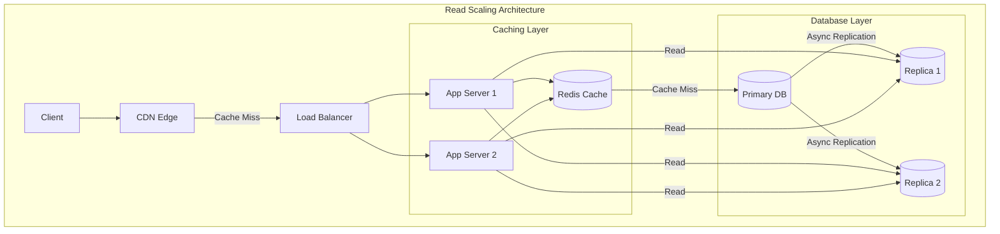

# Scaling Reads

## Overview

Most systems are read-heavy (90-99% reads). Scaling reads is about serving more read requests without overwhelming your primary database.

## What You Must Master

### 1. The Read Scaling Pyramid

```
┌─────────────────────────────────────────────────────────────────────────┐
│                    Read Scaling Layers                                   │
│                                                                          │
│   Fastest ─────────────────────────────────────────────── Slowest       │
│                                                                          │
│   ┌───────────────────────────────────────────────────────────────┐     │
│   │                     Browser Cache                              │     │
│   │              (< 1ms, limited by user device)                  │     │
│   └───────────────────────────────────────────────────────────────┘     │
│                              ▼                                           │
│   ┌───────────────────────────────────────────────────────────────┐     │
│   │                         CDN                                    │     │
│   │           (5-50ms, edge locations worldwide)                  │     │
│   └───────────────────────────────────────────────────────────────┘     │
│                              ▼                                           │
│   ┌───────────────────────────────────────────────────────────────┐     │
│   │                   Application Cache                            │     │
│   │              (Redis/Memcached, 1-5ms)                         │     │
│   └───────────────────────────────────────────────────────────────┘     │
│                              ▼                                           │
│   ┌───────────────────────────────────────────────────────────────┐     │
│   │                   Read Replicas                                │     │
│   │           (Database replicas, 10-50ms)                        │     │
│   └───────────────────────────────────────────────────────────────┘     │
│                              ▼                                           │
│   ┌───────────────────────────────────────────────────────────────┐     │
│   │                  Primary Database                              │     │
│   │             (Source of truth, 10-100ms)                       │     │
│   └───────────────────────────────────────────────────────────────┘     │
│                                                                          │
└─────────────────────────────────────────────────────────────────────────┘
```

## Architecture Diagram



## Pattern 1: Read Replicas

```
┌─────────────────────────────────────────────────────────────────────────┐
│                    Read Replica Pattern                                  │
│                                                                          │
│   Application                                                            │
│       │                                                                  │
│       ├──── Writes ────► Primary DB ────┐                               │
│       │                       │         │                               │
│       │                       ▼         ▼                               │
│       └──── Reads ────► [Replica 1] [Replica 2]                        │
│                                                                          │
│   Replication Types:                                                     │
│   ┌─────────────────────────────────────────────────────────────────┐   │
│   │ Synchronous: Write waits for all replicas                       │   │
│   │   ✅ Strong consistency                                          │   │
│   │   ❌ Higher latency, lower availability                          │   │
│   │                                                                  │   │
│   │ Asynchronous: Write returns immediately, replicas catch up      │   │
│   │   ✅ Low latency, high availability                              │   │
│   │   ❌ Eventual consistency (may read stale data)                  │   │
│   └─────────────────────────────────────────────────────────────────┘   │
│                                                                          │
│   Replication Lag Problem:                                               │
│   User writes → Primary (success)                                       │
│   User reads → Replica (sees old data!)                                 │
│                                                                          │
│   Solutions:                                                             │
│   1. Read-your-writes: Route user's reads to primary after write       │
│   2. Sticky sessions: Same user always hits same replica               │
│   3. Wait for replication: Track replication lag before reading        │
│                                                                          │
└─────────────────────────────────────────────────────────────────────────┘
```

## Pattern 2: Caching

```
┌─────────────────────────────────────────────────────────────────────────┐
│                    Caching Strategies                                    │
│                                                                          │
│   1. Cache-Aside (Lazy Loading)                                         │
│   ┌─────────────────────────────────────────────────────────────────┐   │
│   │   def get(key):                                                  │   │
│   │       value = cache.get(key)                                    │   │
│   │       if value is None:          # Cache miss                   │   │
│   │           value = db.query(key)  # Query database               │   │
│   │           cache.set(key, value)  # Populate cache               │   │
│   │       return value                                               │   │
│   │                                                                  │   │
│   │   ✅ Only caches what's actually read                            │   │
│   │   ❌ First read is slow (cache miss)                             │   │
│   │   ❌ Cache can become stale                                       │   │
│   └─────────────────────────────────────────────────────────────────┘   │
│                                                                          │
│   2. Read-Through Cache                                                  │
│   ┌─────────────────────────────────────────────────────────────────┐   │
│   │   App ──► Cache ──► Database                                    │   │
│   │           (cache handles DB queries transparently)              │   │
│   │                                                                  │   │
│   │   ✅ Simpler application code                                    │   │
│   │   ❌ Cache becomes critical path                                 │   │
│   └─────────────────────────────────────────────────────────────────┘   │
│                                                                          │
│   3. Write-Through (keeps cache warm)                                   │
│   ┌─────────────────────────────────────────────────────────────────┐   │
│   │   On write: Update cache AND database together                  │   │
│   │                                                                  │   │
│   │   ✅ Cache always consistent                                     │   │
│   │   ❌ Higher write latency                                        │   │
│   │   ❌ May cache data that's never read                            │   │
│   └─────────────────────────────────────────────────────────────────┘   │
│                                                                          │
└─────────────────────────────────────────────────────────────────────────┘
```

## Pattern 3: CDN (Content Delivery Network)

```
┌─────────────────────────────────────────────────────────────────────────┐
│                    CDN Architecture                                      │
│                                                                          │
│                        ┌─────────┐                                      │
│   User in Tokyo ──────►│ Tokyo   │ (5ms)                               │
│                        │  Edge   │                                      │
│                        └────┬────┘                                      │
│                             │ Cache Miss                                │
│                             ▼                                           │
│                        ┌─────────┐                                      │
│                        │ Origin  │ (200ms to US)                       │
│                        │ Server  │                                      │
│                        └─────────┘                                      │
│                                                                          │
│   What to CDN:                                                           │
│   ✅ Static assets (JS, CSS, images)                                    │
│   ✅ Cacheable API responses                                            │
│   ✅ Video/media content                                                │
│   ❌ User-specific data                                                 │
│   ❌ Frequently changing data                                           │
│                                                                          │
│   Cache-Control headers:                                                 │
│   • public, max-age=31536000  (static assets, 1 year)                  │
│   • private, max-age=0        (user data, no CDN cache)                │
│   • s-maxage=3600             (CDN caches for 1 hour)                  │
│                                                                          │
└─────────────────────────────────────────────────────────────────────────┘
```

## Pattern 4: Denormalization

```
┌─────────────────────────────────────────────────────────────────────────┐
│                    Denormalization for Reads                             │
│                                                                          │
│   Normalized (slow reads, many JOINs):                                  │
│   ┌────────────────────────────────────────────────────────────────┐    │
│   │   SELECT u.name, COUNT(o.id) as order_count                    │    │
│   │   FROM users u                                                  │    │
│   │   JOIN orders o ON u.id = o.user_id                            │    │
│   │   GROUP BY u.id                                                 │    │
│   └────────────────────────────────────────────────────────────────┘    │
│                                                                          │
│   Denormalized (fast reads, pre-computed):                              │
│   ┌────────────────────────────────────────────────────────────────┐    │
│   │   users table:                                                  │    │
│   │   | id | name  | order_count |  ← Pre-computed!                │    │
│   │   | 1  | Alice | 47          |                                 │    │
│   │                                                                 │    │
│   │   Update on each order:                                        │    │
│   │   UPDATE users SET order_count = order_count + 1               │    │
│   │   WHERE id = :user_id                                          │    │
│   └────────────────────────────────────────────────────────────────┘    │
│                                                                          │
│   Trade-off:                                                             │
│   • Faster reads (no JOINs, pre-computed aggregates)                   │
│   • More complex writes (must update multiple places)                  │
│   • Risk of inconsistency                                               │
│                                                                          │
└─────────────────────────────────────────────────────────────────────────┘
```

## Scaling Decision Matrix

| Technique | Latency Improvement | Complexity | Best For |
|-----------|-------------------|------------|----------|
| Browser cache | 100x | Low | Static assets |
| CDN | 10-50x | Low | Global users, static content |
| Redis cache | 10-100x | Medium | Hot data, sessions |
| Read replicas | 2-10x | Medium | DB read throughput |
| Denormalization | 2-10x | High | Complex queries |

## Interview Checklist

- [ ] **Caching**: Cache-aside vs read-through vs write-through
- [ ] **CDN**: When to use, Cache-Control headers
- [ ] **Replicas**: Sync vs async, replication lag
- [ ] **Read-your-writes**: Consistency after user's own write
- [ ] **Cache invalidation**: TTL, event-based, write-through
- [ ] **Hot spots**: What if one key is extremely popular?

## Key Concepts to Articulate

| Concept | One-Liner |
|---------|-----------|
| **Replication lag** | Time between write to primary and replica sync |
| **Cache stampede** | Many requests hit DB when cache expires |
| **Thundering herd** | Similar, many clients waiting for same resource |
| **TTL** | Time-to-live, when cache entry expires |
| **Cache warming** | Pre-populating cache before traffic hits |
