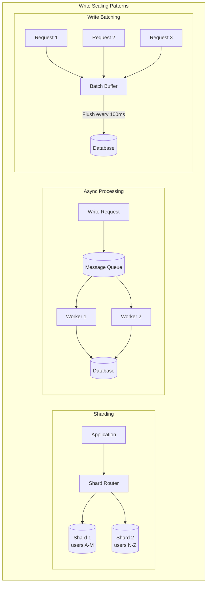

# Scaling Writes

## Overview

Write scaling is harder than read scaling. You can't just add replicas because all writes must go to one place to maintain consistency. This pattern covers techniques to scale write-heavy workloads.

## What You Must Master

### 1. Why Writes Are Hard to Scale

```
┌─────────────────────────────────────────────────────────────────────────┐
│                    Write Scaling Challenge                               │
│                                                                          │
│   Reads: Can be served by any replica                                   │
│   ┌─────────┐     ┌─────────┐     ┌─────────┐                          │
│   │Replica 1│     │Replica 2│     │Replica 3│    ← All can serve reads │
│   └─────────┘     └─────────┘     └─────────┘                          │
│                                                                          │
│   Writes: Must go through one node (or require coordination)            │
│   ┌─────────┐                                                           │
│   │ Primary │    ← Single point, limited throughput                    │
│   └─────────┘                                                           │
│        │                                                                 │
│        ▼                                                                 │
│   ┌─────────┐     ┌─────────┐     ┌─────────┐                          │
│   │Replica 1│     │Replica 2│     │Replica 3│                          │
│   └─────────┘     └─────────┘     └─────────┘                          │
│                                                                          │
│   Single PostgreSQL: ~10,000 writes/sec (practical limit)              │
│   Need more? Must distribute writes across multiple nodes               │
│                                                                          │
└─────────────────────────────────────────────────────────────────────────┘
```

## Architecture Diagram



## Pattern 1: Sharding (Horizontal Partitioning)

```
┌─────────────────────────────────────────────────────────────────────────┐
│                    Sharding for Write Scale                              │
│                                                                          │
│   Before: Single DB handling all writes                                 │
│   ┌─────────────────────────────────────────────────────────────────┐   │
│   │                     10,000 writes/sec                            │   │
│   │                           │                                      │   │
│   │                           ▼                                      │   │
│   │                    ┌──────────┐                                 │   │
│   │                    │ Database │  ← Bottleneck!                  │   │
│   │                    └──────────┘                                 │   │
│   └─────────────────────────────────────────────────────────────────┘   │
│                                                                          │
│   After: Writes distributed across shards                               │
│   ┌─────────────────────────────────────────────────────────────────┐   │
│   │                     40,000 writes/sec                            │   │
│   │          ┌────────────┼────────────┐                            │   │
│   │          ▼            ▼            ▼                            │   │
│   │     ┌────────┐   ┌────────┐   ┌────────┐   ┌────────┐          │   │
│   │     │ Shard1 │   │ Shard2 │   │ Shard3 │   │ Shard4 │          │   │
│   │     │ 10K/s  │   │ 10K/s  │   │ 10K/s  │   │ 10K/s  │          │   │
│   │     └────────┘   └────────┘   └────────┘   └────────┘          │   │
│   └─────────────────────────────────────────────────────────────────┘   │
│                                                                          │
│   Shard Key Selection (CRITICAL):                                       │
│   ✅ user_id   - Even distribution, user data together                 │
│   ✅ tenant_id - Multi-tenant SaaS, data isolation                     │
│   ❌ timestamp - All recent data on one shard (hot spot!)              │
│   ❌ country   - Uneven distribution (US >> small countries)           │
│                                                                          │
└─────────────────────────────────────────────────────────────────────────┘
```

## Pattern 2: Asynchronous Writes

```
┌─────────────────────────────────────────────────────────────────────────┐
│                    Async Write Pattern                                   │
│                                                                          │
│   Synchronous (blocking):                                                │
│   ┌─────────────────────────────────────────────────────────────────┐   │
│   │   Client ──► API ──► Database ──► Response                      │   │
│   │                         │                                        │   │
│   │              Wait for DB (100ms) ────►                          │   │
│   │                                                                  │   │
│   │   Total latency: 100ms                                          │   │
│   └─────────────────────────────────────────────────────────────────┘   │
│                                                                          │
│   Asynchronous (non-blocking):                                          │
│   ┌─────────────────────────────────────────────────────────────────┐   │
│   │   Client ──► API ──► Queue ──► Response (immediate)             │   │
│   │                  │                                               │   │
│   │                  └──► Worker ──► Database (background)          │   │
│   │                                                                  │   │
│   │   Total latency: 5ms (queue write)                              │   │
│   │   Trade-off: Eventual consistency                               │   │
│   └─────────────────────────────────────────────────────────────────┘   │
│                                                                          │
│   When to use async:                                                     │
│   ✅ Analytics events, logging                                          │
│   ✅ Email/notification sending                                         │
│   ✅ Image/video processing                                             │
│   ❌ Financial transactions (need immediate confirmation)              │
│   ❌ User expecting immediate result                                    │
│                                                                          │
└─────────────────────────────────────────────────────────────────────────┘
```

## Pattern 3: Write Batching

```
┌─────────────────────────────────────────────────────────────────────────┐
│                    Write Batching                                        │
│                                                                          │
│   Without batching: N writes = N round trips                            │
│   ┌─────────────────────────────────────────────────────────────────┐   │
│   │   INSERT INTO events VALUES (1, 'click');  -- 5ms               │   │
│   │   INSERT INTO events VALUES (2, 'view');   -- 5ms               │   │
│   │   INSERT INTO events VALUES (3, 'click');  -- 5ms               │   │
│   │   ... 100 inserts = 500ms total                                 │   │
│   └─────────────────────────────────────────────────────────────────┘   │
│                                                                          │
│   With batching: N writes = 1 round trip                                │
│   ┌─────────────────────────────────────────────────────────────────┐   │
│   │   INSERT INTO events VALUES                                     │   │
│   │     (1, 'click'),                                               │   │
│   │     (2, 'view'),                                                │   │
│   │     (3, 'click'),                                               │   │
│   │     ... 100 values;  -- 10ms total                              │   │
│   └─────────────────────────────────────────────────────────────────┘   │
│                                                                          │
│   Implementation:                                                        │
│   ┌─────────────────────────────────────────────────────────────────┐   │
│   │   buffer = []                                                    │   │
│   │   MAX_BATCH = 100                                               │   │
│   │   MAX_WAIT = 100ms                                              │   │
│   │                                                                  │   │
│   │   def write(item):                                              │   │
│   │       buffer.append(item)                                        │   │
│   │       if len(buffer) >= MAX_BATCH or time_since_last > MAX_WAIT:│   │
│   │           flush_to_db(buffer)                                    │   │
│   │           buffer = []                                            │   │
│   └─────────────────────────────────────────────────────────────────┘   │
│                                                                          │
│   Trade-off: Latency vs throughput                                      │
│   • Higher batch size = more throughput, more latency                  │
│   • Lower batch size = less throughput, less latency                   │
│                                                                          │
└─────────────────────────────────────────────────────────────────────────┘
```

## Pattern 4: Write-Ahead Log (WAL)

```
┌─────────────────────────────────────────────────────────────────────────┐
│                    Write-Ahead Log Pattern                               │
│                                                                          │
│   Problem: Writing directly to data structures is slow                  │
│   Solution: Append to sequential log first (fast), then update later   │
│                                                                          │
│   ┌─────────────────────────────────────────────────────────────────┐   │
│   │                                                                  │   │
│   │   Write ──► WAL (append-only, sequential) ──► Acknowledge       │   │
│   │              │                                                   │   │
│   │              └──► Background: Apply to data structure           │   │
│   │                                                                  │   │
│   │   Sequential write: ~100MB/s                                    │   │
│   │   Random write: ~1MB/s                                          │   │
│   │   100x faster!                                                  │   │
│   │                                                                  │   │
│   └─────────────────────────────────────────────────────────────────┘   │
│                                                                          │
│   Used by:                                                               │
│   • PostgreSQL, MySQL (transaction log)                                 │
│   • Kafka (append-only log IS the storage)                             │
│   • LSM trees (LevelDB, RocksDB, Cassandra)                            │
│                                                                          │
└─────────────────────────────────────────────────────────────────────────┘
```

## Pattern 5: CQRS (Command Query Responsibility Segregation)

```
┌─────────────────────────────────────────────────────────────────────────┐
│                    CQRS Pattern                                          │
│                                                                          │
│   Traditional: Same model for reads and writes                          │
│   ┌─────────────────────────────────────────────────────────────────┐   │
│   │   App ────► [Single Model] ────► Database                       │   │
│   └─────────────────────────────────────────────────────────────────┘   │
│                                                                          │
│   CQRS: Separate models optimized for each                              │
│   ┌─────────────────────────────────────────────────────────────────┐   │
│   │                                                                  │   │
│   │   Commands (Writes)           Queries (Reads)                   │   │
│   │        │                            │                           │   │
│   │        ▼                            ▼                           │   │
│   │   ┌──────────┐               ┌──────────┐                       │   │
│   │   │  Write   │───Events────►│   Read   │                       │   │
│   │   │  Model   │               │  Model   │                       │   │
│   │   └────┬─────┘               └────┬─────┘                       │   │
│   │        │                          │                             │   │
│   │        ▼                          ▼                             │   │
│   │   ┌──────────┐               ┌──────────┐                       │   │
│   │   │ Write DB │               │ Read DB  │                       │   │
│   │   │(Postgres)│               │ (Redis)  │                       │   │
│   │   └──────────┘               └──────────┘                       │   │
│   │                                                                  │   │
│   └─────────────────────────────────────────────────────────────────┘   │
│                                                                          │
│   Benefits:                                                              │
│   • Scale reads and writes independently                                │
│   • Optimize each model for its use case                               │
│   • Different storage technologies per model                           │
│                                                                          │
│   Downsides:                                                             │
│   • Eventual consistency between models                                 │
│   • More complex architecture                                           │
│   • Must handle sync failures                                           │
│                                                                          │
└─────────────────────────────────────────────────────────────────────────┘
```

## Scaling Decision Matrix

| Technique | Write Improvement | Complexity | Use Case |
|-----------|------------------|------------|----------|
| Sharding | 10-100x | High | Large datasets |
| Async writes | 10-50x latency | Medium | Non-critical writes |
| Batching | 10-100x throughput | Low | High-frequency writes |
| WAL | 10-100x | Built into DBs | All writes |
| CQRS | 10x | High | Different read/write patterns |

## Interview Checklist

- [ ] **Sharding**: Key selection, cross-shard queries
- [ ] **Async**: When acceptable, queue guarantees
- [ ] **Batching**: Size vs latency trade-off
- [ ] **WAL**: Why sequential writes are fast
- [ ] **CQRS**: When to use, consistency handling
- [ ] **Idempotency**: Handling retries safely

## Key Concepts to Articulate

| Concept | One-Liner |
|---------|-----------|
| **Shard key** | Column used to distribute data across shards |
| **Hot shard** | One shard getting disproportionate traffic |
| **Idempotency** | Same operation multiple times = same result |
| **At-least-once** | May process duplicates, consumer must handle |
| **Backpressure** | Slowing down producers when consumers are slow |
| **Write amplification** | One logical write causes multiple physical writes |
