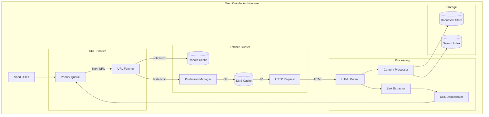

# Web Crawler Design

## Overview

A web crawler (spider) systematically browses the web to index pages, collect data, or monitor websites. This is a classic system design question that tests your understanding of distributed systems, throttling, and data processing.

## What You Must Master

### 1. Core Challenges

```
┌─────────────────────────────────────────────────────────────────────────┐
│                    Web Crawler Challenges                               │
│                                                                         │
│   1. Scale: Billions of pages, petabytes of data                       │
│   2. Politeness: Don't overwhelm websites                              │
│   3. Freshness: Keep content up-to-date                                │
│   4. Duplicates: Same content, different URLs                          │
│   5. Traps: Infinite loops, generated pages                            │
│   6. Robustness: Handle failures gracefully                            │
│                                                                         │
└─────────────────────────────────────────────────────────────────────────┘
```

### 2. Requirements

| Functional | Non-Functional |
|-----------|----------------|
| Start from seed URLs | Crawl 1B pages/day |
| Extract links from pages | Low latency per page |
| Store/index content | Distributed across data centers |
| Respect robots.txt | Fault-tolerant |
| Handle different content types | Politeness (rate limiting) |

## Architecture Diagram



## Component Deep Dive

### URL Frontier (The Heart)

```
┌─────────────────────────────────────────────────────────────────────────┐
│                        URL Frontier                                      │
│                                                                          │
│   Manages which URLs to crawl next                                      │
│                                                                          │
│   ┌─────────────────────────────────────────────────────────────────┐   │
│   │                    Prioritizer                                   │   │
│   │   • PageRank scores                                              │   │
│   │   • Freshness (time since last crawl)                           │   │
│   │   • Domain importance                                            │   │
│   │   • Change frequency                                             │   │
│   └───────────────────────────┬─────────────────────────────────────┘   │
│                               ▼                                          │
│   ┌─────────────────────────────────────────────────────────────────┐   │
│   │                 Front Queues (Priority)                          │   │
│   │   [High Priority] → [Medium] → [Low Priority]                   │   │
│   └───────────────────────────┬─────────────────────────────────────┘   │
│                               ▼                                          │
│   ┌─────────────────────────────────────────────────────────────────┐   │
│   │                Back Queues (Per Domain)                          │   │
│   │   [example1.com] [example2.com] [example3.com] ...              │   │
│   │   ↑ One queue per domain for politeness                        │   │
│   └─────────────────────────────────────────────────────────────────┘   │
│                                                                          │
└─────────────────────────────────────────────────────────────────────────┘
```

### Politeness & Robots.txt

```
┌─────────────────────────────────────────────────────────────────────────┐
│                     Politeness Manager                                   │
│                                                                          │
│   robots.txt rules:                                                      │
│   ┌─────────────────────────────────────────────────────────────────┐   │
│   │   User-agent: *                                                  │   │
│   │   Disallow: /private/                                           │   │
│   │   Disallow: /api/                                               │   │
│   │   Crawl-delay: 10                                               │   │
│   └─────────────────────────────────────────────────────────────────┘   │
│                                                                          │
│   Best practices:                                                        │
│   • Wait 1-2 seconds between requests to same domain                   │
│   • Honor Crawl-delay if specified                                      │
│   • Identify yourself: User-Agent: MyBot/1.0 (+http://mybot.com)       │
│   • Max 1 concurrent connection per domain                              │
│                                                                          │
└─────────────────────────────────────────────────────────────────────────┘
```

### URL Deduplication

```
┌─────────────────────────────────────────────────────────────────────────┐
│                     URL Deduplication                                    │
│                                                                          │
│   Challenge: Billions of URLs, need O(1) lookup                        │
│                                                                          │
│   Solution 1: Hash Table in memory                                      │
│   • 1B URLs × 8 bytes = 8GB (doable with sharding)                     │
│                                                                          │
│   Solution 2: Bloom Filter                                              │
│   • Probabilistic: may have false positives                            │
│   • 1B URLs, 1% false positive = ~1.2GB                                │
│   • False positive just means re-crawl (acceptable)                    │
│                                                                          │
│   Solution 3: Content Hash (MinHash/SimHash)                           │
│   • Detect near-duplicate CONTENT (same page, different URL)           │
│                                                                          │
└─────────────────────────────────────────────────────────────────────────┘
```

## Capacity Estimation

```
Goal: Crawl 1 billion pages/month

Pages/day = 1B / 30 = 33M pages/day
Pages/sec = 33M / 86400 = ~380 pages/sec

Storage per page:
- HTML: ~100KB average
- Metadata: ~1KB
- Total: ~101KB

Monthly storage = 1B × 101KB = 101TB/month

Crawlers needed:
- 1 page takes ~2 seconds (DNS, HTTP, parse)
- 1 crawler: 30 pages/minute = 1800 pages/hour
- Pages/day per crawler: 43,200
- Crawlers needed: 33M / 43,200 = ~764 crawlers
```

## Key Algorithms

### 1. URL Normalization

```
All these should resolve to SAME canonical URL:

http://example.com
https://Example.Com/
HTTP://EXAMPLE.COM/path/../
http://example.com:80/

→ Canonical: https://example.com/
```

### 2. Prioritization Strategies

| Strategy | When to Use |
|----------|-------------|
| BFS (Breadth-First) | General crawling |
| Important pages first | PageRank-based priority |
| Freshness-based | News sites, frequently changing |
| Focused crawling | Specific topics only |

## Interview Checklist

- [ ] **Seed URLs**: Where do we start?
- [ ] **Frontier**: How to prioritize URLs?
- [ ] **Politeness**: robots.txt, rate limiting
- [ ] **Deduplication**: URLs and content
- [ ] **Storage**: Where to store pages?
- [ ] **Indexing**: How to make searchable?
- [ ] **Freshness**: How often to re-crawl?
- [ ] **Traps**: Spider traps, infinite loops
- [ ] **Scale**: How many crawlers needed?

## Common Trap Questions

**Q: How to handle infinite loop?**
- Limit depth per domain
- Detect repeating URL patterns
- Hash-based cycle detection

**Q: How to handle dynamic content (JavaScript)?**
- Headless browser (Puppeteer, Playwright)
- Much slower, more resources needed

**Q: How to handle different content types?**
- Check Content-Type header
- Parse HTML, store PDFs/images differently

## Key Concepts to Articulate

| Concept | Explanation |
|---------|-------------|
| **robots.txt** | Standard for allowed/disallowed paths |
| **Sitemap** | XML list of URLs provided by website |
| **URL Frontier** | Queue of URLs to be crawled |
| **Politeness** | Not overwhelming servers |
| **Bloom Filter** | Space-efficient set membership |
| **MinHash** | Detect similar documents |
