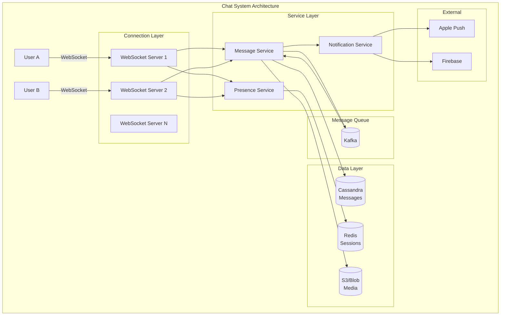

# Chat System Design (WhatsApp/Messenger)

## Overview

Designing a real-time chat system tests your understanding of WebSockets, message delivery guarantees, and handling millions of concurrent connections.

## What You Must Master

### 1. Core Requirements

```
┌─────────────────────────────────────────────────────────────────────────┐
│                    Chat System Requirements                              │
│                                                                          │
│   Functional:                                                            │
│   ├── 1:1 messaging                                                     │
│   ├── Group chats (up to 1000 members)                                 │
│   ├── Online/offline presence                                          │
│   ├── Read receipts                                                     │
│   ├── Media sharing (images, videos)                                   │
│   └── Message history sync                                              │
│                                                                          │
│   Non-Functional:                                                        │
│   ├── Real-time (<100ms latency)                                       │
│   ├── Message ordering guaranteed                                       │
│   ├── At-least-once delivery                                           │
│   ├── 500M DAU                                                         │
│   └── 99.99% availability                                              │
│                                                                          │
└─────────────────────────────────────────────────────────────────────────┘
```

### 2. Message Delivery States

```
┌─────────────────────────────────────────────────────────────────────────┐
│                    Message Delivery Flow                                 │
│                                                                          │
│   Sender                                                   Receiver      │
│   ┌─────┐                                                 ┌─────┐       │
│   │     │ ────1. Send message──────►  Server              │     │       │
│   │     │ ◄───2. Message stored────    │                  │     │       │
│   │  ✓  │ (single checkmark)           │                  │     │       │
│   │     │                              │                  │     │       │
│   │     │                              │───3. Deliver────►│     │       │
│   │ ✓✓  │ ◄───4. Delivered ACK────────│                  │     │       │
│   │     │ (double checkmark)           │                  │     │       │
│   │     │                              │                  │     │       │
│   │     │                              │◄──5. Read ACK────│     │       │
│   │ ✓✓  │ ◄───6. Read notification────│                  │     │       │
│   │blue │ (blue checkmark)             │                  │     │       │
│   └─────┘                                                 └─────┘       │
│                                                                          │
└─────────────────────────────────────────────────────────────────────────┘
```

## Architecture Diagram



## Component Deep Dive

### WebSocket Connection Management

```
┌─────────────────────────────────────────────────────────────────────────┐
│                 WebSocket Server Challenges                              │
│                                                                          │
│   Scale: 500M users, 20% online = 100M concurrent connections          │
│                                                                          │
│   Single server: ~100K connections (memory limited)                     │
│   Servers needed: 100M / 100K = 1,000 servers                          │
│                                                                          │
│   Session Management:                                                    │
│   ┌────────────────────────────────────────────────────────────────┐   │
│   │  Redis: { user_id → [server_id, socket_id, last_active] }      │   │
│   │                                                                 │   │
│   │  user_123 → { server: "ws-42", socket: "abc", active: now() }  │   │
│   └────────────────────────────────────────────────────────────────┘   │
│                                                                          │
│   Routing a message to user_456:                                        │
│   1. Lookup user_456 in Redis → server "ws-17"                         │
│   2. If online: Send to ws-17 via internal message bus                 │
│   3. If offline: Queue message + send push notification                │
│                                                                          │
└─────────────────────────────────────────────────────────────────────────┘
```

### Message Storage Schema (Cassandra)

```sql
-- Messages table (partition by conversation_id for chat history)
CREATE TABLE messages (
    conversation_id UUID,
    message_id TIMEUUID,        -- Time-ordered UUID
    sender_id UUID,
    content TEXT,
    content_type VARCHAR,       -- text, image, video
    media_url TEXT,
    created_at TIMESTAMP,
    PRIMARY KEY ((conversation_id), message_id)
) WITH CLUSTERING ORDER BY (message_id DESC);

-- Inbox table (for syncing unread across devices)
CREATE TABLE user_inbox (
    user_id UUID,
    conversation_id UUID,
    last_message_id TIMEUUID,
    unread_count INT,
    PRIMARY KEY ((user_id), conversation_id)
);
```

### Group Chat Fanout

```
┌─────────────────────────────────────────────────────────────────────────┐
│                    Group Message Delivery                                │
│                                                                          │
│   Group with 500 members:                                               │
│                                                                          │
│   Option 1: Fan-out on Write (push)                                     │
│   ├── Store message once                                                │
│   ├── Push to 500 users immediately                                    │
│   ├── Pro: Fast read                                                   │
│   └── Con: Expensive for large groups                                  │
│                                                                          │
│   Option 2: Fan-out on Read (pull)                                      │
│   ├── Store message once                                                │
│   ├── Users fetch messages when they open chat                         │
│   ├── Pro: Cheap write                                                 │
│   └── Con: Slower read                                                 │
│                                                                          │
│   Hybrid: Push to online users, pull for offline                       │
│                                                                          │
└─────────────────────────────────────────────────────────────────────────┘
```

### Presence (Online/Offline Status)

```
┌─────────────────────────────────────────────────────────────────────────┐
│                    Presence System                                       │
│                                                                          │
│   Challenge: Showing online status for 100M users is expensive         │
│                                                                          │
│   Solution: Heartbeat + Pub/Sub                                         │
│                                                                          │
│   1. User sends heartbeat every 30s                                     │
│   2. Server updates Redis: SET user:123:online = 1 EX 60               │
│   3. On disconnect or timeout: user goes offline                        │
│                                                                          │
│   Broadcasting status:                                                   │
│   • Don't push to ALL friends (expensive)                              │
│   • Only push to users who have chat open                              │
│   • Use pub/sub channels per user                                       │
│                                                                          │
│   Redis:                                                                 │
│   SUBSCRIBE user:123:presence                                           │
│   PUBLISH user:123:presence "online"                                    │
│                                                                          │
└─────────────────────────────────────────────────────────────────────────┘
```

## End-to-End Encryption

```
┌─────────────────────────────────────────────────────────────────────────┐
│                    E2E Encryption (Signal Protocol)                      │
│                                                                          │
│   Key concepts:                                                          │
│   • Each user has identity key pair (public/private)                   │
│   • Signal Protocol for key exchange                                    │
│   • Messages encrypted on device, server only sees ciphertext          │
│                                                                          │
│   Alice → Bob:                                                          │
│   1. Alice gets Bob's public key from server                           │
│   2. Alice encrypts message with shared secret                         │
│   3. Server stores encrypted blob                                       │
│   4. Bob decrypts with his private key                                 │
│                                                                          │
│   Server sees: { to: "bob", content: "a8f3b2c4e5..." }                 │
│   Server CANNOT read content                                            │
│                                                                          │
└─────────────────────────────────────────────────────────────────────────┘
```

## Capacity Estimation

```
500M DAU, 50 messages/user/day = 25B messages/day

Per second:
25B / 86400 = ~290K messages/sec

Storage per message:
- message_id: 16 bytes
- conversation_id: 16 bytes
- sender_id: 16 bytes
- content: 500 bytes avg
- metadata: 100 bytes
- Total: ~650 bytes

Daily storage: 25B × 650 bytes = ~15 TB/day
Yearly: ~5.5 PB (need retention policy!)
```

## Interview Checklist

- [ ] **Protocol**: WebSocket vs long polling vs SSE
- [ ] **Connection management**: How to handle 100M connections
- [ ] **Message ordering**: How to guarantee order
- [ ] **Delivery guarantees**: At-least-once vs exactly-once
- [ ] **Group chats**: Fanout strategy
- [ ] **Presence**: Online/offline status
- [ ] **Push notifications**: For offline users
- [ ] **Media handling**: Upload, storage, CDN
- [ ] **E2E encryption**: Optional but good to mention
- [ ] **Message sync**: Across multiple devices

## Key Concepts to Articulate

| Concept | Explanation |
|---------|-------------|
| **WebSocket** | Full-duplex, persistent connection |
| **Heartbeat** | Periodic ping to detect dead connections |
| **Message ordering** | Use sequential IDs per conversation |
| **Fanout** | Distributing message to all recipients |
| **Pub/Sub** | Pattern for real-time updates |
| **Push notification** | Wake up offline clients |
