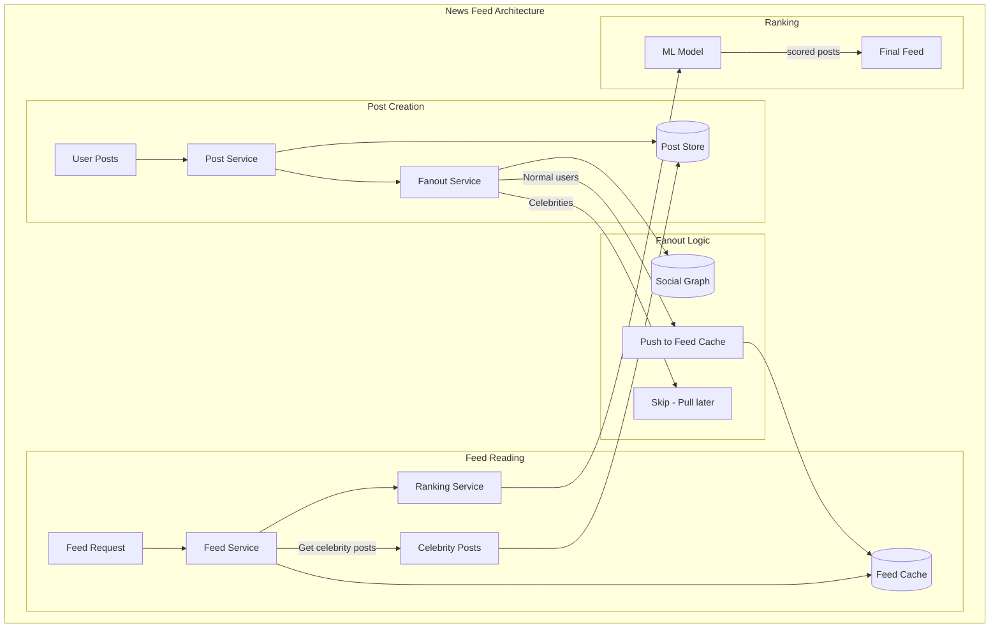

# News Feed Design (Facebook/Twitter)

## Overview

News feed is one of the most asked system design questions. It tests your understanding of fanout strategies, caching, ranking algorithms, and real-time updates.

## What You Must Master

### 1. The Core Problem

```
┌─────────────────────────────────────────────────────────────────────────┐
│                    News Feed Challenge                                   │
│                                                                          │
│   User follows 500 people                                               │
│   Each posts 2 times/day on average                                    │
│   = 1000 potential posts/day to show                                   │
│                                                                          │
│   But user only sees ~50 posts/session                                 │
│                                                                          │
│   Challenge:                                                            │
│   1. How to collect all potential posts? (Fanout)                      │
│   2. How to sort by relevance? (Ranking)                               │
│   3. How to load fast? (<200ms) (Caching)                              │
│   4. How to show new posts? (Real-time)                                │
│                                                                          │
└─────────────────────────────────────────────────────────────────────────┘
```

### 2. Fanout Strategies

```
┌─────────────────────────────────────────────────────────────────────────┐
│              Push vs Pull (The Key Decision)                            │
│                                                                          │
│   PUSH Model (Fanout on Write)                                          │
│   ┌─────────────────────────────────────────────────────────────────┐   │
│   │   User A posts →  A has 1000 followers                          │   │
│   │                   → Write to 1000 user feeds immediately        │   │
│   │                                                                  │   │
│   │   feed:user_123 = [post_A, post_B, post_C, ...]                │   │
│   │                                                                  │   │
│   │   ✅ Fast read: Feed is pre-computed                            │   │
│   │   ❌ Slow write: Celebrity with 10M followers = 10M writes      │   │
│   │   ❌ Wasted work: Many followers never check feed               │   │
│   └─────────────────────────────────────────────────────────────────┘   │
│                                                                          │
│   PULL Model (Fanout on Read)                                           │
│   ┌─────────────────────────────────────────────────────────────────┐   │
│   │   User opens feed →  Fetch posts from all 500 followees         │   │
│   │                   → Merge and sort                              │   │
│   │                   → Return top N                                │   │
│   │                                                                  │   │
│   │   ✅ Fast write: Just store post once                           │   │
│   │   ❌ Slow read: Must query 500 users every time                 │   │
│   │   ❌ Hard to rank: Need all posts to rank properly              │   │
│   └─────────────────────────────────────────────────────────────────┘   │
│                                                                          │
│   HYBRID (Facebook/Twitter approach)                                    │
│   ┌─────────────────────────────────────────────────────────────────┐   │
│   │   Normal users: PUSH (fanout on write)                          │   │
│   │   Celebrities (>10K followers): PULL (fanout on read)           │   │
│   │                                                                  │   │
│   │   When user requests feed:                                      │   │
│   │   1. Get pre-computed feed from cache                           │   │
│   │   2. Fetch recent posts from celebrities they follow            │   │
│   │   3. Merge and re-rank                                          │   │
│   └─────────────────────────────────────────────────────────────────┘   │
│                                                                          │
└─────────────────────────────────────────────────────────────────────────┘
```

## Architecture Diagram



## Component Deep Dive

### Feed Storage

```
┌─────────────────────────────────────────────────────────────────────────┐
│                    Feed Storage Options                                  │
│                                                                          │
│   Option 1: Redis List (Simple)                                         │
│   ┌─────────────────────────────────────────────────────────────────┐   │
│   │   feed:user_123 = [post_789, post_456, post_123, ...]          │   │
│   │   LPUSH feed:user_123 new_post_id                              │   │
│   │   LRANGE feed:user_123 0 49  # Get latest 50                   │   │
│   │                                                                  │   │
│   │   Keep only latest 1000: LTRIM feed:user_123 0 999             │   │
│   └─────────────────────────────────────────────────────────────────┘   │
│                                                                          │
│   Option 2: Redis Sorted Set (With scores)                              │
│   ┌─────────────────────────────────────────────────────────────────┐   │
│   │   ZADD feed:user_123 {timestamp} post_789                      │   │
│   │   ZREVRANGE feed:user_123 0 49  # Latest 50 by time            │   │
│   │                                                                  │   │
│   │   Can also score by relevance instead of time                  │   │
│   └─────────────────────────────────────────────────────────────────┘   │
│                                                                          │
└─────────────────────────────────────────────────────────────────────────┘
```

### Ranking Algorithm

```
┌─────────────────────────────────────────────────────────────────────────┐
│                    Feed Ranking                                          │
│                                                                          │
│   Basic signal combination:                                              │
│                                                                          │
│   score = (affinity × post_quality × time_decay)                       │
│                                                                          │
│   Affinity: How close is poster to viewer?                              │
│   • Direct connection weight                                            │
│   • Interaction history (likes, comments, views)                        │
│   • Common connections                                                  │
│                                                                          │
│   Post Quality:                                                          │
│   • Engagement rate (likes/impressions)                                 │
│   • Content type (video > image > text)                                │
│   • Post length / completeness                                          │
│                                                                          │
│   Time Decay:                                                            │
│   • Exponential decay: score × e^(-λ × age_hours)                      │
│   • Newer posts get priority                                            │
│                                                                          │
│   ML Ranking:                                                            │
│   • Feature vector → Neural network → P(engagement)                   │
│   • Features: user history, post features, context (time, device)      │
│                                                                          │
└─────────────────────────────────────────────────────────────────────────┘
```

### Real-time Updates

```
┌─────────────────────────────────────────────────────────────────────────┐
│                 Real-time Feed Updates                                   │
│                                                                          │
│   Options:                                                               │
│                                                                          │
│   1. Polling (Simple)                                                    │
│      • Client polls every 30s                                           │
│      • Inefficient, but simple                                          │
│                                                                          │
│   2. Long Polling                                                        │
│      • Server holds request until new content                           │
│      • Better than polling, more complex                                │
│                                                                          │
│   3. WebSocket                                                           │
│      • Full duplex, push new posts instantly                            │
│      • Most responsive, but expensive at scale                          │
│                                                                          │
│   4. Server-Sent Events (SSE)                                           │
│      • One-way push from server                                         │
│      • Good balance for feed updates                                    │
│                                                                          │
│   Facebook approach:                                                     │
│   • Badge update via WebSocket ("3 new posts")                         │
│   • Click to load new posts (reduces ranking complexity)               │
│                                                                          │
└─────────────────────────────────────────────────────────────────────────┘
```

## Capacity Estimation

```
500M DAU, average 1000 followees
10% of users post daily, avg 2 posts = 50M × 2 = 100M posts/day

Push fanout:
- 100M posts × 1000 followers (avg) = 100B fan-out writes/day
- Too expensive! That's why hybrid model.

With hybrid (only non-celebrity push):
- 90% posts from non-celebrities: 90M posts
- Average followers: 100 (excluding celebrities)
- Fanout writes: 90M × 100 = 9B writes/day
- Per second: 9B / 86400 = ~104K writes/sec

Feed cache size:
- 500M users × 1000 post IDs × 8 bytes = 4 TB
- This fits in Redis cluster
```

## Database Schema

```sql
-- Posts table
CREATE TABLE posts (
    post_id UUID PRIMARY KEY,
    user_id UUID,
    content TEXT,
    media_urls TEXT[],
    created_at TIMESTAMP,
    likes_count INT DEFAULT 0,
    comments_count INT DEFAULT 0
);

-- Social graph
CREATE TABLE follows (
    follower_id UUID,
    followee_id UUID,
    created_at TIMESTAMP,
    PRIMARY KEY (follower_id, followee_id)
);

-- Pre-computed feed (or use Redis)
CREATE TABLE user_feeds (
    user_id UUID,
    post_id UUID,
    score FLOAT,
    created_at TIMESTAMP,
    PRIMARY KEY ((user_id), score, post_id)
) WITH CLUSTERING ORDER BY (score DESC);
```

## Interview Checklist

- [ ] **Fanout strategy**: Push vs Pull vs Hybrid
- [ ] **Celebrity problem**: How to handle users with millions of followers
- [ ] **Feed storage**: Where to store pre-computed feeds
- [ ] **Ranking**: Time-based vs ML-based
- [ ] **Real-time updates**: How to show new posts
- [ ] **Caching**: What to cache and where
- [ ] **Social graph**: How to track follows efficiently
- [ ] **Scale numbers**: Posts/day, fanout writes, storage

## Key Concepts to Articulate

| Concept | Explanation |
|---------|-------------|
| **Fanout** | Distributing content to all followers |
| **Push model** | Write to all follower feeds on post creation |
| **Pull model** | Aggregate from followees on feed request |
| **Ranking** | Scoring posts by relevance |
| **Time decay** | Recent posts get higher scores |
| **Social graph** | Follower/following relationships |
| **Celebrity problem** | Users with millions of followers are expensive to push |
