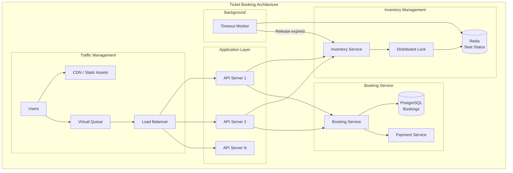

# Ticket Booking System Design (Ticketmaster/BookMyShow)

## Overview

Ticket booking systems require handling high concurrency, preventing overselling, and managing flash sale traffic spikes. This tests your understanding of distributed locking, queue systems, and consistency.

## What You Must Master

### 1. Core Challenges

```
┌─────────────────────────────────────────────────────────────────────────┐
│                    Ticket Booking Challenges                             │
│                                                                          │
│   1. Flash Sale Problem                                                  │
│      • Taylor Swift concert: 1M users, 50K tickets                     │
│      • All requests hit in first 60 seconds                            │
│      • Must not oversell!                                               │
│                                                                          │
│   2. Seat Selection                                                      │
│      • User selects seat, holds temporarily                            │
│      • What if they abandon? (timeout)                                 │
│      • What if payment fails? (release)                                │
│                                                                          │
│   3. Double Booking                                                      │
│      • Same seat shown as available to multiple users                  │
│      • Must ensure exactly one person gets it                          │
│                                                                          │
│   4. Scalability                                                         │
│      • Handle traffic spikes (100x normal)                             │
│      • Multiple events simultaneously                                   │
│                                                                          │
└─────────────────────────────────────────────────────────────────────────┘
```

### 2. Booking State Machine

```
┌─────────────────────────────────────────────────────────────────────────┐
│                    Ticket State Transitions                              │
│                                                                          │
│                      ┌──────────────┐                                   │
│                      │   AVAILABLE  │                                   │
│                      └──────┬───────┘                                   │
│                             │                                            │
│                      User selects seat                                  │
│                             │                                            │
│                             ▼                                            │
│                      ┌──────────────┐                                   │
│            ┌─────────│   RESERVED   │─────────┐                         │
│            │         │  (10 min TTL)│         │                         │
│            │         └──────────────┘         │                         │
│            │                                  │                         │
│       Timeout/Cancel                    Payment Success                 │
│            │                                  │                         │
│            ▼                                  ▼                         │
│      ┌──────────────┐                  ┌──────────────┐                 │
│      │  AVAILABLE   │                  │    BOOKED    │                 │
│      │   (again)    │                  │  (confirmed) │                 │
│      └──────────────┘                  └──────────────┘                 │
│                                                                          │
│   RESERVED: Held for user, others can't book                           │
│   BOOKED: Payment complete, ticket owned                               │
│                                                                          │
└─────────────────────────────────────────────────────────────────────────┘
```

## Architecture Diagram



## Component Deep Dive

### Seat Inventory Management

```
┌─────────────────────────────────────────────────────────────────────────┐
│                    Redis Seat Inventory                                  │
│                                                                          │
│   Key design: One key per seat                                          │
│                                                                          │
│   seat:{event_id}:{section}:{row}:{number}                             │
│                                                                          │
│   Value: { status: "available" | "reserved" | "booked",                │
│            user_id: "user_123",     // who reserved                    │
│            reserved_at: timestamp,  // for timeout                     │
│            booking_id: "book_456"   // if booked                       │
│          }                                                              │
│                                                                          │
│   Reserve seat (atomic via Lua):                                        │
│   ┌─────────────────────────────────────────────────────────────────┐   │
│   │   local seat = redis.call('GET', KEYS[1])                       │   │
│   │   if seat.status == "available" then                            │   │
│   │       seat.status = "reserved"                                   │   │
│   │       seat.user_id = ARGV[1]                                    │   │
│   │       seat.reserved_at = ARGV[2]                                │   │
│   │       redis.call('SET', KEYS[1], seat)                          │   │
│   │       redis.call('EXPIRE', KEYS[1], 600)  -- 10 min TTL         │   │
│   │       return "OK"                                                │   │
│   │   else                                                           │   │
│   │       return "TAKEN"                                             │   │
│   │   end                                                            │   │
│   └─────────────────────────────────────────────────────────────────┘   │
│                                                                          │
└─────────────────────────────────────────────────────────────────────────┘
```

### Virtual Queue for Flash Sales

```
┌─────────────────────────────────────────────────────────────────────────┐
│                    Virtual Queue System                                  │
│                                                                          │
│   Problem: 1M users, 50K tickets, all hit at once                      │
│   Solution: Virtual waiting room                                        │
│                                                                          │
│   Flow:                                                                  │
│   1. User visits → Placed in queue with position                       │
│   2. Shown: "You are #52,341 in line"                                  │
│   3. Users let in gradually (e.g., 1000/minute)                        │
│   4. When turn comes → 10 minutes to complete purchase                 │
│                                                                          │
│   Implementation:                                                        │
│   ┌─────────────────────────────────────────────────────────────────┐   │
│   │   Redis Sorted Set:                                              │   │
│   │   ZADD queue:{event_id} {timestamp} {user_id}                   │   │
│   │                                                                  │   │
│   │   Get position:                                                  │   │
│   │   ZRANK queue:{event_id} {user_id}  → 52341                     │   │
│   │                                                                  │   │
│   │   Let in next batch:                                            │   │
│   │   ZPOPMIN queue:{event_id} 1000                                 │   │
│   └─────────────────────────────────────────────────────────────────┘   │
│                                                                          │
│   Benefits:                                                              │
│   • Fair ordering (first come, first served)                           │
│   • Controlled load on backend                                          │
│   • Better user experience than errors                                  │
│                                                                          │
└─────────────────────────────────────────────────────────────────────────┘
```

### Preventing Overselling

```
┌─────────────────────────────────────────────────────────────────────────┐
│                    Overselling Prevention                                │
│                                                                          │
│   Option 1: Optimistic Locking (DB)                                     │
│   ┌─────────────────────────────────────────────────────────────────┐   │
│   │   UPDATE seats SET status = 'booked', version = version + 1    │   │
│   │   WHERE seat_id = 123                                           │   │
│   │   AND status = 'reserved'                                       │   │
│   │   AND user_id = 'user_456'                                      │   │
│   │   AND version = 5;                                              │   │
│   │                                                                  │   │
│   │   If rows_affected = 0 → Someone else got it                   │   │
│   └─────────────────────────────────────────────────────────────────┘   │
│                                                                          │
│   Option 2: Distributed Lock (Redis)                                    │
│   ┌─────────────────────────────────────────────────────────────────┐   │
│   │   SET lock:seat:123 user_456 NX EX 30                          │   │
│   │   # NX = only if not exists                                     │   │
│   │   # EX 30 = expire in 30 seconds                               │   │
│   │                                                                  │   │
│   │   If returns OK → You have the lock, proceed                   │   │
│   │   If returns nil → Someone else has it                         │   │
│   └─────────────────────────────────────────────────────────────────┘   │
│                                                                          │
│   Option 3: Redis DECR for General Admission                            │
│   ┌─────────────────────────────────────────────────────────────────┐   │
│   │   SET tickets:event_123 50000  # Initial inventory             │   │
│   │                                                                  │   │
│   │   result = DECR tickets:event_123                               │   │
│   │   if result >= 0:                                               │   │
│   │       # Got a ticket!                                           │   │
│   │   else:                                                         │   │
│   │       INCR tickets:event_123  # Rollback                       │   │
│   │       # Sold out                                                │   │
│   └─────────────────────────────────────────────────────────────────┘   │
│                                                                          │
└─────────────────────────────────────────────────────────────────────────┘
```

## Database Design

```sql
-- Events
CREATE TABLE events (
    event_id UUID PRIMARY KEY,
    name VARCHAR(255),
    venue_id UUID,
    event_date TIMESTAMP,
    total_seats INT,
    available_seats INT,  -- denormalized for quick check
    status VARCHAR(20)    -- draft, on_sale, sold_out, completed
);

-- Seats (physical inventory)
CREATE TABLE seats (
    seat_id UUID PRIMARY KEY,
    event_id UUID REFERENCES events(event_id),
    section VARCHAR(50),
    row VARCHAR(10),
    number INT,
    price DECIMAL(10, 2),
    status VARCHAR(20),  -- available, reserved, booked
    version INT DEFAULT 0  -- for optimistic locking
);

CREATE INDEX idx_seats_event_status ON seats(event_id, status);

-- Bookings
CREATE TABLE bookings (
    booking_id UUID PRIMARY KEY,
    user_id UUID,
    event_id UUID,
    status VARCHAR(20),  -- pending, confirmed, cancelled, refunded
    total_amount DECIMAL(10, 2),
    created_at TIMESTAMP,
    confirmed_at TIMESTAMP,
    payment_id VARCHAR(100)
);

-- Booking Items (seats in a booking)
CREATE TABLE booking_items (
    booking_id UUID REFERENCES bookings(booking_id),
    seat_id UUID REFERENCES seats(seat_id),
    price DECIMAL(10, 2),
    PRIMARY KEY (booking_id, seat_id)
);
```

## Interview Checklist

- [ ] **State machine**: Available → Reserved → Booked
- [ ] **Overselling**: How to prevent (locks, atomic operations)
- [ ] **Timeout handling**: Release unpaid reservations
- [ ] **Flash sale**: Virtual queue, rate limiting
- [ ] **Seat selection**: Real-time availability
- [ ] **Payment integration**: Handle failures
- [ ] **Scalability**: Partition by event
- [ ] **Fairness**: First come, first served

## Capacity Estimation

```
Big concert launch:
- 1M users trying to buy
- 50K tickets available
- All in first 10 minutes

Peak load:
- 1M / 600 seconds = ~1,700 requests/sec (just checking)
- With retries: 5,000+ requests/sec

Inventory checks:
- Redis can handle 100K+ ops/sec
- No problem

Database writes:
- 50K successful bookings in 10 min
- ~83 writes/sec (manageable)

Virtual queue:
- 1M ZADD operations: Redis handles easily
- Position checks: O(log N) per user
```

## Key Concepts to Articulate

| Concept | Explanation |
|---------|-------------|
| **Optimistic locking** | Check version before update, fail if changed |
| **Pessimistic locking** | Lock row before reading |
| **Distributed lock** | Redis lock across multiple servers |
| **Reservation timeout** | Auto-release if not paid |
| **Virtual queue** | Fair ordering for high-demand events |
| **Idempotency** | Same request = same result (payment safety) |
| **Two-phase commit** | Reserve then confirm (avoid partial state) |
